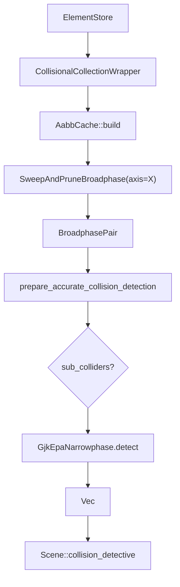
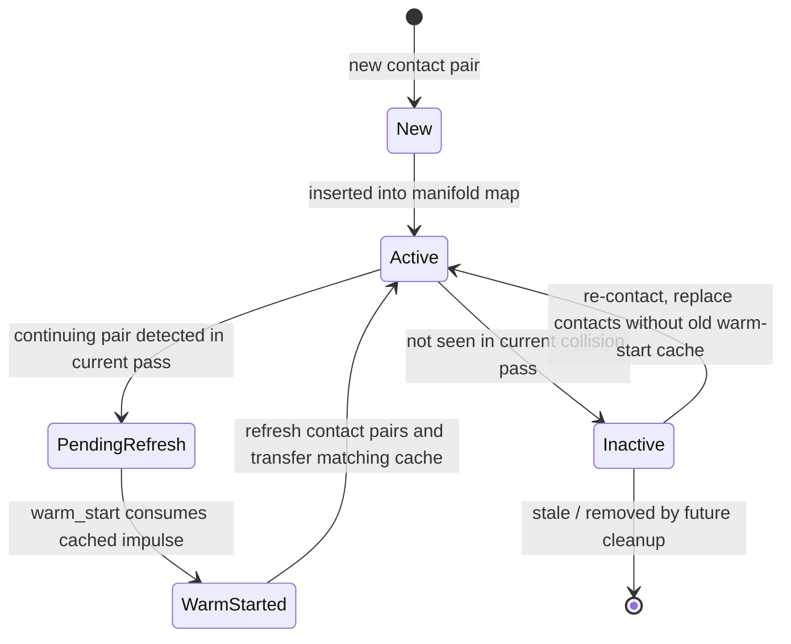
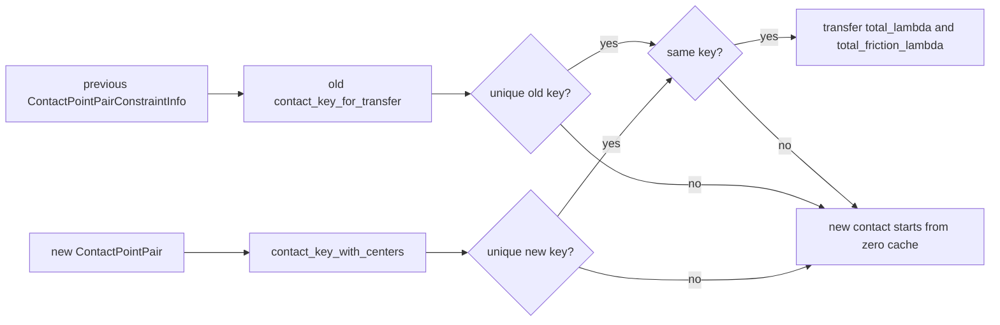
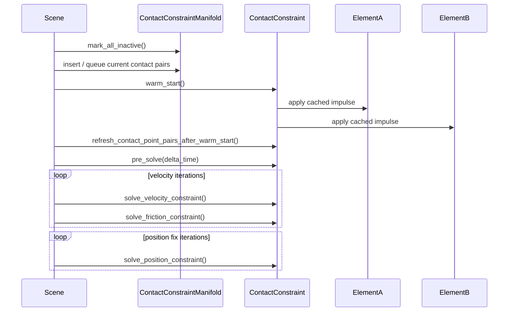

# Collision And Constraints

Collision and constraint solving are intentionally split:

- `collision` finds potential and actual contact pairs.
- `constraints` turns contacts into solver state and applies impulses/corrections.
- `scene` orchestrates the order and owns the lifecycle of contact manifolds.

## Collision Pipeline

## Manifold Lifecycle

## Contact Key Transfer

`ContactPointKey` is a conservative identity for transferring cached impulses between rebuilt contact points.

Transfer rules:

- Only transfer cached `total_lambda` and `total_friction_lambda`.
- Do not transfer `real_total_lambda` or `real_total_friction_lambda`; the current frame solver recomputes real applied totals.
- Non-finite, zero-normal, degenerate, duplicate, or ambiguous keys do not transfer.
- Re-contact after an inactive pass does not inherit pre-separation lambda.

## Constraint Solve Flow

## Boundaries

| Area | Belongs In | Should Not Leak Into |
| --- | --- | --- |
| AABB filtering and broadphase strategy | `collision` | `constraints` solver math |
| Contact pair identity and geometry-derived keys | `collision` + `constraints/contact` | wasm API |
| Contact lifecycle timing | `scene` | shape geometry |
| Effective mass and lambda clamping | `constraints` | broadphase |
| Shape sub-collider decomposition | `shape` | solver |

## Known Design Tradeoffs

- AABB cache is rebuilt per broadphase pass; it is not yet a persistent shape cache.
- Contact identity is conservative and may drop warm-start cache rather than risk wrong transfer.
- `Scene` still uses internal raw-pointer patterns around constraint iteration; storage mutations clear manifolds to avoid stale contact pointers.
- `ContactPointPair` currently uses `Vec` contact collections; future work may reduce allocations and add stable per-feature IDs.

