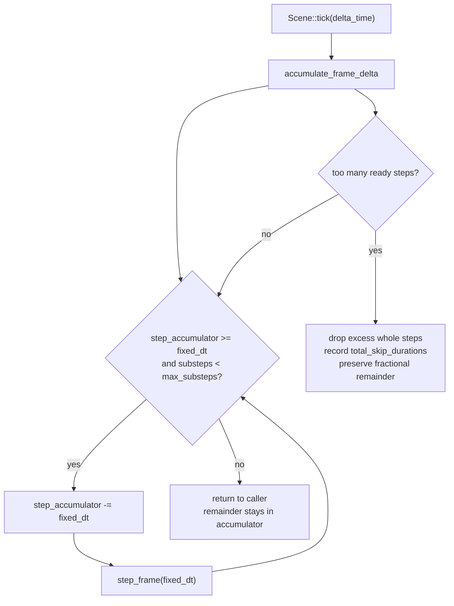
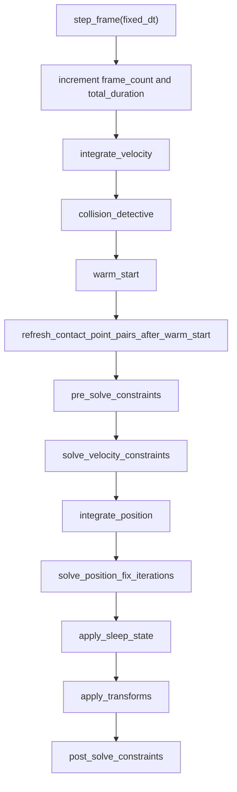

# Runtime Pipeline

The runtime entrypoint is `Scene::tick(delta_time)`. Public callers can pass arbitrary frame deltas; the scene internally advances the simulation using a fixed step.

## Fixed-Step Tick

The current fixed-step constants are private implementation details in `scene/mod.rs`:

- `FIXED_DELTA_TIME = 1 / 60`
- `MAX_SUBSTEPS_PER_TICK = 8`
- `STEP_EPSILON = 0.000001`

## Step Frame Stages

## Stage Responsibilities

| Stage | Responsibility | Key Data |
| --- | --- | --- |
| `integrate_velocity` | Apply gravity to non-fixed, non-sleeping, non-ignore-gravity elements. | `Context`, `Meta.velocity` |
| `collision_detective` | Mark old manifolds inactive, detect current pairs, insert/refresh contact constraints. | `ElementStore`, `ContactConstraintManifold` |
| `warm_start` | Apply cached normal/friction impulses for continuing active contacts. | `ContactConstraint`, `ContactPointPairConstraintInfo` |
| `refresh_contact_point_pairs_after_warm_start` | Replace pending contact pairs after warm start and transfer cached impulses by contact key. | `pending_contact_point_pairs`, `ContactPointKey` |
| `pre_solve_constraints` | Prepare contact/join/point constraints for the solver pass. | effective mass, contact count, `r_a`, `r_b` |
| `solve_velocity_constraints` | Iterate point, join, and contact velocity constraints. | lambda, friction lambda, velocity bias |
| `integrate_position` | Integrate positions and emit position update callbacks. | `Meta`, callback hook |
| `solve_position_fix_iterations` | Resolve positional overlap/correction. | delta transform |
| `apply_sleep_state` | Enter or leave sleep based on kinetic/motion thresholds. | `Meta`, `Context` thresholds |
| `apply_transforms` | Sync element transforms into shape geometry. | `ShapeTraitUnion` |
| `post_solve_constraints` | Cleanup / post-stage constraint work. | constraints and manifold state |

## Important Invariants

- `collision_detective` must run before `warm_start` so stale separated pairs are not warmed.
- Continuing contacts warm start before their pending contact pairs are refreshed.
- Re-contact after an inactive pass must not inherit pre-separation cached lambda.
- `push_element` and `remove_element` invalidate contact manifolds because constraints may hold element pointers.
- `clear()` resets the accumulator and skipped duration, not only element storage.

## Observability Hooks

Current runtime observability is mostly tests and public query methods. Future debug traces should record:

- tick, substep, and phase
- candidate pairs from broadphase
- contact pair rebuild and contact key transfer/drop reason
- cached/applied normal and friction lambda
- sleep/wakeup state transitions

See `docs/ai/debug-artifacts.md` for the recommended debug artifact shape.

