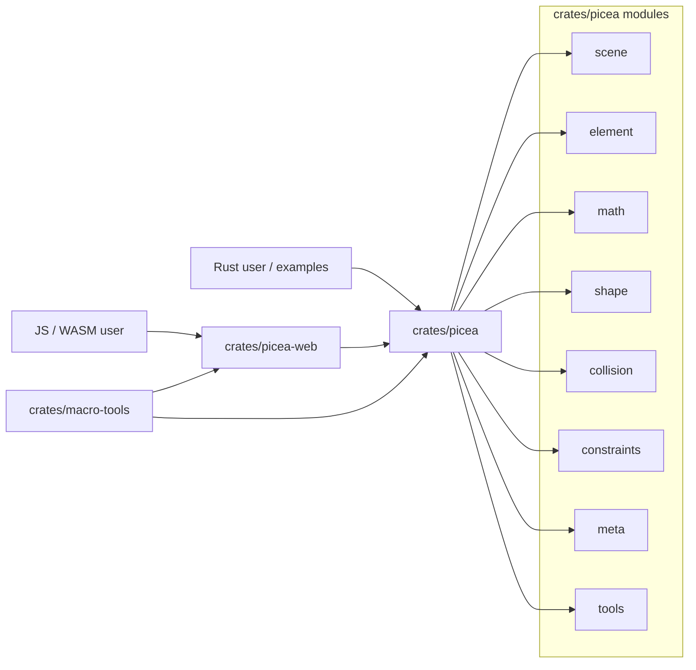
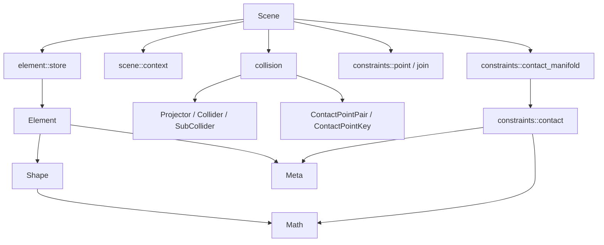

# System Overview

Picea is a Rust workspace for a 2D physics engine. The core engine is in `crates/picea`; `crates/picea-web` exposes a wasm-bindgen API over the core; `crates/macro-tools` provides internal proc macro helpers.

## Workspace Diagram

## Crate Boundaries

| Crate | Owns | Does Not Own |
| --- | --- | --- |
| `crates/picea` | Physics runtime, data model, math, shapes, collision, constraints, debug helpers. | wasm public API and JS/TS error shape. |
| `crates/picea-web` | wasm-bindgen facade, JS input validation, legacy fallback methods, `try*` Result methods, TypeScript section. | Core physics formulas, collision algorithms, solver policy. |
| `crates/macro-tools` | Internal derive/attribute helpers used by the Rust crates. | Runtime behavior or physics semantics. |

## Core Module Ownership

| Module | Owns | Main Entry |
| --- | --- | --- |
| `scene` | `Scene`, fixed-step ticking, constraint orchestration, callbacks, sleep/wakeup, contact manifold refresh timing. | `crates/picea/src/scene/mod.rs` |
| `element` | Body/shape/meta/data container, IDs, storage, pair mutable lookup. | `crates/picea/src/element/mod.rs`, `element/store.rs` |
| `math` | Numeric types and operations: `Point`, `Vector`, `Segment`, `Matrix`, axis helpers. | `crates/picea/src/math/mod.rs` |
| `shape` | Shape traits, circles/polygons, convex/concave geometry, local/world transform sync. | `crates/picea/src/shape/mod.rs` |
| `collision` | Projection traits, AABB generation, broadphase candidates, narrowphase dispatch, contact point pairs, contact keys. | `crates/picea/src/collision/mod.rs` |
| `constraints` | Contact/join/point constraints, warm start, effective mass, velocity solve, position correction. | `crates/picea/src/constraints/mod.rs` |
| `meta` | Mass, transform, velocity, kinetic state, force metadata. | `crates/picea/src/meta/mod.rs` |
| `tools` | Debug and helper tools outside the core physics contract. | `crates/picea/src/tools/mod.rs` |

## Dependency Shape

## Current Architectural Principles

- Runtime truth lives in `Scene` and its owned stores.
- wasm is a facade over core behavior, not a second physics implementation.
- Shape geometry owns local/world transform semantics; collision consumes shape projections and sub-colliders.
- Collision finds candidate contacts; constraints solve impulses and position correction.
- Milestone changes should stay inside the current module boundary unless the milestone explicitly expands scope.

