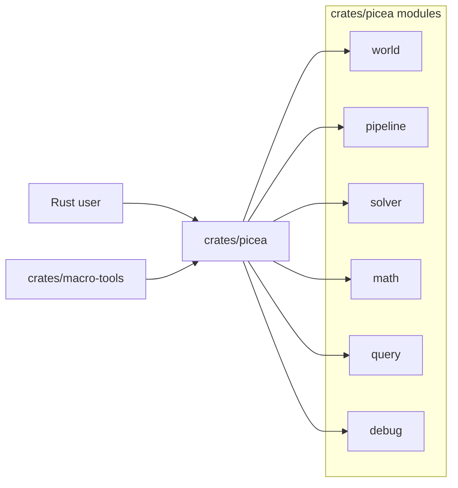
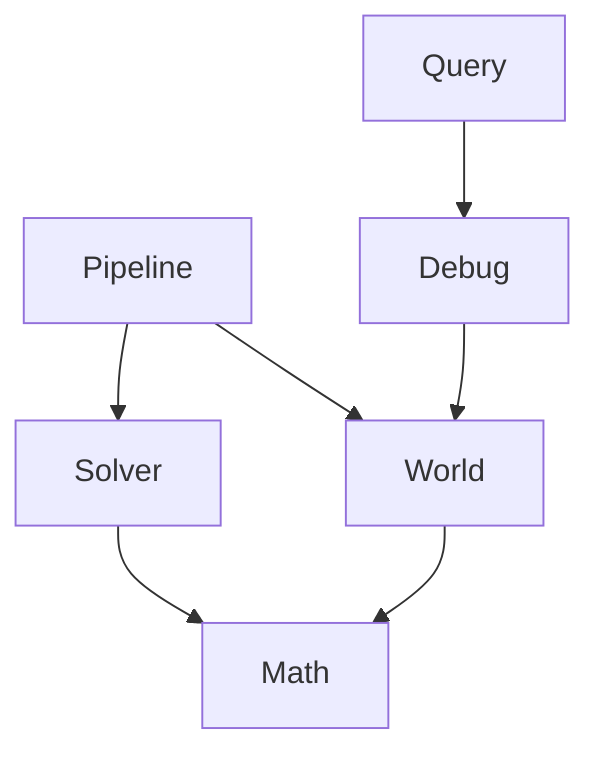

# System Overview

Picea is a Rust workspace for a 2D physics engine. The core engine is in `crates/picea`; `crates/macro-tools` provides internal proc macro helpers.

## Workspace Diagram

## Crate Boundaries

| Crate | Owns | Does Not Own |
| --- | --- | --- |
| `crates/picea` | World-centric physics runtime, math, stepping pipeline, query/debug facts. | GUI, wasm facade, or separate artifact tooling. |
| `crates/macro-tools` | Internal derive/attribute helpers used by the Rust crates. | Runtime behavior or physics semantics. |

## Core Module Ownership

| Module | Owns | Main Entry |
| --- | --- | --- |
| `world` | `World` lifecycle surface, retained state, handles, revisioned store/runtime facts. | `crates/picea/src/world.rs`, `world/*` |
| `pipeline` | `SimulationPipeline` and explicit step orchestration. | `crates/picea/src/pipeline.rs`, `pipeline/*` |
| `solver` | Internal solve helpers for the world path. | `crates/picea/src/solver/*` |
| `math` | Numeric types and operations: `Point`, `Vector`, `Segment`, `Matrix`, axis helpers. | `crates/picea/src/math/mod.rs` |
| `query` | Stable spatial queries over debug/world facts. | `crates/picea/src/query.rs` |
| `debug` | Stable debug snapshot and structured read model. | `crates/picea/src/debug.rs` |

## Dependency Shape

## Current Architectural Principles

- Runtime truth lives in `World` and its retained facts.
- External consumers should read through `DebugSnapshot` and `QueryPipeline`, not private internals.
- Math types are concrete `f32` and use named algebra instead of legacy operator tricks.
- Milestone changes should stay inside the current module boundary unless the milestone explicitly expands scope.
