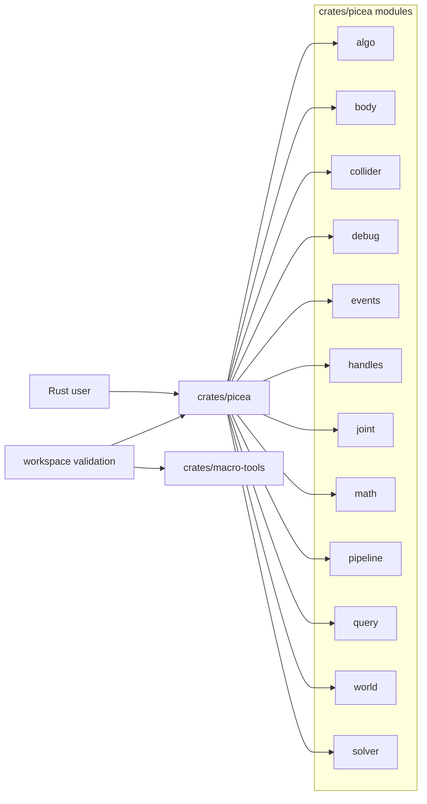
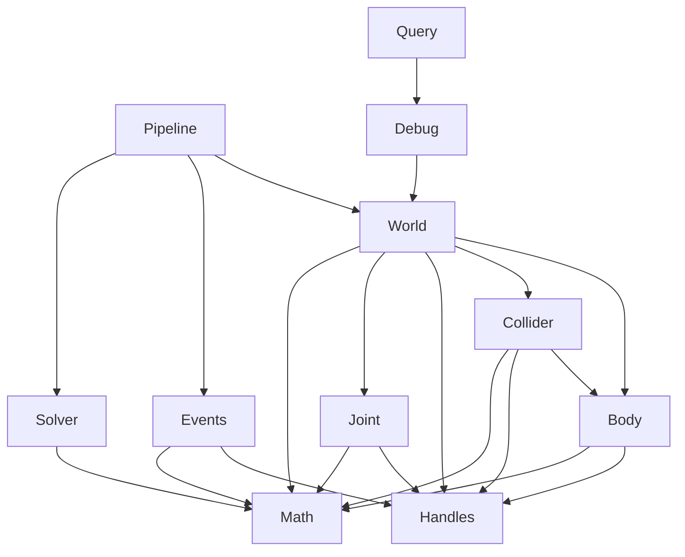

# System Overview

Picea is a Rust workspace for a 2D physics engine. The current core dependency graph centers on `crates/picea`; `crates/macro-tools` is a standalone proc-macro crate in the workspace and is verified separately.

Current routing should start from live repo facts: `crates/picea/src/lib.rs`, Cargo manifests, and fresh verification output. Archived `Scene` / `Context` / `picea-web` / wasm notes in the milestone archive or legacy architecture docs are historical only.

## Workspace Diagram

The public crate-root module list above comes directly from `crates/picea/src/lib.rs`; `solver` is included here as an internal architectural module even though it is not a public crate-root export.

## Crate Boundaries

| Crate | Owns | Does Not Own |
| --- | --- | --- |
| `crates/picea` | World-centric physics runtime, math, stepping pipeline, query/debug facts. | GUI, wasm facade, or separate artifact tooling. |
| `crates/macro-tools` | Standalone proc-macro helpers crate in the workspace for derives such as `Accessors`, `Builder`, and `Deref`. | Runtime behavior, physics semantics, or the current `crates/picea` dependency graph. |

## Core Module Ownership

| Module | Owns | Main Entry |
| --- | --- | --- |
| `algo` | Sorting and collection-order helpers used by the core crate. | `crates/picea/src/algo/mod.rs`, `algo/sort.rs` |
| `body` | Stable body descriptors, patches, views, and `Pose`/`BodyType`. | `crates/picea/src/body.rs` |
| `collider` | Stable collider descriptors, material/filter settings, shared shapes, and views. | `crates/picea/src/collider.rs` |
| `debug` | Stable debug snapshot and structured read model. | `crates/picea/src/debug.rs` |
| `events` | Stable `WorldEvent` payloads emitted by `SimulationPipeline::step`. | `crates/picea/src/events.rs` |
| `handles` | Opaque handles and `WorldRevision` for the stable world API. | `crates/picea/src/handles.rs` |
| `joint` | Stable joint descriptors, patches, and views. | `crates/picea/src/joint.rs` |
| `math` | Numeric types and operations: `Point`, `Vector`, `Segment`, `Matrix`, axis helpers. | `crates/picea/src/math/mod.rs` |
| `pipeline` | `SimulationPipeline` and explicit step orchestration. | `crates/picea/src/pipeline.rs`, `pipeline/*` |
| `query` | Stable spatial queries over debug/world facts. | `crates/picea/src/query.rs` |
| `world` | `World` lifecycle surface, retained state, handles, revisioned store/runtime facts. | `crates/picea/src/world.rs`, `world/*` |
| `solver` (internal) | Internal solve helpers for the world path. | `crates/picea/src/solver/*` |

## Dependency Shape

This diagram covers the current `crates/picea` runtime graph. Historical milestone gates may still mention `picea-macro-tools` as a separate workspace validation target, and archived `Scene` / `Context` / `picea-web` / wasm narratives live outside this current map.

## Current Architectural Principles

- Runtime truth lives in `World` and its retained facts.
- External consumers should read through `DebugSnapshot` and `QueryPipeline`, not private internals.
- Math types are concrete `f32` and use named algebra instead of legacy operator tricks.
- Milestone changes should stay inside the current module boundary unless the milestone explicitly expands scope.
