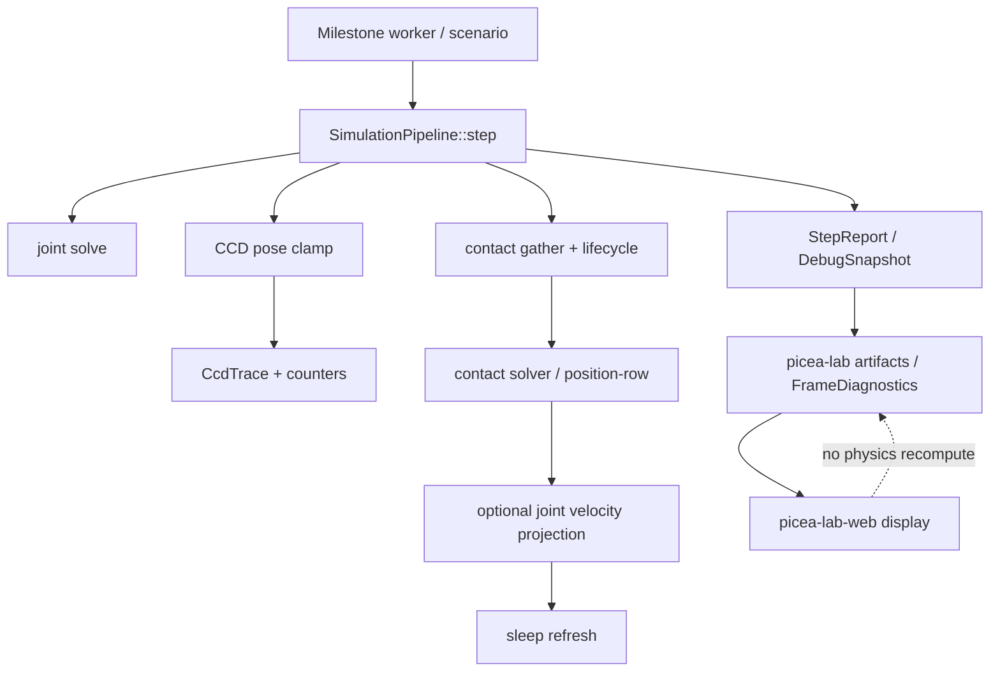
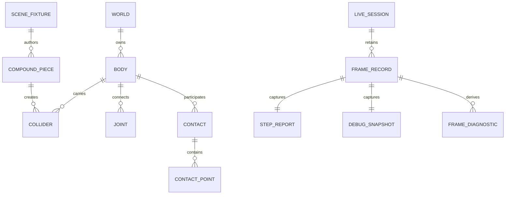
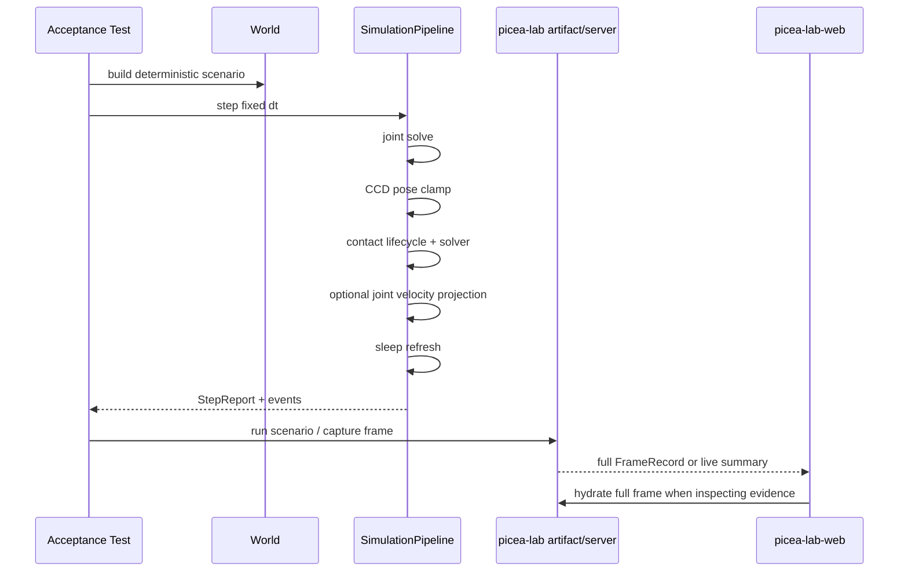

# Picea Physics Realism vNext 软件架构设计

状态：已确认
设计文档：docs/design/2026-06-17-physics-realism-vnext-architecture.md
最后更新：2026-06-17
工作目录：/Users/asyncrustacean/projects/picea
SpecFlow change：不使用
Profiles：architecture-heavy, api-contract, ui-browser
Artifact 状态：architecture ready; ADR not-needed; risk matrix ready

## 背景与目标

本设计回答“往真实模拟效果方向优化 Picea 物理引擎”应该先动哪里、哪些边界不能混淆、以及后续如何用 milestone 和 subagent 执行。

目标不是一次性把 Picea 变成 Box2D / Rapier / PhysX 的克隆，而是在当前 `World + SimulationPipeline` 刚体主线上，按可验收的小片推进真实感：

1. 先让刚体接触、堆叠、摩擦、阻尼、休眠更稳定。
2. 再扩展窄 CCD slice、复杂形状 authoring 证据和 joint 约束表现。
3. 同步强化 lab artifact / live / browser 证据，确保“更真实”不是视觉错觉。
4. 将 deformable / soft-body 保持为独立 RFC / design gate，不把 rigid-body lattice proxy 误称为软体。

## 非目标

- 不在本设计阶段修改生产实现代码。
- 不改变 `World` / `SimulationPipeline` / `QueryPipeline` public beta surface。
- 不把 `picea-lab-web` 变成第二套 physics runtime。
- 不合并 contact/joint row stream，不引入 multithreaded solver。
- 不做 direct arbitrary concave contact solver。
- 不做 rotational CCD、broad all-shape CCD 或 true deformable body 的实现。
- 不把 benchmark wall-clock 作为 correctness hard fail。

## 现状证据

- 当前主线是 `World` / `SimulationPipeline` / `QueryPipeline` / `DebugSnapshot` / `WorldRecipe`，core runtime 在 `crates/picea`，lab/web 只消费 Rust facts。
- `StepConfig` 当前公开固定步长、solver iteration、restitution threshold、contact position correction、joint velocity projection、sleep 开关。
- `StepStats` / `DebugStats` 已有 broadphase、contact、island、solver row、warm-start、CCD、position correction、sleep 和 numeric warning counters。
- `Material` 当前 public surface 只有 `friction` / `restitution`。contact combine law 已在 private contact path 中存在：friction 几何平均，restitution 取 max。
- `DistanceJointDesc` / `WorldAnchorJointDesc` 已有 `damping` 字段，但当前 joint solver 主要消费 `stiffness`，`damping` 语义尚未兑现。
- CCD 是显式 pre-contact pose-clamp phase；已覆盖 dynamic circle/static、dynamic convex/static、translational dynamic convex/dynamic convex、dynamic compound/static wall。dynamic circle-vs-dynamic、rotational CCD、all-shape CCD 仍是后续。
- `picea-lab` 已有 `stack_4`、`matrix_stack`、`joint_anchor`、`lattice_grid`、`compound_provenance`、`concave_decomposition`、`ccd_dynamic_convex_pair`、`ccd_dynamic_compound_wall` 场景。
- 当前 builtin 场景库存为 16 个 `ScenarioId`。只有 `stack_4`、`matrix_stack`、`matrix_stack_aligned`、`newton_cradle`、`lattice_grid` 有参数面板；其他场景主要作为固定证据样本。
- `FrameDiagnostics`、live summary/full frame、missing-evidence、profile contract 和 UI contract 已存在，适合作为验收基础。
- `docs/design/deformable-body-roadmap.md` 明确当前 Picea 是 2D rigid-body engine；M38 lattice 是 rigid-body lattice proxy，不是真 soft-body。
- 当前源码没有 `DeformableHandle`、`ParticleHandle`、`ElementHandle`、`ConstraintHandle`、`DeformableDesc`、`DeformableHit` 等 deformable 专属 public/core type；query/debug/lab schema 仍是 rigid facts。

## 证据分级

- Fact：规划开始前 subagent 探索和本地主线程确认了 `main...origin/main` 基线，`HEAD=ac2941d`；执行中的 live `git status` 始终优先于本文快照。
- Fact：观测/lab explorer 已实际跑通多条 `picea-lab` server/artifact/web contract/build gate；其他 explorer 的部分结论来自源码/测试/文档读取，未全部 fresh run。
- Fact：`docs/design/physics-engine-upgrade-technical-plan.md` 中仍有一处 dynamic compound CCD 状态漂移；当前应以 M26 计划、测试和代码为准。
- Fact：deformable explorer 已确认真实 soft-body/deformable 仍处在 RFC 边界；当前 `lattice_grid` 是刚体 proxy，不能作为已实现 soft-body 能力宣传。
- Inference：下一轮真实感收益最大的执行顺序是 `contact lifecycle -> position-row/budget -> sleep convergence`，而不是先调 sleep threshold、扩大 friction 或改 row ordering。
- Inference：`joint.damping` 字段未被 solver 消费是 public surface 语义债，优先级高于新增 motor/limit/breakable API。
- Assumption：本轮规划只写文档、测试计划和 subagent handoff，不自动提交；实现阶段仍可连续执行，但高风险 public API / compatibility gate 需要单独停。
- Recommendation：先用现有 tests/artifacts/browser contracts 约束 7 个方向，再逐个 execution milestone 写 acceptance-as-code。

## 领域名词

| 名词 | 含义 | 为什么重要 |
| --- | --- | --- |
| contact lifecycle | 接触从进入、持续、退出到 warm-start eligibility 的跨帧身份与证据链。 | 堆叠稳定依赖可信接触身份，不能靠错误 impulse 复用。 |
| position-row | 从 contact observation 派生出的 residual position correction 决策单位。 | 处理 penetration 和支撑保持，避免重复消费 stale raw-depth。 |
| dense pressure | 多接触共享 body 时 position correction 对同一组 body 反复施压的累积效应。 | 过量会推出支撑，过弱会穿透和抖动。 |
| support friction | 低法向 impulse 的浅支撑接触中给 tangent row 的保守预算。 | 是稳定性桥接，不等同于完整 material model。 |
| CCD pose clamp | 在 contact generation 前用 time of impact 把高速 body clamp 到接触前位置。 | 防 tunneling，同时保持 contact solver 主路径清晰。 |
| compound provenance | authored / generated convex pieces 的来源、顺序和继承事实。 | 复杂形状真实感必须解释 piece 如何影响质量、惯量和接触。 |
| live summary/full frame | live playback 的轻量帧与完整证据帧分层。 | 防止播放流畅性和诊断证据混为一谈。 |
| rigid-body lattice proxy | 用刚体节点和 joints 近似网格视觉形变。 | 不是 particle/PBD/FEM soft-body。 |

## 待确认问题

### 必须现在确认

无。用户已授权自主规划，不需要 Plan Gate 停顿；但以下高风险项仍保留 mid-run gate：public API / compatibility break、direct concave core hard boundary、deformable public surface、删除/迁移/部署。

### 可在文档中选择

- [x] 默认路线：先强化刚体真实感，再开 deformable RFC。好处是复用现有 tests/artifacts，风险最低；代价是 soft-body 不会马上进入实现。
- [x] CCD 下一片选择 `dynamic circle -> stationary dynamic convex target`。好处是沿现有 translational + explicit trace 主干推进；代价是 rotational/all-shape 继续延期。
- [x] 材质方向先兑现 `joint.damping`，不先扩 `Material`。好处是修复已有 API 语义债；代价是 static/dynamic friction 需要后续 evidence 再决策。
- [x] complex shape 先补 provenance/mass evidence，不做 direct concave solver。好处是保持 M22/M27 边界；代价是用户想要 arbitrary concave contact 时仍要明确拒绝。

## 开源方案调研与引用策略

| 能力/模块 | 候选开源方案 | 证据来源 | 推荐用法 | 不采用/需自研部分 | 主要风险 |
| --- | --- | --- | --- | --- | --- |
| 刚体 step / sleep / damping / CCD | Box2D | https://box2d.org/documentation/md_simulation.html | reference only：固定步长、substep、sleep、damping、dynamic body CCD 取舍 | 不引入依赖；Picea 保持 Rust API、debug facts、milestone gates | 照搬会破坏现有 public surface 与 deterministic evidence |
| broadphase tree | Box2D dynamic tree | https://box2d.org/documentation/group__tree.html | reference only：继续用 dynamic AABB tree 思路 | 不暴露 proxy ids，不重写已完成 broadphase | 过早 tuning 会掩盖 solver 真实问题 |
| collider / shape authoring | Rapier collider model | https://rapier.rs/docs/user_guides/rust/colliders/ | reference only：对比 collider/body 分层和 shape support | 不把 Picea 改成 Rapier API | direct concave / compound 语义容易被误读 |
| soft-body | PhysX soft bodies | https://nvidia-omniverse.github.io/PhysX/physx/5.3.1/docs/SoftBodies.html | reference only：说明 soft-body 需要独立 mesh/solver/artifact surface | 不把 UI lattice 改名为 soft-body | 若未建 core facts 就宣称 soft-body，会制造假能力 |

结论：只参考成熟引擎的分层与验收思路，不引入外部 physics runtime。Picea 的本地所有权是 deterministic Rust core、debug facts、lab artifacts 和 public beta API。

## 模块边界与源码组织

| 模块/目录/文件 | 职责 | 所有者/生命周期 | 允许依赖 | 禁止依赖 | 拆分理由 |
| --- | --- | --- | --- | --- | --- |
| `crates/picea/src/pipeline/contacts.rs` | contact gather、lifecycle、warm-start provenance、`ccd_trace` attach | core transient step owner | world contact state、narrowphase facts、CCD traces | solver row math、web display | 保持 contact 身份和求解分离 |
| `crates/picea/src/solver/contact.rs` | contact velocity solve、friction/restitution、position-row、dense pressure | core solver internal | `StepConfig`、contact observations、body state | public API/schema、lab artifacts | 数值策略集中管理 |
| `crates/picea/src/pipeline/sleep.rs` | island sleep/wake evaluation and reasons | core pipeline | body/contact/joint connectivity | 掩盖 solver 不稳定 | sleep 是结果，不是第一修复入口 |
| `crates/picea/src/pipeline/ccd.rs` | swept candidates、TOI ordering、pose clamp、`CcdTrace` | core CCD phase | broadphase snapshots、shape helpers | narrowphase solver、rotational/all-shape scope creep | 保持 CCD 显式 phase |
| `crates/picea/src/pipeline/joints.rs` | distance/world-anchor joint solve and projection | core joint pipeline | joint descs、island slots、body state | contact row order rewrite、new public joint API | 先兑现现有 fields，再扩类型 |
| `crates/picea/src/collider.rs` / `recipe.rs` | material/shape descriptors and authoring helpers | public API owner | validation、mass properties | direct concave solver | 保护 beta surface |
| `crates/picea-lab/src/scenario.rs` | scenario/compound/concave authoring and validation | lab authoring owner | recipe/core public API | core solver internals | lab 负责将复杂 authoring 转成 convex pieces |
| `crates/picea-lab/src/artifact.rs` | `FrameRecord`、diagnostics、provenance、artifact files | lab evidence owner | `StepReport`、`DebugSnapshot`、events | physics recomputation | 证据层不改变模拟 |
| `crates/picea-lab/src/server.rs` | live session、summary/full frame、freshness guard | lab server owner | authoritative live runtime | arbitrary live patch | live 调试不是 visual editor |
| `crates/picea-lab/web/src/*` | replay/workbench/browser acceptance | web display owner | Rust exported facts | recompute physics/decomposition | UI 只做展示和 source label |

## 能力展示矩阵

这张矩阵把 vNext 的工程路线落到实际可展示的 `ScenarioId`、参数面板、Web 展示面和验收入口。后续“场景更新”优先补元数据、默认叠加层和验收步骤；不要先新增大量场景来掩盖现有展示链路不清的问题。

| vNext 能力 | 现有 / 推荐 `ScenarioId` | 参数面板状态 | lab-web 展示面 | 验收入口 | 场景更新建议 |
| --- | --- | --- | --- | --- | --- |
| stack/contact stability | `stack_4`, `stack_stability_tower`, `matrix_stack`, `matrix_stack_aligned`, `falling_box_contact` | stack/matrix 有 `RectStack` 参数；falling box 固定 | Stack stability overlay, Diagnostics, Timeline markers, Inspector contact/island facts | `physics_realism_acceptance stack_4`, `artifact_run matrix_stack`, browser stack/matrix live summary/full | 增加 showcase 默认叠加：support chain、sleep、diagnostics；把 `stack_4` 作为第一屏能力样本 |
| material / damping | `newton_cradle`, 后续可补 `material_damping_showcase` | `newton_cradle` 有参数面板；material/damping showcase 尚未实现 | Inspector body/joint facts, trajectory/energy 相关证据；后续展示 friction/restitution/body damping/joint damping 对比 | friction/restitution/body damping/joint damping gates | 先保护 `newton_cradle`，E2 后再决定是否新增 material showcase；不要扩 `Material` public schema 作为展示捷径 |
| CCD | `ccd_fast_circle_wall`, `ccd_fast_convex_walls`, `ccd_dynamic_convex_pair`, `ccd_dynamic_compound_wall` | 固定样本 | Trajectory CCD mode, Inspector `ccd_trace`, counters candidate/hit/miss/clamp | `physics_realism_acceptance ccd`, `artifact_run ccd_dynamic`, browser CCD trace inspection | E3 后优先把 dynamic target CCD 做成 guided step；展示 TOI/clamp/swept path，而不是只展示“速度快” |
| compound / concave boundary | `compound_provenance`, `concave_decomposition`, `sat_polygon` | 固定样本 | Inspector compound provenance, SAT manifold points, source labels | `picea-lab concave`, `compound_provenance`, `query_debug_contract query_shape_rejects_direct_concave_polygon_input` | 场景文案必须区分 “static decomposition / provenance” 与 “direct concave solver unsupported” |
| joints / constraints | `joint_anchor`, `newton_cradle`, `lattice_grid` | `newton_cradle` 和 `lattice_grid` 有参数面板；`joint_anchor` 固定 | Inspector joint rows, joint velocity projection facts, lattice proxy panel | joint/order gates, `test:i18n`, browser joint/lattice inspection | E5 先锁 step order；lattice 只作为 rigid-body proxy，不承诺 soft-body |
| observability / live evidence | `matrix_stack`, `stack_4`, `compound_provenance`, `ccd_dynamic_convex_pair`, `lattice_grid`, `broadphase_sparse` | 混合 | Toolbar source/session metadata, Diagnostics, Timeline skipped/not hydrated, Profile badge, copy debug context | server summary/full routes, `test:ui-contract`, `test:i18n`, `test:profile`, browser live summary -> full hydrate | E6 验收必须跨 stack/CCD/compound/lattice，不只看 stack/matrix |
| deformable future route | `lattice_grid` 仅作 rigid-body lattice proxy；未来 `deformable_*` 另走 RFC | `lattice_grid` 有 stiffness/constraint profile | Lattice proxy panel, not-soft-body 文案, i18n contract | `test:i18n`, lattice artifact/browser checks, D7 design review | 不把 lattice 改名为 soft-body；真实 deformable 先定义 handles/query/artifact schema |

Showcase 元数据建议后续落到 lab scenario descriptor 或 Web 层消费：

| 字段 | 含义 | 初始来源 |
| --- | --- | --- |
| `capability_tags` | 场景证明的能力类别，例如 `stack`, `ccd`, `compound`, `joint`, `diagnostics` | `ScenarioId` + 本矩阵 |
| `proof_points` | 用户应该观察的事实，例如 support chain、TOI clamp、provenance piece order | artifact/debug facts |
| `recommended_overlays` | 默认打开的叠加层或 trajectory mode | Web overlay presets |
| `evidence_panels` | 建议打开的 Inspector/Timeline/Diagnostics/Profile 面板 | lab-web workbench |
| `limitations` | 场景不能证明什么，例如 lattice 不是 soft-body、concave 不是 direct solver | 设计文档和 i18n |

## 架构视图

## 软件接口说明

### 接口：Realism Acceptance Slice

职责：每个真实感执行里程碑必须先写一个可运行行为锁或可复现 browser/API 检查，再实现。

契约摘要：

| 项 | 说明 |
| --- | --- |
| 调用形式 | Rust test / lab artifact test / web contract / browser procedure |
| 方法/路径/主题/函数 | `physics_realism_acceptance`, `artifact_run`, `server_routes`, `npm --prefix crates/picea-lab/web` |
| 同步性 | sync test/build/browser steps |
| 版本/稳定性 | milestone-local contract；通过后可升为 regression guard |

输入：

| 字段 | 类型/格式 | 必填/可空 | 含义 | 来源/生产者 | 约束/校验 | 默认/空值语义 | 兼容性 | 示例 |
| --- | --- | --- | --- | --- | --- | --- | --- | --- |
| scenario/test id | string | 必填 | 要锁住的行为 | milestone plan | 必须指向已有或新增测试 | 无 | 保持稳定命名 | `stack_4_long_window_enters_sleep_after_stable_vertical_stack` |
| frame/window | integer/range | 可空 | 需要观测的帧窗口 | test/scenario | 固定 dt，可复现 | 空表示单步/默认窗口 | 不改变历史 artifact | `180`, `600` |
| expected facts | table/assertions | 必填 | 二元通过条件 | design/plan | 必须可观察 | 无 | 可 additive 扩展 | `ccd_clamp_count == 1` |
| evidence | file/log/screenshot | 必填 | 验收证据 | verifier/browser | 命令输出或 artifact 路径 | 无 | 保留可重跑命令 | `frames.jsonl` |

输出：

| 字段 | 类型/格式 | 必填/可空 | 含义 | 消费者 | 约束/派生规则 | 默认/空值语义 | 兼容性 | 示例 |
| --- | --- | --- | --- | --- | --- | --- | --- | --- |
| pass/fail | boolean | 必填 | 是否通过 | main Codex/user | 由测试或步骤决定 | 无 | 不用 agent 自述替代 | pass |
| residual risk | text | 必填 | 未证明项 | plan/receipt | 必须具体 | 无 | 可后续关闭 | browser not rerun |

错误：

| 错误/状态 | 触发条件 | 返回形态 | 可重试 | 用户/下游可见影响 | 处理策略 |
| --- | --- | --- | --- | --- | --- |
| red lock still red | 实现后测试仍失败 | test failure | 是 | milestone 不可验收 | worker 修复或回计划 |
| blocked environment | 依赖/浏览器/网络不可用 | blocker note | 是 | 只能部分验收 | 记录 fallback 和最小后续检查 |
| scope drift | 需要改 public API 或高风险边界 | stop condition | 否 | 需要人工 gate | 暂停并修订计划 |

不变量：验收先于实现；任何 user-visible/lab-web 改动必须有 browser/API/contract 证据；LLM reviewer 只是建议，不替代验收。

### 接口：Live Summary / Full Frame Freshness Guard

职责：保持 live playback 流畅性和诊断证据分离。

契约摘要：

| 项 | 说明 |
| --- | --- |
| 调用形式 | HTTP server response / web hydration |
| 方法/路径/主题/函数 | `POST /api/sessions/:id/control`, `GET /api/sessions/:id/frames/:index` |
| 同步性 | request/response |
| 版本/稳定性 | lab live contract |

输入/输出关键字段：

| 字段 | 类型/格式 | 必填/可空 | 含义 | 来源/生产者 | 约束/校验 | 默认/空值语义 | 兼容性 | 示例 |
| --- | --- | --- | --- | --- | --- | --- | --- | --- |
| `session_id` | string | 必填 | live session identity | server | 与 active session 匹配 | 无 | stable | `abc` |
| `session_epoch` | integer | 必填 | reset/patch freshness | server | hydrate 时必须匹配 | 无 | additive | `3` |
| `frame_index` | integer | 必填 | frame identity | server | hydrate 时必须匹配 | 无 | stable | `120` |
| `world_revision` | integer/handle | 必填 | authoritative world freshness | core/server | hydrate 时必须匹配 | 无 | stable | `WorldRevision(42)` |
| `diagnostics` | object/null | full 必填，summary 空 | evidence facts | artifact/server | summary 必须显示 not hydrated | `null` = 未 hydrate，不是 0 风险 | backward compatible | `null` |

不变量：summary 不能携带或伪造 full-only evidence；Web 在未 hydrate 时必须显示 missing/not hydrated。

## 实体关系图 / 数据模型

| 关系 | 基数 | 生命周期所有者 | 删除/归档语义 | 一致性约束 | 证据 |
| --- | --- | --- | --- | --- | --- |
| World-Body-Collider | 1:N | `World` | handle generation/stale rules | query sync follows revision | core tests |
| Body-Joint | N:M via joint | `World` | stale handles invalid | joint kind patch must match | `core_model_world` |
| FrameRecord-Diagnostics | 1:1 optional/additive | `picea-lab` | artifact immutable | missing != zero | artifact tests |
| SceneFixture-CompoundPiece | 1:N | `picea-lab` | generated per run | stable order/provenance | `compound_provenance` tests |
| LiveSession-FrameRecord | 1:N retained window | `server` | evicted frames not reconstructed | freshness guard | server routes |

## 核心逻辑实现说明

| 逻辑单元 | 触发入口 | 输入来源 | 处理步骤/决策规则 | 状态读写 | 外部依赖 | 顺序/并发/幂等 | 错误路径 | 输出/副作用 | 证据/待验证 |
| --- | --- | --- | --- | --- | --- | --- | --- | --- | --- |
| contact lifecycle deepening | `SimulationPipeline::step` contact phase | broadphase/narrowphase/contact state | 保守识别持续接触、edge swap candidate、source-row provenance；不扩大错误 warm-start | contact state | none | deterministic gather order | identity 不可信则 drop | events/debug stats | stack/contact gates |
| position-row eligibility | contact solver position pass | `ContactObservation`, body state | pseudo-position 重评估、dense pressure budget、row decision | body pose queued translation | none | deterministic row order | numeric warning containment | pose correction stats | position-row tests |
| joint damping | joint solve/projection | `JointDesc::damping` | 基于相对径向速度耗散，不改 public API | body velocities/pose | none | fixed step deterministic | non-finite damping rejected | lower radial speed | new damping test |
| joint phase-order lock | full step | live code phase sequence | 锁定 `joint solve -> CCD -> contact phases -> optional joint velocity projection -> sleep`；不合并 contact/joint row stream | step trace/tests only | none | fixed order deterministic | 文档与代码冲突时以 live code 为准并同步文档 | ordering contract | E5 tests |
| CCD dynamic circle slice | CCD phase | swept circle + dynamic convex target | relative sweep、TOI、earliest hit、clamp、trace | body pose clamp | none | before contact generation | missed sweep no clamp | `CcdTrace` | CCD tests/artifact |
| complex shape provenance | lab scenario/artifact | fixture pieces / concave loop | validate, decompose, inherit, export provenance and mass contribution | artifact only | none | deterministic piece order | stable nested errors | `compound_provenance` | lab/core tests |
| live evidence hydration | server/web | live frame summary/full | summary for render; full for evidence; four-field freshness guard | session buffer | browser/API | request-driven | stale response discard | visible not-hydrated | server/web tests |
| deformable gate | design only | RFC evidence | define particle/PBD handles, solver phase, artifact fields before implementation | none | none | not executable yet | no public claim | future RFC | design/review |

## 关键运行时流程 / 调用流 / 数据流

## 错误、兼容性与安全语义

- `restitution > 1`：当前 API 接受非负值，solver clamp 到 1。后续不得静默改变为 validation reject；若要收紧，必须走 public compatibility gate。
- `SharedShape::ConcavePolygon`：当前可构造，但 core solver/query/authoring 边界不支持 arbitrary direct concave solving。若改成 hard reject，是 public/API 语义门。
- `joint.damping`：字段已公开但未生效是语义债；兑现字段比新增 API 风险低。
- `live summary`：缺失 diagnostics 表示 not hydrated，不表示没有风险。
- `benchmark`：单次 wall-clock 只作 informational，不能作为 correctness hard fail。

### Public 兼容现状矩阵

| Surface | 当前已确认行为 | 后续可做 | 禁止静默改变 |
| --- | --- | --- | --- |
| `Material::friction` / `Material::restitution` | public 字段仅有 friction/restitution；private combine law 是 friction 几何平均、restitution max；solver 对 restitution 上限做 clamp | 补行为锁、文档化 clamp 语义、后续另开 API gate 讨论 static/dynamic friction | 不经 public compatibility gate 就新增字段、改 validation、改 combine law |
| `BodyDesc` damping | `linear_damping` / `angular_damping` 是现有 body 行为，integration 阶段消费 | 补 body damping regression，防止 material milestone 漏验既有行为 | 不把 body damping 和 material friction 混成同一 public 概念 |
| `JointDesc::damping` | 字段已公开，但 joint solver 语义债未兑现 | E2/E5 中用行为锁兑现或明确 unsupported | 不新增 joint API 替代既有字段 |
| `SharedShape::ConcavePolygon` | core enum 可构造；query surface 对 concave query 明确拒绝；lab authoring 只允许 static concave decomposition | E4 补 provenance/mass/boundary evidence | 不经 public/API gate 就把 low-level shape 改成 hard reject 或宣称 direct concave solver |
| Deformable query/selection | 当前没有 `DeformableHit`、particle/element selection、revision-aware deformable cache | D7 RFC 先定义 whole-deformable / particle / element / proxy hit 语义 | 不把 deformable 静默塞进现有 rigid `RayHit/PointHit/AabbHit` |

## 质量属性与风险场景

| 质量属性 | 场景 | 刺激/负载/环境 | 期望响应 | 指标/阈值 | 风险 | 缓解 | 验证方式 | 证据 |
| --- | --- | --- | --- | --- | --- | --- | --- | --- |
| 稳定性 | `stack_4` 长窗口 | 300-1200 frame fixed dt | 保持竖直支撑链并进入 quiet/sleep | existing stack gates | correction 推开支撑 | contact lifecycle + position-row gates | `physics_realism_acceptance stack_4` | test output |
| 真实性 | ramp/material | high vs low friction | high friction 更少下滑，separating contact 不施加摩擦 | existing friction gates | support friction 被误当 material model | 先 private policy，不扩 API | `physics_realism_acceptance friction` | test output |
| CCD 正确性 | high-speed circle vs dynamic target | thin/dynamic target | no tunneling, no false clamp | candidate/hit/miss/clamp counters | all-shape scope creep | narrow dynamic circle slice | targeted CCD tests | trace/artifact |
| 可观测性 | live playback inspect | summary frame then full hydrate | summary 可画，full 才可诊断 | four-field freshness guard | UI 伪造 evidence | source labels/missing | server/web contract | logs/screenshots |
| 兼容性 | old artifacts | missing additive fields | defaults safe, missing visible | serde defaults | old replay broken | additive only | artifact compatibility tests | test output |
| 可维护性 | future deformable | soft-body request | stop at RFC gate | no production code before design | UI 假 soft-body | separate surface | design review | doc |

## 方案选择与取舍

| 方案 | 选择 | 好处 | 代价 | 适用边界 |
| --- | --- | --- | --- | --- |
| 先修刚体稳定性 | 推荐 | 用户最可见，复用现有 gates | soft-body 延后 | stack/contact/material/joint |
| 先做 static/dynamic friction public API | 放弃 | 材质表达更完整 | API/schema/UI 波及大 | 需证明单一 friction 不足 |
| CCD 下一片做 dynamic circle-vs-dynamic | 推荐 | 沿现有 trace 主干 | rotational 延后 | translational narrow slice |
| direct concave core solver | 放弃 | 用户 authoring 简单 | solver/CCD/query 风险大 | 未来独立研究 |
| lab/web 先补可观测性 | 推荐 | 验收闭环强 | 不直接提升物理 | evidence/browser milestones |
| deformable 直接实现 | 放弃 | 视觉新能力强 | core model 缺失，风险极高 | 先 RFC/design gate |

## 架构决策记录 (ADR)

| 决策 | 状态 | 选择 | 替代方案 | 影响 | 重访触发 |
| --- | --- | --- | --- | --- | --- |
| vNext 先刚体真实感 | Accepted | contact/material/CCD/shape/joint/evidence 优先 | soft-body first | 里程碑可验收 | 用户明确要求 soft-body 实现 |
| CCD 下一片 | Accepted | dynamic circle -> stationary dynamic convex target | rotational/all-shape | 降低 scope | dynamic circle slice 完成后 |
| complex shape 边界 | Accepted | lab decomposition + provenance，不 direct concave solver | core direct concave | 保持 M22/M27 | core API hard reject 决策 |
| live evidence | Accepted | summary/full 分层和 freshness guard | full-only live playback | 性能/证据兼顾 | browser acceptance 失败 |
| deformable | Proposed | 独立 RFC / PBD prototype contract | 直接改 rigid body | 避免假能力 | RFC 完成并有 behavior locks |

## 风险矩阵

| 风险 | 场景 | 影响 | 缓解 | 验收 / 人工门 | 剩余风险 |
| --- | --- | --- | --- | --- | --- |
| public API 语义破坏 | `Material`、`SharedShape::ConcavePolygon`、joint fields | 用户代码编译或行为变化 | 默认不改 public shape；改动前停 | public API mid-run gate | beta 仍未 1.0 freeze |
| 文档与代码顺序不一致 | M28 contact-first vs code joint-first | worker 按错合同实现 | 以 live code 为准，安排合同锁和 doc sync | ordering test + doc update | 仍需 broad regression |
| 稳定性 heuristic 被当真实模型 | support friction / dense damping | 材质真实感误导 | 标注 private bridge，不 public 化 | tests + docs | 后续 material model 仍需研究 |
| browser 伪证据 | live summary 未 hydrate | 用户误判无风险 | missing/not hydrated UI | server/web contract + browser | 需真实 browser run |
| soft-body 假能力 | rigid lattice 被命名为 soft-body | 产品/架构债 | 单独 deformable RFC gate | design review | 实现仍很大 |

## 验收方案

| 验收目标 | 覆盖风险/接口/不变量 | 验收层级 | 验收方法 | 通过标准 | 证据产物 | 责任方 | 受限缺口 |
| --- | --- | --- | --- | --- | --- | --- | --- |
| stack/contact baseline | contact lifecycle / position-row / sleep | core integration | `rtk proxy cargo test -p picea --test physics_realism_acceptance stack_4` | stack gates pass | command output | verifier | current full green not rerun by main |
| material baseline | friction/restitution/damping | core integration | 分别运行 friction、restitution、body damping、joint damping gates | existing gates pass; new damping red->green | command output | verifier | network may block |
| CCD slice | explicit trace / no false clamp | core + artifact | targeted CCD tests + artifact tests | counters/trace match | test output/artifact | verifier | rotational deferred |
| complex shape evidence | provenance/mass/concave boundary | core + lab | concave/compound tests | positive and negative paths pass | test output | verifier | core hard reject needs gate |
| joint constraints | ordering/damping/chain | core integration | joint/ordering tests | live code order locked; damping observable | command output | verifier | no new joint types |
| observability/browser | live summary/full/missing | server + web + browser | server routes, npm contracts, browser steps | summary not full; hydrate full; missing visible | logs/screenshot | verifier/browser | browser may be unavailable |
| deformable route | no false soft-body claim; query/selection public boundary | design/static | RFC design review | no production implementation before handles/query/artifact contract | doc/review | reviewer | no runtime feature |

### 接口验收设计

| 接口 | 字段/错误/兼容性风险 | 验收层级 | 正向用例 | 负向/兼容性用例 | 证据 | 后续 owner |
| --- | --- | --- | --- | --- | --- | --- |
| `StepStats`/`DebugStats` | additive counters/missing fields | integration | position/CCD/sleep counters present | old serde defaults | tests | observability milestone |
| `CcdTrace` | target kind, clamp, swept poses | integration/artifact | dynamic circle target trace | missed sweep no trace | tests/artifact | CCD milestone |
| `Material` | restitution clamp vs validation | design/API | existing friction/restitution behavior | no public reject without gate | tests/docs | material milestone |
| `JointDesc::damping` | field currently not consumed | integration | damping reduces radial speed | zero damping baseline | test output | joint milestone |
| live frame | `session_id/epoch/frame/revision` | server/web | summary -> full hydrate | stale hydrate discarded | server/web/browser | observability milestone |
| compound provenance | generated piece facts | artifact | piece order/mass/provenance | old artifact missing defaults | tests/artifact | shape milestone |
| direct concave query | `QueryShape::polygon` rejects concave input | public API | convex polygon query builds | direct concave polygon returns `UnsupportedShape` | `query_debug_contract` | shape milestone |
| scenario showcase metadata | capability/proof/overlay/limitation fields | lab-web/product | guided ability tour selects right panels | missing metadata does not hide unsupported physics | UI contract/browser | observability milestone |
| deformable query/selection | future `DeformableHit` / particle / element / proxy surface | design/API | RFC defines public hit semantics | rigid query remains unchanged until gate | review checklist | deformable milestone |

### 功能点测试设计

| 功能点/流程 | 测试场景 | 前置条件/测试数据 | 步骤或触发 | 期望结果 | 测试层级 | 覆盖风险 | 失败信号 | 证据产物 |
| --- | --- | --- | --- | --- | --- | --- | --- | --- |
| stack contact | 4 box stack | fixed dt world | 300/1200 steps | stable support + sleep | integration | support gap | ejection/no sleep | output |
| material damping | distance joint | two worlds zero/high damping | compare radial speed | damped lower peak | integration | dead public field | equal speeds | output |
| CCD dynamic circle | fast circle vs dynamic convex | deterministic world | one step | earliest target clamp | integration | tunneling/false clamp | wrong counters | trace |
| concave boundary | dynamic concave fixture | lab fixture | build/run | stable error | integration | false solver support | world instantiates | error path |
| live evidence | live session summary | server/web | step summary then hydrate | not hydrated visible; full loads | API/browser | fake evidence | diagnostics shown as zero | response/screenshot |
| deformable RFC | soft-body request | docs only | review design | no production slice | design | false claim | implementation starts | doc |

## 验收标准

- 架构设计通过标准：7 个方向都有 owner boundary、risk、acceptance input、subagent mapping；高风险 gate 已列明。
- 后续执行通过标准：每个 execution milestone 都先提交或定义 acceptance-as-code，再由 worker/reviewer/verifier 闭环。
- 用户验收通过标准：验收报告列出成功标准、复现命令/URL/步骤、实际证据、剩余风险。

## 对后续里程碑的输入

建议里程碑按以下顺序执行：

1. D0/V0：基线和文档同步。
2. E1：stack/contact lifecycle 和 position-row stability。
3. E2：material/joint damping 语义债。
4. E3：CCD dynamic circle-vs-dynamic narrow slice。
5. E4：complex shape provenance 与 concave boundary。
6. E5：joint ordering/damping/chain diagnostics。
7. E6：lab/live/browser evidence hardening。
8. D7：deformable RFC gate。
9. V8/C9：review、verification、doc sync。

### 里程碑交接合同

| 架构项/接口/实体/流程/风险 | 来源章节 | 必须/可选 | 建议 owner milestone | 必须触及/禁止触及 | 必须验收 | 证据 | 备注 |
| --- | --- | --- | --- | --- | --- | --- | --- |
| contact lifecycle / position-row | 模块边界、核心逻辑 | 必须 | E1 | 可触及 `contacts.rs`/`solver/contact.rs`；禁止 public API | stack gates | test output | 先行为锁 |
| material/body damping | 现状证据、接口验收 | 必须 | E2 | 可触及 material tests/body damping regression；禁止新增 material API | friction/restitution/body damping gates | test output | 先保护既有行为 |
| joint damping | 现状证据、接口验收 | 必须 | E2/E5 | 可触及 joint solver；禁止新增 joint API | damping observable | test output | 修语义债 |
| joint phase-order lock | 核心逻辑、调用流、风险矩阵 | 必须 | E5 | 可触及 phase-order tests/docs；禁止 unified contact/joint row stream | ordering/velocity projection gates | test output | 顺序为 joint solve -> CCD -> contact phases -> optional projection -> sleep |
| CCD dynamic circle target | 方案取舍 | 必须 | E3 | 可触及 `ccd.rs`；禁止 rotational/all-shape | trace/counters | tests/artifact | narrow slice |
| compound/concave evidence | 实体模型、风险矩阵、能力展示矩阵 | 必须 | E4 | lab provenance；禁止 direct concave solver | positive/negative tests + direct concave query reject | artifacts/test output | public boundary gate |
| live summary/full | Software Interface Spec、能力展示矩阵 | 必须 | E6 | server/web contracts；禁止 web physics | API/browser/i18n/profile | logs/screenshot | source labels |
| scenario capability showcase | 能力展示矩阵 | 必须 | E6/C9 | 可补 scenario/Web metadata；禁止 Web 伪造 physics facts | stack/CCD/compound/lattice browser coverage | screenshot/DOM/console/profile | 产品展示入口 |
| deformable route | 非目标、ADR、Public 兼容现状矩阵 | 必须 | D7 | 只文档；禁止 production code；必须覆盖 query/selection contract | RFC reviewed | doc | future work |
| doc routing | 验收标准 | 必须 | C9 | docs/ai/doc-catalog and design README | YAML/diff check | command output | 保持导航 |

## 风险 / 后续

- 若 execution milestone 发现设计与代码冲突，先修订本设计和计划，不得让 worker 自行扩大范围。
- 若 `cargo test` 因网络/依赖失败，需要按权限规则申请 escalation 或记录 blocker，不能把未运行说成通过。
- 若 browser automation 不可用，必须保留最小可复现人工步骤和 fallback evidence。
