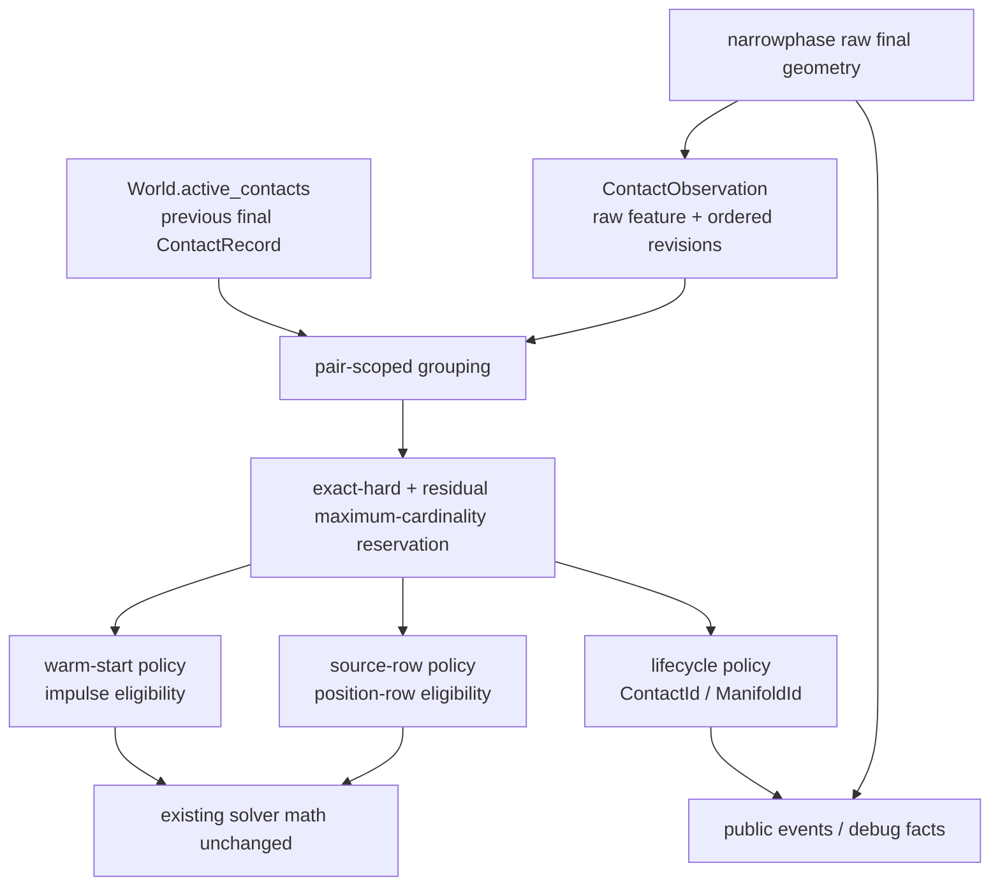
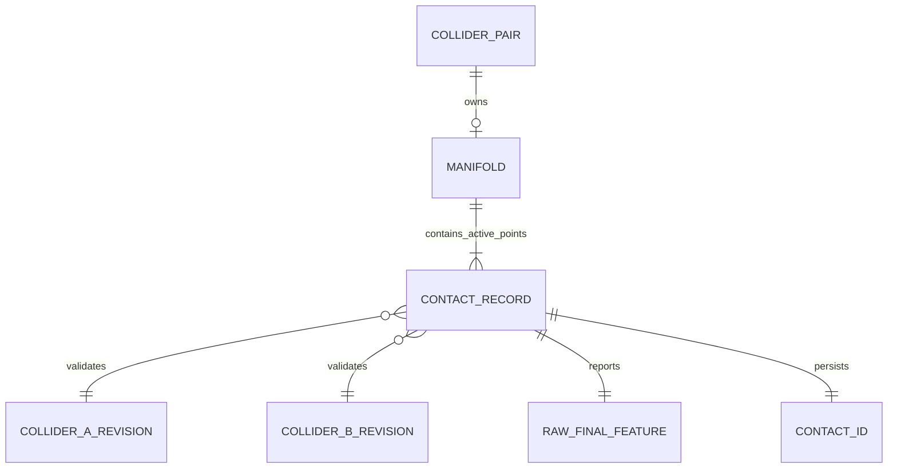

# SAT Manifold Persistence Design

状态：S4-D `6045bd2`、S4-RED `c4298ae`、S4-ORACLE-D `4a0c865`、S4-ORACLE-RED `4a32ddb`、S4-ORACLE-EVIDENCE `cca2475`、S4-ORACLE-REPLACE `d9d96b0` 已提交；S4-IMPL targeted accepted，commit pending
日期：2026-07-13
基线：`main=9427a17`
执行计划：`docs/plans/2026-07-13-vnext-s4-manifold-persistence-milestone.md`

## 决策摘要

用户已批准以下设计裁决：

1. `ContactFeatureId` 继续描述本帧 authoritative final geometry；SAT reference/incident role 交换时，raw feature 允许改变。
2. 跨帧等价由 history-aware `ContactId` / `ManifoldId` 一一持久化保证，不再要求无历史输入的 narrowphase 伪造稳定 raw id。
3. collider shape/local-pose geometry revision invalidation 纳入本切片；warm-start、lifecycle 和 source-row 三个 history consumer 都不得跨 revision 复用状态。

这三项裁决正式 supersede handoff §4 的 raw-id 字面目标，但保留并加强其真实意图：reference/incident role 交换不得造成物理接触点身份 churn，也不得错误复用另一个点的 impulse。

## 目标与非目标

目标：

- 对同一 ordered collider pair 的 current/predicted/final contact points 做 deterministic、exact-hard、residual maximum-cardinality、一对一 previous-point reservation。
- reference/incident role 交换时，两点按双侧 local witness 对应继承正确的 `ContactId`；同一 previous point 不得被消费两次。
- geometry revision 改变后，warm-start、lifecycle、source-row 都拒绝旧 contact state。
- 保留 final geometry、sensor、separation、A/B ordering、point-slot distinctness 和 matrix-stack 稳定性合同。

非目标：

- 不 canonicalize narrowphase raw feature，不增加 SAT hysteresis。
- 不改 contact solver math、position-row heuristics、sleep、broadphase、CCD 或阈值。
- 不新增 public handle、enum variant、serde field、prelude export 或 schema。
- 不进入 vNext E4 complex-shape、handoff §5 revolute joint 或 §6 design gates。
- 不把 lifecycle persistence 自动解释为 warm-start eligibility。

## 当前事实

### Fact

- SAT 在两个近似最小轴之间可因微小姿态变化交换 reference/incident role；ignored fixture 两帧 raw feature index 分别为 `16785408` 与 `16777218`，normal dot 大于 `0.999`。
- narrowphase 单次调用没有 previous manifold，无法判断跨帧 point correspondence。
- `pipeline/contacts.rs` 同时拥有 previous final contact records、current/predicted source rows 和位置积分后的 final manifold。
- current + predicted gather 对同一 pair 当前最多可产生 4 个 observations。Final manifold 缺失时，最多 4 个已确认 solver interactions 也可能进入 active records，因此下一帧 previous 不能假定只有 2 个。实现和规模锁按至少 4x4 设计。
- lifecycle、warm-start 和 source-row 目前分别扫描 previous contacts；source-row 会进入 position-row eligibility，因此它不是纯展示诊断。
- `ColliderRecord::geometry_revision` 当前为 private `u32`，shape 或 local pose patch 时递增，clone 保留 revision。
- 旧 `matrix_stack_long_settle_observation_reports_residual_e4_risk` 是历史失败形状的 observation lock；当前 forced E4 acceptance 与它断言相反，二者不能同时作为 live green gate。

### Inference

- raw feature 的 role-aware 编码对 final geometry 和 diagnostics 有价值，但不等价于 persistent point identity。
- 逐 current point 贪心选择最近 previous point，即使一对一消费，也可能得到非最大匹配；缺边图中会错误丢失可持久化点。
- exact feature、same-index slot drift 和 edge-swap 是不同语义。只有完整 key exact 才能产生 public `ExactFeature` lifecycle reason。
- shape/local-pose patch 后，即使 feature bits 和 local anchors 巧合接近，也不能复用旧 geometry 的 impulse、lifecycle 或 source-row state。

### Assumption

- 当前 narrowphase 每次返回不超过两个 final manifold points；current/predicted union 和 retained previous records 均可能达到四个。算法按 pair 分组并支持一般小规模输入，不依赖全局 contact count 扫描。
- `u64` revision 在一个 world 实例的实际生命周期内不会 wrap。该假设是残余风险，不宣称数学上永不 wrap。

### Recommendation

保留 raw feature，将三类 history consumer 路由到同一个 private reservation primitive；每类 consumer 提供独立 policy、candidate gate 和输出解释。

## 开源参考

只借鉴机制与不变量，不复制实现，也不增加依赖。

| 项目 | 固定来源 | License | 可借鉴 | 不直接照搬 |
| --- | --- | --- | --- | --- |
| Box2D 3.x | [manifold.c @ 56edae7](https://github.com/erincatto/box2d/blob/56edae79f2949d86142b03450d5d60f63bcf5a6f/src/manifold.c), [contact.c](https://github.com/erincatto/box2d/blob/56edae79f2949d86142b03450d5d60f63bcf5a6f/src/contact.c) | MIT | point id 按固定 shape A/B 解释；old/new exact id 后转移 impulse | 16-bit vertex pair 与 Picea handle/feature layout 不兼容；重复 key 仍依赖生成器保证 |
| Box2D 2.4 | [polygon collision @ 9ebbbcd](https://github.com/erincatto/box2d/blob/9ebbbcd960ad424e03e5de6e66a40764c16f51bc/src/collision/b2_collide_polygon.cpp), [ContactID](https://github.com/erincatto/box2d/blob/9ebbbcd960ad424e03e5de6e66a40764c16f51bc/include/box2d/b2_collision.h) | MIT | flip 时交换 A/B feature provenance；reference bias 减少抖动 | union overlay、8-bit index 和 SAT bias 都不适合作为 Picea persistence 修复 |
| Parry 0.29 | [contact_manifold.rs @ 8436f7c](https://github.com/dimforge/parry/blob/8436f7c21875f8225bc1af4c84190aeefa1ae672/src/query/contact_manifolds/contact_manifold.rs), [polygonal_feature2d.rs](https://github.com/dimforge/parry/blob/8436f7c21875f8225bc1af4c84190aeefa1ae672/src/shape/polygonal_feature2d.rs) | Apache-2.0 | 双侧 feature provenance；raw feature 与 tracked contact data 分层 | 其 matcher 不保证严格一对一，不能直接复制 |
| Rapier 0.34 | [narrow_phase.rs @ c13133a](https://github.com/dimforge/rapier/blob/c13133ad293ee70c7f9cec9e498eac016c362169/src/geometry/narrow_phase.rs) | Apache-2.0 | 区分 persistent geometric contact data 与当帧 solver contact index | solver `contact_id` 只是当帧数组下标，不是 Picea public `ContactId` |

访问日期均为 2026-07-13。若未来翻译代码而非独立实现不变量，必须另做 license/NOTICE/attribution review。

## 架构视图





`ManifoldId` 归 geometry-compatible ordered pair；通常两个 final manifold records 共享一个 manifold id，各自拥有独立 contact id。Confirmed source interactions 可令 active records 暂时超过两个，因此 ER 不把 record 基数写死为 2。

## 模块与依赖

| 模块 | 本切片职责 | 禁止扩张 |
| --- | --- | --- |
| `pipeline/narrowphase.rs` | 保留 raw SAT/clip geometry；迁移 ignored fixture 为 raw role-swap characterization | 不改轴选择、clipping、feature 编码、阈值 |
| `pipeline/contacts.rs` | pair grouping、reservation primitive、三个 policy、final lifecycle | 不改 solver row math、position correction threshold |
| `world/contact_state.rs` | previous record 保存 ordered collider geometry revisions | 不增加 public state/schema |
| `collider.rs` | private revision 升为 `u64` 并提供 crate-private getter | 不改 public `ColliderView` |
| `events.rs` / `debug.rs` | 澄清 raw `ContactFeatureId` 是当帧 final geometry feature；`ContactId` 才是跨帧 point identity；澄清 `MissFeatureId` 包含内部 geometry generation identity | 只改doc comments；不增加/重命名 enum variant、field或serde值 |
| `physics_realism_acceptance.rs` | history-aware 行为锁 | 不通过扩大阈值让测试绿 |

依赖方向保持 `collider/world state -> contacts -> solver/events projection`；narrowphase 不读取 world history。

## Software Interface Specs

### Ordered geometry identity

`ContactObservation` 和 `ContactRecord` 增加 private fields：

| Field | Type | 来源 | 约束 | 空值/错误语义 |
| --- | --- | --- | --- | --- |
| `geometry_revision_a` | `u64` | ordered `collider_a` record | 必须与 `collider_a` handle order 对齐 | 无空值；mismatch 禁止 history reuse |
| `geometry_revision_b` | `u64` | ordered `collider_b` record | 必须与 `collider_b` handle order 对齐 | 同上 |
| `feature_id` | `ContactFeatureId` | authoritative final narrowphase，或 solver-start source | 继续是 raw geometry id | revision 不能编码进 public id |
| `witness_a_local/b_local` | `Point` | 相对 ordered collider pose | 必须 finite 且分别比较 | non-finite candidate 不合格 |
| `is_sensor` | `bool` | 当前 observation；previous record独立保留 | lifecycle policy不得通过warm-start reason间接推断sensor | sensor无solver impulse |

geometry-compatible 定义为 pair handles、两侧 revisions 全部相等。Revision mismatch 不进入 exact 或 fallback reservation：warm-start 输出现有 `MissFeatureId`，lifecycle 输出 `Started` 并分配新的 `ContactId` 与 `ManifoldId`，source-row 在 solver rows 构建前输出 non-candidate。`MissFeatureId` 的 public variant/serde 不变，只澄清其“point-level feature identity”包含内部 geometry generation。

Public documentation同时澄清：`ContactFeatureId` 是 authoritative current geometry feature，在 SAT role swap时可变；跨帧稳定身份由 `ContactId` / `ManifoldId` 表达。该修订只改doc comments，不改Rust类型或序列化合同。

### Reservation primitive

概念接口：

```text
reserve_previous_matches(current_pair, previous_pair, policy)
  -> Vec<Option<ReservedPrevious>> aligned with current_pair
```

输入必须已按 ordered `ContactPairKey` 分组；禁止每个 current observation 重扫全局 previous map。

`ReservedPrevious` 包含 private previous key、match kind 和 score，不暴露 public API。

| Match kind | Full key exact | Same feature index | Edge swap |
| --- | --- | --- | --- |
| `Exact` | 是 | 隐含 | 否 |
| `SameFeatureIndex` | 否，slot 可变 | 是 | 否 |
| `PersistentEdgeSwap` | 否 | 否 | reference/incident edges 对调 |
| `SourceRowCandidate` | 否 | policy 不依赖 feature equality | 明确排除 edge swap |

确定性排序：

1. 先固定预留所有 geometry-compatible full exact matches。Exact 是不可牺牲的身份硬约束，即使牺牲它能让 fallback 总数更高也不得释放。
2. 对 exact 预留后的 residual candidate graph 枚举全部合法 matching。
3. 在 residual graph 内优先最大 cardinality。
4. warm-start policy 在 cardinality 相等时优先更多 `SameFeatureIndex`；其他 policy 无此偏好。
5. 再最小化最大 local-anchor drift、总 drift。
6. 最后按 `(current_key, previous_key, match_kind)` 的完整 lexicographic mapping 决胜。

这避免贪心反例：没有 exact edge时，`c0-p0=.01, c0-p1=.02, c1-p0=.03` 且 `c1-p1` 不合格，必须选择两个 matches，而不是只选最近的一个。

Exact-hard反例的预期相反：`c0-p0 exact, c0-p1 fallback, c1-p0 fallback` 时固定 `c0-p0`，即使全图 cardinality 因此只有1。Fallback不得通过“匹配更多”窃取明确属于 exact current point 的previous identity。

当前每 pair 的 current source observations 和 previous active records 都可能达到4；复杂度目标为 `O(total_contacts log n + pairs * matchings(k))`，当前 `k <= 4`。不得随无关 pair数量退化为 current × global previous全扫描；4x4全候选规模锁必须覆盖实现的枚举上界。

S4-RED允许在`persistent_manifold_lifecycle_candidate`入口使用仅`#[cfg(test)]`编译的thread-local evaluation counter，对比同一4x4 pair有无unrelated pairs时的candidate evaluation count。reset/read helper、storage和递增路径在非test build中必须完全不存在；该instrumentation不参与返回值、排序或production behavior。

S4-IMPL必须把该`#[cfg(test)]`increment迁到新matcher实际使用的candidate-edge predicate；不能把increment遗留在被替换的旧函数上，让A15以`0 == 0`真空通过。Implementation reviewer必须确认4x4 baseline count保持`> 0`且`<= 16`，并与加入unrelated pairs后的count相等。

### Consumer policies

| Consumer | Exact | Same-index | Edge-swap | Revision mismatch | 是否转移 impulse |
| --- | --- | --- | --- | --- | --- |
| Warm-start | 保留，仍过 normal/anchor/sensor/finite gates | 允许，仍过同一安全门 | 允许，仅 normal impulse，tangent清零 | `MissFeatureId` | 只有 `Hit`；双点distinct sentinel impulses必须按local witness对应 |
| Lifecycle | `ExactFeature` | 禁止 | solid->solid 时 `PersistentEdgeSwap` | `Started` | 否 |
| Source-row | exact warm hit 时无需 candidate | 只按既有 non-edge geometric continuity policy | 禁止 | solver rows构建前non-candidate | 否；独立一对一，不能让两个rows消费一个previous candidate |

三类 policy 独立运行并独立消费 previous records；它们只共享 reservation mechanics。一个 lifecycle match 不授权 warm-start，一个 source-row match也不授权 impulse。

### Sensor and separation policy

| Previous -> current | Exact lifecycle | Same-index lifecycle | Edge-swap lifecycle | Warm-start |
| --- | --- | --- | --- | --- |
| solid -> solid | 保持 | 禁止 | 可持久，需 geometry/normal/anchor gates | 按安全门 |
| sensor -> sensor | 保持现有 exact | 禁止 | 禁止 | `SkippedSensor` |
| solid -> sensor | 保持现有 exact event identity | 禁止 | 禁止 | `SkippedSensor` |
| sensor -> solid | 保持现有 exact event identity | 禁止 | 禁止 | exact 为 `MissPreviousSensor`，非 exact 不复用 |

Previous sensor身份由private `ContactRecord::is_sensor` 承载，lifecycle不依赖`warm_start_reason`反推。

Final geometry无overlap且没有本帧confirmed solver interaction时，不得仅靠history保留contact。既有“base normal solve执行且累计正finite impulse”的confirmed interaction可在final manifold缺失时保留depth 0事实；本切片不删除或扩大该语义。

## 核心流程

```text
group current and previous once by ordered collider pair
for each pair:
    reject every cross-revision edge
    reserve compatible full-key exact edges
    build policy-specific candidate graph for unmatched points
    enumerate legal one-to-one matchings
    preserve exact, then choose residual maximum-cardinality deterministic result

warm-start:
    run warm policy on solver-start observations
    apply existing safety gates; edge-swap clears tangent impulse

source-row:
    only MissFeatureId rows enter existing continuity classification
    reserve previous points one-to-one before position rows are built
    edge swap and revision mismatch reject; no stale candidate reaches solver

after final geometry refresh:
    run lifecycle policy on final observations
    publish final raw feature/point/normal
    reuse ContactId only from the reserved corresponding local witnesses
```

## 2 -> 1 -> 2 lifecycle

三帧行为固定为：

- frame N：两个 points，各有独立 `ContactId`，共享一个 `ManifoldId`。
- frame N+1：按 local witness 对应的幸存 point 保留其 `ContactId`；消失 point 发 `ContactEnded`。
- frame N+2：幸存 point 继续持久；返回 point 获得新 `ContactId`，但同 pair 继续共享现存 `ManifoldId`；不得复活 N 帧的旧 impulse。

验收必须按 local-anchor 对应检查，不只比较 unordered id set，防止左右点互换。

## Geometry revision 与事务

- `geometry_revision` 从 private `u32` 升为 `u64`；shape 或 local-pose patch递增，material/filter/sensor/user-data patch不递增。
- direct successful patch 下一 step 必须拒绝旧 contact history，并分配新的 `ContactId` 和新的 `ManifoldId`；不能从仅按pair预填的old manifold map泄漏旧id。
- `WorldCommands` scratch clone 保留 revision；成功事务提交递增后的 revision 与 world state，失败事务不替换原 world，因此 revision/contact history 均不变。
- revision mismatch 对三个 consumers 都是 hard invalidation，不尝试用“anchors仍接近”绕过。
- `u64` wrap 仅记录为理论残余风险，不加 panic/unwrap 或 public error。

## Tradeoffs / ADR

### ADR-S4-1：拒绝 stateless canonicalization

选择：raw feature 保持 role-aware，persistent identity 放在 contacts history layer。

原因：canonical edge tuple 无法单独判断 point-slot correspondence。历史实验 `d773aad` 把 feature misses 从 `418` 降到 `35`，但在 frame 83 发生 ejection，penetration 约 `0.075719`、quiet linear 约 `14.874845`；见 `docs/plans/2026-05-06-matrix-stack-stability-optimization-milestones.md` 的 canonicalization 负实验记录。

### ADR-S4-2：拒绝 SAT reference hysteresis

选择：不改变最小轴、normal、depth 或 clipping geometry。

原因：hysteresis 会修改本帧物理几何和 row ordering，blast radius 高于 history-only matching。

### ADR-S4-3：exact-hard 后 residual 最大基数优先

选择：exact reservation 后枚举小规模 candidate graph。

原因：逐边最近贪心不保证完整双射；当前 per-pair规模小，枚举成本有明确上界。

### ADR-S4-4：warm provenance 与 final lifecycle attribution 分离

选择：artifact diagnostics 分别报告 solver-start warm miss、final lifecycle 已吸收 edge-swap candidate 和未吸收 candidate，不再用一个 `edge_swap_candidate_count` 同时代表三者。

原因：warm/source-row 在 solver 前消费 current/predicted observations；lifecycle 在位置积分和 final manifold refresh 后运行。`MissFeatureId + PersistentEdgeSwap` 是合法组合，表示 solver-start 没有可安全复用的 previous impulse，但 final geometry仍能一一对应到持久 contact identity。

旧 matrix `edge_swap_candidate_count == 0` 在 S4-ORACLE-RED 期间保持原样。以下替代锁先在working tree写成test-only diff，经reviewer批准并由verifier把同一patch双跑于`c4298ae` baseline和working implementation；通过后才提交固定test commit `T`。随后S4-ORACLE-EVIDENCE复跑并经spec/code review通过，才允许把该含糊断言替换为更强的absorbed/unabsorbed assertions：

- Final candidate edge完全独立于warm/lifecycle输出：同ordered pair、clip-family compatible、非symmetric raw edge role swap、normal dot `>=0.98`、双侧final midpoint local-anchor drift `<=0.25`、全部输入finite。先按full raw feature exact-hard预留，再在residual graph做最大基数一对一；不得用每点最近邻重复消费previous point。该midpoint gate是独立的artifact-observable midpoint projection，不对core private surface-witness gate主张subset或等价关系；A02/O02继续拥有core双侧surface identity acceptance。
- `final_candidate_total == final_attributed + final_unabsorbed`。Final-attributed candidate必须同时满足`ContactPersisted` event variant、`PersistentEdgeSwap` reason、oracle匹配的previous/current `ContactId`相同且每帧只用一次、`ManifoldId`相同；任何一项不满足都归final-unabsorbed。
- 所有reported `ContactPersisted + PersistentEdgeSwap`必须再满足`reported_total == final_attributed + source_boundary_evidence + unexpected`，三类按`(frame, ContactId)` transition key互斥。任何不属于final-attributed或完整source-boundary evidence的输出都归unexpected。
- Final-unabsorbed与unexpected数量都必须为0；`Started`、`Unknown`、错误`ExactFeature`、错误IDs或错误previous映射不能从分类中漏掉。
- Exact theft按实际输出ID检测：存在geometry-compatible full exact predecessor时，current必须继承该predecessor的`ContactId`；不得由oracle自己的exact reservation构造性地产生0。
- Candidate若 `warm_start_reason != Hit`，warm normal/tangent impulses必须为0；所有drift/impulse必须finite。
- 独立真实SAT和artifact传播锁必须证明至少一个非exact role swap被正确标记，避免通过“全部不匹配”让unabsorbed计数真空为0。
- Matrix180、aligned1200、forced600现有penetration、速度、sleep、support/ejection阈值逐行不变。

O01的attribution report仅为`artifact_run.rs` test-local struct/helper，不增加artifact/public schema。Finite gate读取未sanitize的`FrameRecord.events`，再与snapshot和实际落盘`frames.jsonl`投影交叉核对；不能只读会把non-finite scalar归零的sanitized snapshot。O03必须从落盘artifact反序列化，不能只检查内存`RunResult`。

Source-boundary evidence不是private `base_normal_solve_executed`真值的替代。每条必须有同ordered pair中唯一same-`ContactId`/same-`ManifoldId` predecessor、full feature不同且无full-exact predecessor、非symmetric raw role swap，并且previous/current至少一端满足fail-closed observable projection：non-sensor、`depth == 0`、polygon SAT明确`Some(false)`、finite positive solver normal impulse。缺collider、unsupported shape、退化轴或SAT无法判定都归unexpected。Source endpoint的feature/point/normal不能被描述为final manifold geometry。

## Acceptance Scenarios

| ID | 场景 | Binary success bar | 证据 owner |
| --- | --- | --- | --- |
| A01 | raw SAT role swap | 原 fixture normal `>0.999`、drift `<0.25`、raw feature indices `!=` | narrowphase unit |
| A02 | 两点 persistent bijection | 两个 current points 都按 local anchors继承正确 ContactId；同一 ManifoldId；raw current feature仍是final geometry | physics integration |
| A03 | exact reservation | fallback不能偷走 later full exact previous；exact-hard反例预期1个exact而不是2个fallback | contacts unit |
| A04 | 缺边图 | 选择2个matches而非greedy的1个 | contacts unit |
| A05 | warm-start一一对应 | 一个previous impulse最多消费一次；双点distinct sentinel impulses按local witness对应，不得互换 | contacts unit |
| A06 | residual cross-kind ranking | exact固定后，residual cardinality优先于same-index数量，之后才按kind/drift决胜 | contacts unit |
| A07 | source-row revision/一一对应 | geometry mismatch在position rows构建前non-candidate；两个rows不得复用一个previous candidate | contacts unit pre-solver observation |
| A08 | direct geometry patch | shape/local-pose patch后 lifecycle Started、新ContactId、新ManifoldId、无warm hit/source candidate | physics integration |
| A09 | transaction geometry patch | successful command分配新ids；rejected command保持revision/contact/manifold history | world/physics |
| A10 | sensor matrix | exact保持既有事件；same-index/edge-swap不扩大sensor persistence；无impulse | physics integration |
| A11 | 2->1->2 | 幸存/结束/返回point身份与impulse符合本设计 | physics integration |
| A12 | normalized A/B | handle order交换不改变ordered revisions与对应关系 | existing + new integration |
| A13 | history-only separation | final无overlap且无confirmed interaction时不被history伪造；既有confirmed depth-0语义保持 | contact finalization locks |
| A14 | matrix regression | matrix180、aligned1200、forced E4 600全部无ejection/runaway且既有阈值不变 | picea-lab artifact |
| A15 | 4x4/unrelated-pair scale | 4 current x 4 previous枚举确定且候选评估只与当前pair有关，不随全局unrelated previous contacts线性放大 | contacts unit |
| O01 | matrix edge-swap attribution | conservative candidates按一对一ID归因为absorbed/unabsorbed；exact theft单独报告 | picea-lab artifact test |
| O02 | 真实SAT lifecycle reason | raw role swap且无full exact predecessor时，双点保持ids并明确`PersistentEdgeSwap` | physics integration |
| O03 | artifact propagation | core persisted event/debug/artifact至少传播一个稳定`PersistentEdgeSwap`，ids一一连续 | picea-lab artifact test |
| O04 | A14 preservation | 三条matrix命令与所有既有数值/稳定性断言原样保留 | diff audit + existing artifact tests |
| O05 | symmetric-edge negative | `reference_edge == incident_edge`不得作为role swap或source-row EdgeSwap | physics integration |

## 风险矩阵

| 风险 | 严重度 | 缓解 | 残余 |
| --- | --- | --- | --- |
| 错点 impulse 转移 | High | exact-hard + residual最大基数一对一 + 双侧local witness | 浮点阈值边界仍需matrix gate |
| stale shape history进入solver | High | ordered `u64` revisions覆盖三个consumers | 理论 wrap |
| source-row重复消费 | High | 独立一对一 policy | 既有position heuristic仍是后续技术债 |
| public reason误标 | Medium | same-index不用于lifecycle；只澄清MissFeatureId注释 | 外部用户可能需阅读新说明 |
| candidate enumeration成本 | Medium | pair-scoped；当前4x4小图；规模锁 | 未来多点manifold需重评 |
| raw feature仍churn被误读 | Low | events同时暴露lifecycle reason/ContactId | artifact命名仍有既有解释风险 |
| warm/lifecycle诊断混淆 | High | O01-O05先RED归因，再用absorbed/unabsorbed替换含糊counter | lab-derived heuristic仍不拥有core physics truth |

## 里程碑交接合同

| Architecture item | Source | Owner | Required acceptance | Evidence |
| --- | --- | --- | --- | --- |
| raw/persistent分层 | 决策摘要、ADR-S4-1 | worker | A01/A02 | unit + integration |
| exact-hard/residual最大基数matcher | Reservation primitive | worker | A03-A06/A15 | contacts unit |
| revision invalidation | Geometry revision与事务 | worker | A07-A09 | contacts/world/physics |
| lifecycle边界 | Consumer/sensor policy | worker | A10-A13 | physics integration |
| 稳定性无回归 | Acceptance A14 | verifier | 全部hard gates green | command receipts |
| diagnostic oracle归因 | ADR-S4-4 / O01-O05 | artifact worker + reviewers | 新旧实现归因、真实SAT/artifact正向锁、symmetric negative、原数值门零改动 | dual-baseline receipts |
| scope/API | 目标与非目标 | spec/code reviewers | `lib.rs`/solver/public schema无行为diff | base-relative git diff |

S4-D review 通过只表示设计可执行，不授权省略 RED、code review 或 verifier receipt。
