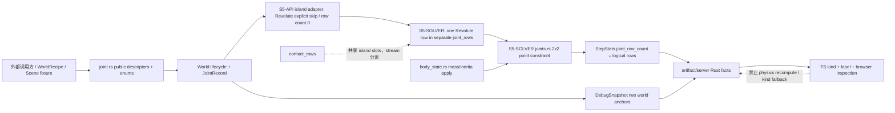
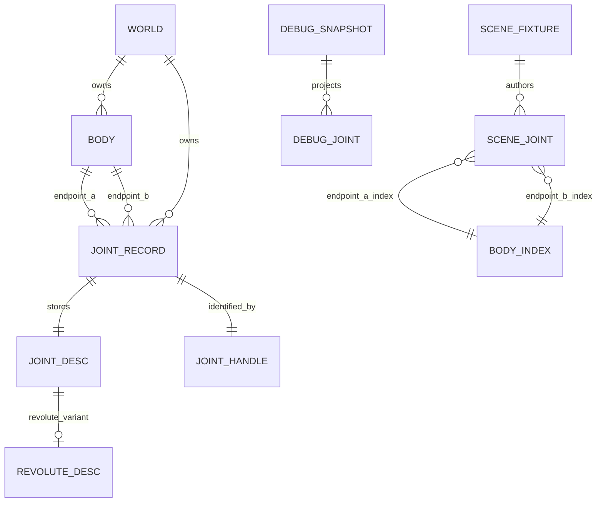

# Picea Revolute Joint Pin-only V1 软件架构设计

状态：S5-D review / verifier 已通过，commit 待完成；implementation / API / solver 未开始；Chrome `NOT RUN / BROWSER PENDING`
设计文档：`docs/design/2026-07-14-revolute-joint-v1-design.md`
最后更新：2026-07-14
工作目录：`/Users/asyncrustacean/projects/picea`
执行计划：`docs/plans/2026-07-14-vnext-s5-revolute-joint-milestone.md`
父计划：`docs/plans/2026-06-17-physics-realism-vnext-milestones.md`
Profiles：architecture-heavy, api-contract, ui-browser
Artifact 状态：architecture reviewed；ADR accepted；risk matrix reviewed；S5-D commit pending；implementation not started

## 1. 背景、目标与边界

本设计把用户已批准的 handoff §5“完整 Pin-only V1”边界收敛为已通过S5-D review/verifier、等待commit的架构包。已冻结的是 public字段、`#[non_exhaustive]`列表、wake语义、lab范围和延期项；2x2具体apply、solver pose selection、checkpoint ownership与acceptance plan已经通过S5-D文档验收，但implementation仍必须按后续RED-first节点逐项取证。V1 的 revolute joint 只约束两个 body 的 local anchor 在 world space 重合；相对旋转保持自由。

目标：

1. 在现有 `World + SimulationPipeline` 主线上增加一个可创建、查询、patch、删除、recipe authoring、debug 投影的 revolute joint。
2. 用包含偏心 anchor 与转动惯量的 2x2 point constraint 同时解两个平移自由度。
3. 统一所有 joint kinds 的 lifecycle wake 语义，并保持 `WorldCommands` transaction 原子性。
4. 在 schema v1 内增加 `type: "revolute"` fixture capability，并由 Rust facts 驱动 lab/Web 展示。
5. 用 RED-first 行为锁、独立 reviewer/verifier 和真实 browser gate 形成可复跑证据链。

非目标：

- 不增加 motor、angle limits、`reference_angle`、stiffness、damping、break force 或 persistent joint warm-start cache。
- 不增加 `collide_connected`；connected bodies 继续按现有 collision filter 产生 contact。
- 不改变 contact solver、contact/joint phase ordering或把两类 row stream 合并。
- 不把一个 revolute 的 x/y 约束计成两个 logical joint rows。
- 不增加 generic live joint patch protocol，不增加 motor/limit UI。
- 不升级 fixture schema version，不修改 Cargo manifest/依赖。
- 不重开已经冻结的 handoff §4，也不冒充父计划 E5/E6 已完成。

## 2. 证据分级与未决项

### Fact（已由 2026-07-14 live source 核对）

- `crates/picea/src/joint.rs` 当前只有 `Distance` / `WorldAnchor` descriptor、patch、kind、record 和 validation；所有相关 public enums 当前都没有 `#[non_exhaustive]`。
- `crates/picea/src/world/api.rs` 的 `create_joint`、`apply_joint_patch`、`destroy_joint_internal` 当前都不产生 lifecycle wake；create 会先验证 descriptor、topology 和 live handles，patch 会先完整验证再 mutation。
- `WorldCommands` 在 clone 的 scratch world 上执行所有 commands，仅在全部成功后 `*self.world = scratch`；rejected transaction 不替换 authoritative world。
- `crates/picea/src/pipeline/step.rs` 的 live 顺序是 velocity integration -> CCD pose clamp -> mandatory joint -> contact solve -> optional joint velocity projection -> position integration -> final contact -> sleep。
- `pipeline/island.rs` 已把 `contact_rows` 与 `joint_rows` 分开存储，但共享 deterministic island-local body slots；`joint_row_count` 当前按 `joint_rows.len()` 统计。
- `pipeline/sleep.rs::build_active_solver_islands`只要求同一island至少一个body awake或有wake
  reason；因此与awake endpoint相连的sleeping dynamic仍可进入active joint row。
- mandatory joint position phase之后，contact solve与optional joint velocity projection都可能
  修改linear/angular velocity；final integration消费修改后的velocity。CCD-clamped dynamic
  继续skip linear advance，但不会skip angular advance。
- `StepConfig::joint_velocity_projection`的public doc当前仍写成distance-joint radial
  projection，default/serde行为锁已存在于`pipeline.rs`。
- `solver/body_state.rs` 的 existing pair position helper只按 inverse-mass category平移，不包含 anchor lever arm 或 inverse inertia；point impulse helper已按 Picea clockwise-positive 角速度约定消费 inverse inertia。
- `DebugJoint` 已有通用 `bodies: Vec<BodyHandle>` 与两个 world-space `anchors`，无需新增 debug payload field；`WorldEvent::JointCreated/JointRemoved` 也无需新增 event schema。
- lab scenario 已模块化为 `crates/picea-lab/src/scenario/{mod.rs,fixture.rs,...}`。`SceneJointFixture` 当前是 schema v1 tagged enum，只有 `distance` / `world_anchor`。
- `artifact.rs` 和 `server.rs` 直接投影 `DebugSnapshot.joints` 与 `joint_row_count`；Web `DebugJoint.kind` 当前是 `"distance" | "world_anchor"`，label 由 `dynamicValueLabel` 消费。

### Inference（由现状强推导，仍由后续行为锁验真）

- Revolute 需要在 joint row 内保存两个 body slots 与完整 descriptor；一个 enum row carrier 即可保持 logical row count 为 1。
- velocity-first pipeline下，mandatory joint position phase只能按该sampling时点的velocity
  构造eval pose：static与sleeping dynamic保持current；kinematic/awake dynamic预测；
  CCD-clamped awake dynamic只保留current translation但预测sampling angle。该pose不承诺
  等于contact/projection之后的final pose，必须由full-step行为锁验真整体drift。
- lifecycle wake 可以复用现有 `SleepTransitionReason::UserPatch`，把 `JointCorrection` 保留给 solver 实际改变 pose/velocity 的运行时原因；不需要新增 public wake reason variant。
- generic artifact/server 投影预计只需新增 tests，不需要 production special case；若实现时发现不是这样，先更新本设计，不允许 Web 重算或猜 joint facts。

### Decision（用户已冻结边界）

- public surface、`#[non_exhaustive]` 边界、wake 操作集合、lab 范围和延期项以 handoff §4.1-§4.5 为准。
- `SceneRevoluteJointFixture` 使用 required `body_a/body_b` 和 optional `local_anchor_a/local_anchor_b/user_data`；省略 optional 字段时复用 core defaults。
- builtin capability 使用 `ScenarioId::RevolutePendulum` / `revolute_pendulum`。这满足已批准的可复现 pendulum/hinge 场景，不改变 `ScenarioId` 的 attribute policy。
- lifecycle mutation 使 sleeping dynamic endpoint 以 `UserPatch` 唤醒；solver correction 继续以 `JointCorrection` 唤醒。
- fixture envelope 保持 schema v1；新 reader 读旧 v1 数据，旧 reader 读含 `revolute` 的新数据会明确 unknown-variant reject。
- 当前CLI不执行Chrome；S5-LAB/S5-V browser acceptance由外部ChatGPT App按living spec固定
  prompt针对明确full commit SHA回填。未回填只能PENDING/NOT RUN。

### S5-D architecture decisions（review / verifier 已通过，commit 待完成）

- S5-API checkpoint先使所有exhaustive consumers可编译：core `pipeline/island.rs` 对
  `Revolute` 显式skip，不创建solve-plan/solver row，所以该checkpoint的
  `joint_row_count == 0`。S5-BEHAVIOR-RED随后锁定这个缺口，S5-SOLVER才增加one-row
  carrier和2x2 math。
- position `lambda` 导出的平移量是world center-of-mass delta，不是Pose origin delta；
  local COM非零时必须先在`eval_pose`上由corrected world COM和corrected angle反推
  corrected origin，再移除position sampling使用的advance，得到要写回的current pose；
  后续final integration仍以contact/projection更新后的velocity为准。
- debug JSON增加`"revolute"`是additive capability；old serde consumer会明确
  unknown-variant reject，不宣称forward compatible。

### Unknown（无阻塞项）

不存在阻塞设计决策。后续唯一允许触发停机的未知是 live implementation 证明本设计与当前 source contract 冲突；此时必须先修订 design/living spec，不能静默扩大 public surface 或算法范围。

## 3. 领域名词

| 名词 | 含义 | 正确性作用 |
| --- | --- | --- |
| pin-only | 只令两个 world anchors 重合，不约束相对角度。 | 防止 V1 偷渡 motor/limit/fixed-angle 语义。 |
| point constraint | 二维向量约束 `C = pB - pA = 0`。 | 必须联合求解 x/y，不能串行模拟。 |
| logical joint row carrier | island/debug 中代表一个 joint 的内部 row enum 值。 | `joint_row_count` 对一个 revolute 保持 1。 |
| effective mass `K` | 把二维 impulse/correction 映射到 relative anchor velocity/position change 的 2x2 矩阵。 | 同时包含 inverse mass、lever arm、inverse inertia。 |
| lifecycle wake | create/patch/remove/topology mutation 对 sleeping dynamic endpoint 的状态副作用。 | 与 solver 本帧 correction wake 分离。 |
| constraint patch | `local_anchor_a` 或 `local_anchor_b` 至少一个字段为 `Some`。 | 成功后必须 wake；`user_data`-only 不 wake。 |
| schema v1 capability | envelope/version 不变，只增加 tagged enum capability。 | 新 reader 向后读旧数据；不伪称旧 reader 前向兼容。 |

## 4. 开源先例与本地所有权

只参考算法/API 分层，不引入依赖、不复制实现。版本与 license 来自 2026-07-14 官方 repository manifest/license：

| 项目 | 固定来源 | License | 参考内容 | Picea 不采用 | 本地所有权 |
| --- | --- | --- | --- | --- | --- |
| Rapier 0.29.0 | `rapier/src/dynamics/joint/revolute_joint.rs`、joint guide | Apache-2.0 | 两端 local anchors；旋转是 free DOF；motor/limits 是独立能力 | generic joint bitmask、motor/limit surface、依赖 | Picea descriptors、World lifecycle、deterministic debug/lab facts |
| Box2D 3.1.1 | `include/box2d/types.h`、`src/revolute_joint.c` | MIT | point-to-point Jacobian、2x2 `K`、linear impulse与角向 lever arm | spring/motor/limit/warm-start state、solver architecture | Picea clockwise-positive rotation、velocity-first phase和fail-closed policy |
| Avian 0.7.0 | docs.rs API、XPBD revolute source | MIT OR Apache-2.0 | anchor-based API 与独立 advanced capabilities | ECS/Bevy/XPBD execution model | Picea `World` store、island slots、artifact/browser acceptance |

结论：三者共同支持“local anchors 是基础 pivot；motor/limits/softness 是独立扩展”的边界。Picea V1 自研小型 2x2 solve，以当前 runtime/ownership 为权威。若未来从参考项目翻译代码，需另做 license/NOTICE/attribution review；本设计不授权翻译。

## 5. 模块边界与源码组织

| 模块/文件 | S5 职责 | 允许依赖/写入 | 禁止扩张 | 变化理由 |
| --- | --- | --- | --- | --- |
| `crates/picea/src/joint.rs` | `RevoluteJointDesc/Patch`、enum variants、record body handles、validation/apply | handles、Point、existing errors | motor/limit/damping/cache | public domain contract owner |
| `crates/picea/src/lib.rs` | prelude 只重导出 desc/patch | `joint` public types | 不重导出 `JointKind` | 保持批准的 prelude 边界 |
| `crates/picea/src/world/api.rs` | topology/live-handle validation、atomic lifecycle、wake | existing store/sleep helpers | 新 event/wake enums | authoritative lifecycle owner |
| `crates/picea/src/recipe.rs` | `JointBundle::Revolute`、body-index resolve、commands | existing scratch transaction | hot-path solver behavior | declarative authoring owner |
| `crates/picea/src/pipeline/island.rs` | S5-API只加`JointDesc::Revolute`显式skip compile adapter；S5-SOLVER才增加one-row carrier和dense slots | `JointDesc` | API checkpoint不得创建solve-plan row；始终禁止unified stream | 分开API可编译性与solver行为ownership |
| `crates/picea/src/pipeline/joints.rs`、new `pipeline/joints/tests.rs` | S5-BEHAVIOR-RED只允许`#[cfg(test)] mod tests;`和test-only 2x2/sign/singular locks；S5-SOLVER才增加production position/velocity math | island rows、body state | RED节点不得提前实现row/math；禁止phase reorder、warm cache | 先锁test contract，再进入numeric orchestration |
| `crates/picea/src/pipeline.rs` | S5-SOLVER只同步`joint_velocity_projection` public doc与既有default/serde配置锁 | `StepConfig` existing field/tests | 不增加字段、不改default、不改phase order | public配置描述覆盖distance和revolute point-velocity semantics |
| `crates/picea/src/solver/body_state.rs` | pair point correction/impulse的最小 helper | body record/mass facts | contact solver stream | 集中 Picea angular sign 与原子 apply |
| `crates/picea/src/debug.rs` | `DebugJointKind::Revolute`、two-anchor projection | World/JointDesc | 新 debug fields | stable read model owner |
| `crates/picea/src/events.rs` | 无 schema 变更；只使用 existing wake/joint events | existing enum | 新 variants | 已有通用事件足够 |
| `crates/picea-lab/src/scenario/fixture.rs` | schema v1 revolute fixture | public recipe API | schema v2、generic live patch | authored JSON owner |
| `crates/picea-lab/src/scenario/scene_lattice.rs`、`scenario/fixture/tests.rs`及compiler指出的其他external exhaustive consumers | S5-API迁移`JointDesc` non-exhaustive match；仅加wildcard/compat分支 | external public API | 不借兼容迁移改变场景行为或断言强度 | `picea-lab`是external crate，新增attribute后必须显式迁移 |
| `crates/picea-lab/src/scenario/mod.rs`、`scene_dispatch.rs`、new `scene_revolute.rs` | deterministic pendulum catalog/build | fixture/core API | physics recompute | scenario owner |
| `artifact.rs` / `server.rs` | generic projection tests；仅有证据证明必要时才改 production | DebugSnapshot/StepStats | joint reinterpretation | evidence/transport owner |
| `crates/picea-lab/web/src/types.ts`、`i18n.ts`、consumers | kind union、label、inspection | Rust JSON facts | fallback 成其他 kind、motor UI | presentation owner |
| `docs/design/solver-island-ordering-contract.md` | 在 S5-C 同步 live phase order | live source | unified streams | 修复既有文档漂移 |

依赖方向保持：public descriptors -> World/recipe -> island row -> joint solver -> debug snapshot -> lab artifact/server -> Web。Web 只消费 Rust facts。

## 6. 架构与数据流



数据与 ownership 要点：

- `JointRecord` 是 descriptor 的 authoritative retained owner；S5-API checkpoint只存储/投影descriptor并在island显式skip。S5-SOLVER后solver row才每步clone descriptor，且不保留impulse cache。
- `World` 是 create/patch/remove/revision/event/wake 的唯一 write owner。
- `IslandSolveBatch` 可以让 contact/joint 共享 body slots，但 `contact_rows` 与 `joint_rows` 始终是两个 collections 和两个 phases。
- `DebugSnapshot` 是 lab/Web 的 joint geometry事实源；artifact/server 不重新推导 anchor 或 kind。

## 7. Software Interface Spec

### 7.1 接口：Core Revolute Descriptor / Patch

职责：表达一个 body pair 的 pin-only pivot 和允许的原子更新。

```rust
pub struct RevoluteJointDesc {
    pub body_a: BodyHandle,
    pub body_b: BodyHandle,
    pub local_anchor_a: Point,
    pub local_anchor_b: Point,
    pub user_data: u64,
}

pub struct RevoluteJointPatch {
    pub local_anchor_a: Option<Point>,
    pub local_anchor_b: Option<Point>,
    pub user_data: Option<u64>,
}
```

契约摘要：

| 项 | 说明 |
| --- | --- |
| 调用形式 | `World::create_joint(JointDesc::Revolute(desc))`；`World::apply_joint_patch(handle, JointPatch::Revolute(patch))` |
| 同步性 | 同步、单 world authoritative mutation |
| 稳定性 | public beta；本次是明确 source compatibility gate |
| 版本 | Rust API 不单独版本化；fixture envelope 见 §7.4 |

字段：

| 字段 | 类型 | 必填/可空 | 含义/生产者 | 校验 | Default / 空值 | compatibility | 示例 |
| --- | --- | --- | --- | --- | --- | --- | --- | --- |
| `body_a` | `BodyHandle` | desc 必填 | first endpoint；caller/recipe | handle live；与 B 不同 | invalid default handle | patch 不允许换 endpoint | `body_a` |
| `body_b` | `BodyHandle` | desc 必填 | second endpoint | handle live；与 A 不同 | invalid default handle | 同上 | `body_b` |
| `local_anchor_a` | `Point` | desc 必填；patch optional | body A local pivot | x/y 均 finite | `(0,0)`；`None`=保持 | additive field set frozen | `Point::new(0.0, -1.0)` |
| `local_anchor_b` | `Point` | desc 必填；patch optional | body B local pivot | x/y 均 finite | `(0,0)`；`None`=保持 | 同上 | `Point::new(0.0, 1.0)` |
| `user_data` | `u64` | desc 必填；patch optional | opaque caller payload | 全域合法 | `0`；`None`=保持 | 不影响 physics/wake | `42` |

Default：invalid/default handles、zero local anchors、`user_data=0`。Default 可构造但不能成功 create，保持现有 descriptor 风格。

输出与同步 surface：

| Surface | 新增形态 | 约束 |
| --- | --- | --- |
| `JointKind` | `Revolute` | `#[non_exhaustive]`；serde `"revolute"` |
| `JointDesc` | `Revolute(RevoluteJointDesc)` | `kind() == JointKind::Revolute` |
| `JointPatch` | `Revolute(RevoluteJointPatch)` | 只能 patch stored Revolute；wrong kind 保持 existing error |
| `JointView` | existing `desc()/kind()` | 不增加 typed getter |
| prelude | `RevoluteJointDesc`, `RevoluteJointPatch` | `JointKind` 继续 module-qualified |

错误：

| 错误 | 触发 | 形态 | 原子性/副作用 |
| --- | --- | --- | --- |
| invalid anchor | 任一 component NaN/Infinity | `WorldError::Validation(ValidationError::JointDesc/JointPatch { field })` | descriptor/revision/wake/row facts均不变 |
| missing/stale body | create endpoint 不属于当前 world | existing `HandleError::MissingBody/StaleBody` | 不分配 joint、不 attach、不 wake |
| same body | `body_a == body_b` | `TopologyError::SameBodyJointPair { kind: Revolute }` | 同上 |
| wrong patch kind | patch kind与 stored kind不同 | `HandleError::WrongJointKind` | descriptor/revision/wake不变 |
| missing/stale joint | patch/remove target无效 | existing handle error | 无副作用 |

顺序与原子性：先验证 patch 全部字段和 handle/kind，再计算 wake classification，再一次性更新 descriptor；验证失败不得部分更新一个 anchor。Constraint field patch 成功后 wake，`user_data`-only patch 不 wake。

示例：

```rust
use picea::prelude::{Point, RevoluteJointDesc};
use picea::joint::JointDesc;

let joint = world.create_joint(JointDesc::Revolute(RevoluteJointDesc {
    body_a,
    body_b,
    local_anchor_a: Point::new(0.0, -0.5),
    local_anchor_b: Point::new(0.0, 0.5),
    user_data: 42,
}))?;
```

### 7.2 接口：Recipe / JointBundle

职责：在 body handles 尚未分配时，以 recipe body indices 表达 revolute。

```rust
#[non_exhaustive]
pub enum JointBundle {
    Revolute {
        body_a: usize,
        body_b: usize,
        desc: RevoluteJointDesc,
    },
    // existing variants
}

impl JointBundle {
    pub fn revolute(body_a: usize, body_b: usize) -> Self;
}
```

`JointBundle::revolute` 以 `RevoluteJointDesc::default()` 初始化；`resolve` 只替换两个 handles，anchors/user_data 原样保留。body index 越界沿 existing nested path 返回 `recipe.joints[i].desc.body_a/body_b`。`WorldRecipe::instantiate` 仍在 scratch transaction 中完成 bodies 后 joints，任一失败拒绝整个 recipe。

### 7.3 接口：Debug Joint

职责：向 artifact/server/Web 提供 read-only revolute kind 与真实 world anchors。

| 字段 | 值 | 派生规则 | 兼容性 |
| --- | --- | --- | --- |
| `kind` | `DebugJointKind::Revolute` / JSON `"revolute"` | 从 `JointDesc::Revolute` | enum 加 `#[non_exhaustive]` |
| `bodies` | `[body_a, body_b]` | descriptor order，不排序 | existing Vec schema |
| `anchors` | `[pose_a(local_anchor_a), pose_b(local_anchor_b)]` | snapshot 时 world-space transform | existing Vec schema；不新增字段 |

若 endpoint 因内部异常无法 resolve，保持 existing fallback style；正常 authoritative lifecycle 不应出现 dangling joint。Debug projection不得把 revolute 降级成 distance/world_anchor。

Serde compatibility：new consumer读取existing/new debug JSON；old consumer若把
`DebugJointKind`建模为只含Distance/WorldAnchor的closed enum，遇到`"revolute"`会明确
unknown-variant reject。Artifact/server必须原样传输new kind，不能为了old consumer降级；
这是已接受的forward incompatibility，验收必须保留old-consumer reject证据。

### 7.4 接口：Lab `SceneJointFixture` schema v1

职责：在 JSON fixture 中表达 recipe-indexed revolute。

```rust
#[derive(Clone, Debug, PartialEq, Serialize, Deserialize)]
pub struct SceneRevoluteJointFixture {
    pub body_a: usize,
    pub body_b: usize,
    #[serde(default)]
    pub local_anchor_a: Option<[f32; 2]>,
    #[serde(default)]
    pub local_anchor_b: Option<[f32; 2]>,
    #[serde(default)]
    pub user_data: Option<u64>,
}
```

`SceneJointFixture` 新增 `Revolute(SceneRevoluteJointFixture)` 并加 `#[non_exhaustive]`。`body_a/body_b` required；optional anchor/user_data 缺失时使用 core default。所有 finite/topology/live-index validation 继续由转换后的 `WorldRecipe` / `World` authoritative path 执行，不在 Web 复制校验。

```json
{
  "schema_version": 1,
  "joints": [{
    "type": "revolute",
    "body_a": 0,
    "body_b": 1,
    "local_anchor_a": [0.0, -0.5],
    "local_anchor_b": [0.0, 0.5],
    "user_data": 42
  }]
}
```

Compatibility：

- 新 reader + 旧 schema v1 fixture：必须成功，existing defaults/semantics不变。
- 新 reader + revolute schema v1 fixture：成功并完整 roundtrip body indices/anchors/user_data。
- 旧 reader + revolute schema v1 fixture：serde unknown variant，明确 reject；这是已记录的 forward incompatibility，不伪称兼容。
- `schema_version != 1`：继续 existing `UnsupportedSceneSchemaVersion`；本次不升级 version。

### 7.5 接口：Scenario / TypeScript consumer

| Surface | Contract | Failure behavior |
| --- | --- | --- |
| `ScenarioId::RevolutePendulum` | string `revolute_pendulum`；固定 dt、可复现 static/dynamic hinge | unknown ID 仍 clear error |
| Scenario descriptor | 明确 pendulum/hinge、pin-only、free rotation | 不宣称 motor/limit/damping |
| Web `DebugJoint.kind` | `"distance" | "world_anchor" | "revolute"` | unknown runtime kind不得 fallback；TypeScript/contract应失败 |
| i18n | `revolute` 显式 en-US/zh-CN label | 不回退 raw key作为通过条件 |
| Inspector/Hierarchy/Timeline | 显示 revolute kind、bodies、anchors | 不把 anchors 距离解释成 distance rest length |

本轮不增加 live mutation request。Server 只读取/返回 Rust frame facts。

## 8. Body-Joint ER 与 lifecycle ownership



| 关系 | 基数 | 生命周期 owner | 创建/读取/更新 | 删除/一致性 |
| --- | --- | --- | --- | --- |
| World-JointRecord | 1:N | `World` | create/patch/read view | handle generation拒绝 stale；remove发通用event |
| Revolute-Body | 每 joint 恰好2 endpoints；每 body 0:N joints | `World` topology | create attach；solver/debug read | explicit remove detach两端；body cascade删除 joint并wake surviving counterpart |
| JointRecord-JointDesc | 1:1 generic descriptor；Revolute只是optional subtype之一 | `JointRecord` | 按stored kind atomically patch；Revolute更新anchors/user_data | kind不可通过patch改变；不得暗示所有record都是Revolute |
| SceneJoint-BodyIndex | 两个 required references | `WorldRecipe` resolve | fixture author -> handle resolve | 任一index无效拒绝整个 scratch transaction |
| DebugSnapshot-DebugJoint | frame 内1:1 projection | snapshot builder | read-only | artifact immutable；Web不修改 |

删除顺序：direct remove 先解析并保存 endpoints，再 remove slot/detach/event，最后 wake 仍 live 的 sleeping dynamic endpoints并 bump revision。Body cascade 必须排除即将删除的 body，只 wake 仍存活 counterpart；不能先丢失 endpoint 信息再猜 topology。

## 9. 2x2 point constraint 算法

### 9.1 Solver pose、几何与 Picea 符号

Position phase的endpoint `eval_pose`是mandatory joint采样点，不是无条件的final pose：

```text
static:
    eval_pose = current pose

sleeping dynamic in an otherwise active joint island:
    eval_pose = current pose

kinematic / awake dynamic:
    eval_angle = current.angle + sampled_angular_velocity * dt
    eval_translation = current.translation + sampled_linear_velocity * dt

CCD-clamped awake dynamic:
    eval_angle = current.angle + sampled_angular_velocity * dt
    eval_translation = current.translation
```

同一joint island只要另一body awake，sleeping dynamic就可正常进入active row；它必须用
current pose，不能预测其休眠velocity advance。只有finite nonzero correction才以
`JointCorrection` wake；row skip、singular/non-finite或zero correction不得唤醒。CCD只替代
该帧dynamic linear advance，不能吞掉angular integration。
`revolute_joint_ccd_clamped_rotating_endpoint_uses_final_angle`专门锁定此选择，不扩大CCD算法。
`sampled_*_velocity`是position joint运行时的值；其后的contact solve和optional joint
velocity projection可以改变velocity，final integration使用更新后的值。因此`eval_pose`
只用于评估anchor geometry和`K`；correction必须写回authoritative current pose，不能把
predicted `eval_pose`直接写入world，也不能宣称它无条件等于final pose。

对预测/当前 solver pose：

```text
pA = poseA.transform_point(local_anchor_a)
pB = poseB.transform_point(local_anchor_b)
cA = poseA.transform_point(local_center_of_mass_a)
cB = poseB.transform_point(local_center_of_mass_b)
rA = pA - cA
rB = pB - cB
C  = pB - pA
```

Picea 的正角速度是 screen-space clockwise，点速度为：

```text
point_velocity(v, w, r) = v + w * (r.y, -r.x)
```

该符号改变 angular apply 的正负号，但 2x2 effective mass 的对称形式不变。

### 9.2 effective mass `K`

令 `mA/mB` 为 inverse mass，`iA/iB` 为 inverse inertia：

```text
K11 = mA + mB + iA*rA.y^2 + iB*rB.y^2
K12 =              - iA*rA.x*rA.y - iB*rB.x*rB.y
K21 = K12
K22 = mA + mB + iA*rA.x^2 + iB*rB.x^2

K = [[K11, K12],
     [K21, K22]]
```

这正是 2x2 point constraint；偏心 anchor 会通过 `r` 把 impulse/correction耦合到转动惯量。两个串行 scalar distance corrections 会引入 axis order dependence，不能表达矩阵的 off-diagonal coupling，也可能重复/遗漏角向响应，因此明确禁止。

### 9.3 fail-closed inverse

先验证 inverse mass/inertia、poses、anchors、`rA/rB`、`C` 和 `K` 全部 finite，质量项非负。只在：

```text
det = K11*K22 - K12*K21
det.is_finite() && det > f32::EPSILON
```

时计算：

```text
K^-1 = (1/det) * [[ K22, -K12],
                   [-K21,  K11]]
```

singular、static-static、non-finite 或 inverse/correction任一非 finite 时，本 row 本 phase整体 skip：不修改任一 body、不输出 NaN、不新增 `NumericsWarningEvent`。所有 A/B deltas 必须先计算并验证，再原子 apply，防止只更新一端。

### 9.4 Position phase 伪代码

```text
for each active Revolute logical row in deterministic island order:
    evalPoseA = endpoint solver pose from section 9.1
    evalPoseB = endpoint solver pose from section 9.1
    derive pA, pB, centers, rA, rB, C = pB - pA from eval poses
    build K
    if K cannot be inverted safely: continue

    lambda = -inverse(K) * C

    delta_c_A     = -mA * lambda   // world center-of-mass delta, not Pose origin delta
    delta_angle_A =  iA * cross(rA, lambda)   // clockwise-positive Picea angle
    delta_c_B     =  mB * lambda   // world center-of-mass delta, not Pose origin delta
    delta_angle_B = -iB * cross(rB, lambda)

    for each dynamic endpoint X:
        currentPoseX = authoritative current pose
        sampled_translation_advance_X = evalPoseX.translation - currentPoseX.translation
        sampled_angle_advance_X = evalPoseX.angle - currentPoseX.angle
        eval_world_com_X = evalPoseX.transform_point(local_center_of_mass_X)
        corrected_eval_angle_X = evalPoseX.angle + delta_angle_X
        corrected_eval_world_com_X = eval_world_com_X + delta_c_X
        corrected_eval_origin_X = corrected_eval_world_com_X
            - rotate(local_center_of_mass_X, corrected_eval_angle_X)
        new_current_angle_X = corrected_eval_angle_X - sampled_angle_advance_X
        new_current_origin_X = corrected_eval_origin_X - sampled_translation_advance_X
        new_current_pose_X = Pose(new_current_origin_X, new_current_angle_X)

    static and kinematic endpoints receive no correction
    if every A/B delta, new COM, new origin and new pose is finite:
        apply both dynamic-body new poses atomically
        preserve linear/angular velocities
        wake a sleeping body with JointCorrection only if its finite pose delta is nonzero
```

直接把`delta_c`加到current `Pose.translation`只在local COM恰为zero时偶然正确；只用
current COM/current angle重建也会在本帧存在angular advance时丢失`eval_pose`上的COM旋转。
`revolute_joint_nonzero_local_center_of_mass_preserves_pivot`必须用translated/off-center
collider制造nonzero local COM，并给endpoint非零angular velocity，同时击穿这两类错误实现。
A/B两份new authoritative current poses在任何write前一起验证，避免一端已写、另一端
non-finite。如果后续velocity不变，final integration会加回sampling advance并到达corrected
evaluation pose；若contact/projection改了velocity，final pose按更新后的advance演进，这不是
double-advance。整体pivot质量由full-step contact/projection行为锁约束，不能靠重排phase修正。

V1 没有 stiffness/softness 字段，因此不乘用户可调 stiffness，不增加 hidden damping。每 step 沿现有 mandatory joint phase做一次 deterministic linearized correction。相对角度没有 target，也没有独立 angular row；off-center torque只用于保持 pivot coincidence。

### 9.5 Optional velocity projection 伪代码

只在 existing `StepConfig::joint_velocity_projection == true` 时：

```text
for each active Revolute logical row:
    recompute current pA/pB, centers, rA/rB and K
    vPointA = vA + wA * (rA.y, -rA.x)
    vPointB = vB + wB * (rB.y, -rB.x)
    Cdot = vPointB - vPointA
    if K cannot be inverted safely: continue

    lambda_v = -inverse(K) * Cdot
    impulse_A = -lambda_v
    impulse_B =  lambda_v
    precompute finite linear/angular velocity deltas for both bodies
    apply atomically; wake changed sleeping bodies with JointCorrection
```

本 phase 不保留 accumulated impulse，不引入 warm-start cache。即使内部解二维向量，island/debug只保留一个 `JointSolverRow::Revolute`，所以一个 active revolute 的 `joint_row_count == 1`。

### 9.6 Full-step velocity mutation contract

Mandatory position solve之后保持现有顺序：contact solve -> optional joint velocity projection ->
final position integration。contact可同时改变linear/angular velocity；projection enabled时再按
当前pose/velocity施加joint point-velocity constraint，disabled时跳过该phase。两种配置都
必须在contact-rich 240帧场景满足全窗drift`<=0.03`、final`<=0.01`和numeric warning 0。

CCD-clamped dynamic在final integration继续跳过linear advance，但angular advance使用
contact/projection之后的最新angular velocity，而不是position sampling时冻结的值。
`revolute_joint_contact_full_step_preserves_pivot_with_projection_enabled`、
`revolute_joint_contact_full_step_preserves_pivot_with_projection_disabled`和
`revolute_joint_ccd_clamped_contact_full_step_preserves_pivot`锁定该合同。若只能通过重排
contact/joint streams或phase才能满足，命中stop condition，不在S5内改pipeline order。

## 10. Wake semantics 与副作用顺序

### 10.1 二元规则

| 操作 | 成功时 wake | 不 wake | 失败时 |
| --- | --- | --- | --- |
| create any joint kind | 所有 affected sleeping dynamic endpoints | static/kinematic或已awake endpoint不产生虚假transition | 无allocation/attach/event/revision/wake |
| constraint patch | patch中至少一个physics constraint字段为`Some`时，affected sleeping dynamic endpoints | empty patch、`user_data`-only | descriptor/revision/wake/row facts不变 |
| remove joint | 仍 live 的 sleeping dynamic endpoints | non-dynamic | joint保持、无event/revision/wake |
| body cascade remove joint | 只 wake仍存活的sleeping dynamic counterpart | 即将删除的body | transaction失败则全部不变 |
| solver position/velocity correction | 实际发生finite非零delta的sleeping dynamic body | skipped/singular/zero delta | no partial apply |
| solver row skip/singular/zero correction | 无 | sleeping dynamic保持sleeping且使用current eval pose | 不产生synthetic wake/reason |
| `WorldCommands` batch | 仅整个 scratch transaction成功commit后可见上述 wake | rejected scratch | authoritative world完全不变 |

Constraint fields：Distance 为 anchors/rest_length/stiffness/damping；WorldAnchor 为 local/world anchor/stiffness/damping；Revolute 为两个 local anchors。`user_data` 永远不属于 constraint field。

### 10.2 顺序与 reason

Lifecycle create/patch/remove 的顺序固定为：

1. validate descriptor/patch、target handle、kind、topology和所有 endpoint handles；
2. 解析并缓存 affected endpoints，以及 patch 是否包含 constraint field；
3. 完成 store mutation、attach/detach 与 existing event；
4. 对仍 live 的 sleeping dynamic endpoints：`sleeping=false`、`sleep_idle_time=0`，record `SleepTransitionReason::UserPatch`；
5. bump world revision；
6. `WorldCommands` 只在所有 commands成功后整体替换 authoritative world。

already-awake endpoint不需要 synthetic wake event/reason。若同一 step 还有更强 wake reason，existing priority规则继续决定最终 reason。Solver correction继续使用 `JointCorrection`，不把用户 topology mutation冒充求解冲量。

## 11. Compatibility ADR

ADR 采用 append-only 语义；若未来变更，新增 superseding ADR，不删除本记录。

### ADR-S5-1：public joint enums 现在增加 `#[non_exhaustive]`

- 状态：Accepted（用户明确批准）。
- 范围：`JointKind`、`JointDesc`、`JointPatch`、`JointBundle`、`DebugJointKind`、`SceneJointFixture`。
- 选择：新增 `Revolute` variant的同一 compatibility gate 增加 `#[non_exhaustive]`。
- 影响：仓库外 exhaustive `match` 必须增加 wildcard，现有源码可能不能编译；新增 variant本身也会破坏旧 exhaustive match。本次明确承认 source compatibility break，不声称 semver-compatible。
- 收益：后续 variant 扩展有明确 Rust 边界，调用方不能继续依赖封闭枚举。
- 替代方案：只加 variant不加 attribute；放弃，因为会把同类破坏重复留给未来。
- 重访触发：1.0 surface freeze、需要 sealed enum、或 ecosystem 证明 wildcard会掩盖安全关键分支；届时新增 ADR。

### ADR-S5-2：public structs 不加 `#[non_exhaustive]`

- 状态：Accepted。
- 选择：`RevoluteJointDesc/Patch` 与 existing/new public structs继续支持 struct literal。
- 影响：未来加 required public fields会是 source break；V1 字段因此必须保持小而冻结。
- 理由：项目现有 public authoring风格大量使用 struct literals；对 structs 加 attribute会产生额外、未批准的 break。
- 重访触发：下一次必须增加 descriptor字段且 builder strategy 已设计完成。

### ADR-S5-3：fixture 增加 capability但保持 schema v1

- 状态：Accepted。
- 选择：envelope/version不变，新增 tagged `"revolute"`。
- 兼容结论：new reader backward-compatible读取旧 v1；old reader 对新 variant明确 reject，因此不具备 forward compatibility。
- 替代方案：升级 schema v2；放弃，因为 envelope、字段编码、migration机制均未改变，升级只会制造双版本维护。
- 重访触发：envelope重构、breaking field rename/meaning change、需要 old reader graceful preserve unknown variants。

### ADR-S5-4：一个 logical row、separate streams

- 状态：Accepted。
- 选择：内部二维 vector solve由一个 revolute row carrier承担，contact/joint collections和phases保持分离。
- 收益：diagnostics语义稳定、符合现有 island ordering contract。
- 代价：不能复用潜在 unified row scheduler；该优化不属于本 milestone。
- 重访触发：独立 solver-stream architecture milestone获用户批准。

## 12. 风险与取舍

| 风险 | 严重度 | 场景 | 缓解 | 剩余风险 |
| --- | --- | --- | --- | --- |
| 串行scalar导致axis bias/错误torque | High | 偏心anchor | 2x2 K + off-center behavior lock | 单次linearized correction对极大初始误差的收敛未单独优化 |
| singular/non-finite污染world | High | static-static、degenerate mass、NaN | validate + finite/determinant gate + atomic deltas | fail-closed意味着该frame不纠正 |
| nonzero local COM写错Pose origin | High | translated/off-center collider且发生角向correction | 以corrected eval COM/angle重建origin，再移除sampled advance + dedicated behavior lock | 极端COM/angle输入仍走finite fail-closed |
| CCD-clamped endpoint吞掉角度预测 | High | 命中帧dynamic仍有angular velocity | translation保留clamp、angle预测full step + dedicated lock | 不扩展rotational CCD命中算法 |
| sleeping endpoint被错误预测或虚假唤醒 | High | joint island另一body awake | sleeping current pose + finite-nonzero correction wake lock | existing island wake reason优先级仍保持 |
| 把position sampling pose误当final pose | High | contact/projection改变velocity | projection on/off与CCD+contact full-step locks；保持phase order | 若只能靠reorder满足则立即停机 |
| lifecycle wake泄漏 | High | rejected `WorldCommands` | scratch commit gate + direct/batch tests | wake reason仍受existing priority合并 |
| user_data误唤醒 | Medium | metadata-only patch | field classification test | empty patch仍可能按existing behavior bump revision |
| public source break未显式记录 | High | external exhaustive match | ADR + temp crates positive/compile-fail contracts | beta ecosystem需迁移 wildcard |
| schema v1被误称全兼容 | Medium | old reader读new variant | unknown-reject test与文档 | old clients必须升级 |
| row count变2 | Medium | x/y被实现为两rows | one carrier + mixed island test | future perf counters仍需按logical语义维护 |
| Web fallback掩盖unknown kind | Medium | stale TS consumer | strict union/i18n/UI/browser gates | browser gate需要真实backend |
| old debug serde consumer拒绝new kind | Medium | old closed `DebugJointKind`读取new artifact/server frame | 明确unknown-variant reject test与升级说明；禁止降级kind | old consumer必须升级后才能读取new capability |
| 新scenario扩大catalog match | Medium | external exhaustive `ScenarioId` | 明确记录additive catalog variant；不改其attribute policy | external exhaustive match可能迁移；已由批准lab scope接受 |

## 13. Acceptance matrix

每项必须有二元结果；reviewer意见只是辅助，不能代替可执行证据。

| ID | 风险/接口/不变量 | 层级 | 命令/方法 | 二元通过标准 | 证据 | Owner |
| --- | --- | --- | --- | --- | --- | --- |
| A01 | public desc/patch/prelude/enum/bundle surface + API checkpoint compile adapter | external/workspace contract | `rtk proxy ruby crates/picea/tests/verify_revolute_public_api.rb expect-green /var/folders/20/mtxygnnn3w7f0wd4t4dfgwq80000gn/T/opencode/picea-s5-revolute-api`；`rtk proxy cargo test -p picea --test core_model_world revolute_joint_api_checkpoint_has_no_solver_row -- --exact --nocapture`；`rtk proxy cargo check --workspace --all-targets` | positive temp crate green；external exhaustive enum fixture按预期compile-fail；core island显式skip Revolute且API checkpoint `joint_row_count==0`；workspace external consumers编译 | script/check log | S5-API verifier |
| A02 | create/view/kind/default/validation/atomic patch | core integration | `rtk proxy cargo test -p picea --test core_model_world revolute_joint_ -- --nocapture` | all named tests pass；negative cases descriptor/revision/wake不变 | test output | S5-API verifier |
| A03 | lifecycle wake和transaction | core integration | living spec §6的六个`joint_lifecycle_wake_*_contract` exact commands | 每条`running 1 test`+sentinel；Distance/WorldAnchor/Revolute适用case全覆盖；create/constraint/remove/cascade wake，user_data-only/reject不wake | exact test output + events/state assertions | S5-API verifier |
| A04 | recipe、fixture schema v1与external exhaustive consumer迁移 | core + lab contract | `rtk proxy cargo test -p picea-lab scene_fixture_revolute -- --nocapture`；`rtk proxy cargo check --workspace --all-targets` | JSON roundtrip保留indices/anchors/user_data；old fixtures green；unknown/version negative明确；`scene_lattice.rs`、`fixture/tests.rs`及compiler指出的consumer只做wildcard/compat迁移 | test/check output | S5-API verifier |
| A05 | 2x2 off-center mass/inertia、COM pose rebuild | unit/integration | `rtk proxy cargo test -p picea --lib pipeline::joints::tests::revolute_point_constraint_ -- --nocapture` | matrix/cross-sign/static/singular/non-finite、nonzero-local-COM及sampled-advance roundtrip helper tests全绿，无warning/partial mutation | test output | S5-SOLVER verifier |
| A06 | two-dynamic drift | core integration | `rtk proxy cargo test -p picea --test physics_realism_acceptance revolute_joint_two_dynamic_preserves_anchor_coincidence -- --exact --nocapture` | 240帧全窗drift `<=0.03`，final `<=0.01`，numeric warning 0 | per-frame metric log | S5-SOLVER verifier |
| A07 | relative rotation free | core integration | `rtk proxy cargo test -p picea --test physics_realism_acceptance revolute_joint_leaves_relative_rotation_free -- --exact --nocapture` | 60帧relative angle change `>=1.0 rad`，未归零 | output | S5-SOLVER verifier |
| A08 | static/dynamic、off-center torque与nonzero local COM | core integration | `rtk proxy cargo test -p picea --test physics_realism_acceptance revolute_joint_static_dynamic_preserves_static_pose -- --exact --nocapture`；`rtk proxy cargo test -p picea --test physics_realism_acceptance revolute_joint_off_center_anchor_uses_rotational_inertia -- --exact --nocapture`；`rtk proxy cargo test -p picea --test physics_realism_acceptance revolute_joint_nonzero_local_center_of_mass_preserves_pivot -- --exact --nocapture` | static pose bit-exact；dynamic rotation `>=0.5 rad`；带非零angular velocity的COM fixture满足A06 drift；对照可区分translation-only、COM-delta-as-origin和current-pose rebuild错误实现 | output | S5-SOLVER verifier |
| A08b | CCD-clamped rotating endpoint position sampling | core integration | `rtk proxy cargo test -p picea --test physics_realism_acceptance revolute_joint_ccd_clamped_rotating_endpoint_uses_final_angle -- --exact --nocapture` | 无后续velocity mutation的隔离case使用clamped current translation和sampled `angle + angular_velocity*dt`；不要求新增rotational CCD | output | S5-SOLVER verifier |
| A08c | awake/sleeping endpoint solve与wake | core integration | `rtk proxy cargo test -p picea --test physics_realism_acceptance revolute_joint_awake_sleeping_pair_uses_current_pose_and_wakes_on_correction -- --exact --nocapture` | sleeping endpoint用current pose；finite nonzero correction以`JointCorrection` wake；skip/singular/zero保持sleeping | pose/events output | S5-SOLVER verifier |
| A09 | determinism/finite | core integration | `rtk proxy cargo test -p picea --test physics_realism_acceptance revolute_joint_is_deterministic_and_finite -- --exact --nocapture` | 同场景双跑逐帧snapshot hash相同；所有pose/velocity/anchors finite | hashes/log | S5-SOLVER verifier |
| A10 | separate streams/logical row/contact | core integration | `rtk proxy cargo test -p picea --test physics_realism_acceptance revolute_joint_mixed_contact_island_keeps_separate_logical_rows -- --exact --nocapture`；`rtk proxy cargo test -p picea --test physics_realism_acceptance revolute_joint_connected_bodies_still_contact -- --exact --nocapture` | 同island contact rows >0且`joint_row_count==1`；connected contact存在 | StepStats/events | S5-SOLVER verifier |
| A10b | contact/projection/CCD full-step integration | core integration | living spec §8/§9三个`revolute_joint_*full_step*` exact commands | projection enabled/disabled及CCD-clamped+contact均有真实contact并满足全窗`<=0.03`、final`<=0.01`、warning 0；final使用更新velocity；phase order不变 | per-frame metrics/config/contact facts | S5-SOLVER verifier |
| A11 | lab scenario/artifact + debug forward compatibility | lab integration | `rtk proxy cargo test -p picea-lab --test artifact_run revolute_pendulum -- --nocapture`；`rtk proxy cargo test -p picea-lab --test artifact_run revolute_debug_kind_old_consumer_rejects_unknown_variant -- --exact --nocapture` | artifact有revolute kind、2 anchors、row facts、deterministic hash、finite；old closed debug-kind consumer fixture明确unknown-variant reject | artifact/test output | S5-LAB verifier |
| A12 | server passthrough + debug forward compatibility | lab API | `rtk proxy cargo test -p picea-lab --test server_routes revolute_pendulum -- --nocapture` | frame JSON原样保留`revolute`和anchors；不为old consumer降级；compat reject行为有证据 | response assertions | S5-LAB verifier |
| A13 | TS/i18n/UI/build | web contract | `rtk proxy npm --prefix crates/picea-lab/web run test:ui-contract`；`rtk proxy npm --prefix crates/picea-lab/web run test:i18n`；`rtk proxy npm --prefix crates/picea-lab/web run build` | 三条exit0；kind union和两locale显式覆盖 | logs/dist build | S5-LAB verifier |
| A14 | browser critical journey | external Chrome | living spec §11/§12固定ChatGPT App prompts | receipt绑定被测40位full SHA、URL、时间、Chrome/viewport、逐项PASS/FAIL、截图、console/network；无回填=PENDING，S5-V不得称full acceptance | external receipt + screenshot + DOM/network/debug facts | external ChatGPT App verifier |
| A15 | full regression/hygiene | workspace/static | S5-V CLI command set + filesystem hygiene | 全部CLI exit0、clippy 0 warnings、git-visible scope通过、repo内无fixture-local lock/target/temp；ignored normal build outputs分类报告而非误报 | CLI command/hygiene receipt | S5-V CLI verifier |

注：living spec §6-§12 是每个节点的完整执行清单；receipt 必须逐条记录，不得只摘取本矩阵的一条代表命令。

### 架构验收

- 本文基于已批准 public/wake/lab/deferred边界，包含字段/default/validation/error/atomicity/compat examples、两张有ownership含义的Mermaid、已通过S5-D review的2x2 apply/pose plan、wake contract、ADR、acceptance mapping和里程碑交接合同。
- living spec 给每个 mandatory item 指定 primary owner、RED gate、review/verifier和commit边界。
- 第三轮reviewer结论为`0 High / 0 Medium / 1 Low`，允许进入verifier；唯一Low保留到S5-C处理。
- independent docs verifier于`2026-07-14 17:16:23 CST`给出`S5-D VERIFIER PASS`；S5-D commit仍为`PENDING`。

### 实现验收输入

- external compile fixture、core/lab/web behavior locks必须先在对应 RED node提交。
- targeted GREEN 后再运行 full workspace、clippy、examples、bench和Web CLI gates；Chrome由
  external ChatGPT App针对full commit SHA独立回填。
- `DebugSnapshot`/artifact/StepStats 是实现证据；不得只看最终画面或 agent判断。

### 用户 / browser 验收

- 用户已批准 API/行为边界，不需要重新确认字段。
- 当前CLI不调用Chrome。External browser gate必须看到真实Rust source badge、revolute
  label、pivot/free-rotation、authoritative row/kind/anchor facts并记录console/network；unit
  tests不能替代。
- external receipt未回填时只能`PENDING / NOT RUN`；即使CLI全部PASS，S5-V也不得称full
  browser acceptance或complete。

## 14. 里程碑交接合同

| 架构项 | 来源章节 | 必须/可选 | Primary owner node | 必须触及 | 禁止触及 | 必须验收 | 证据 |
| --- | --- | --- | --- | --- | --- | --- | --- |
| public enums/desc/patch/prelude | §7.1, ADR-S5-1/2 | 必须 | S5-API | `joint.rs`, `lib.rs` | extra fields/prelude exports | A01/A02 | temp crate/core tests |
| recipe/index resolution | §7.2 | 必须 | S5-API | `recipe.rs` | solver behavior | A01/A04 | compile/recipe tests |
| lifecycle wake/atomicity | §10 | 必须 | S5-API | `world/api.rs`, focused tests | new wake/event enum | A03 | state/events |
| fixture v1 + TS skeleton | §7.4/7.5, ADR-S5-3 | 必须 | S5-API | fixture/type union | schema version bump | A04/A13 type gate | JSON/test |
| API checkpoint compile adapters | §5/§6, S5-D decision | 必须 | S5-API | `pipeline/island.rs` explicit skip；external exhaustive matches | solver row/math、场景行为变化 | A01/A04 + workspace check | compile + row-count-zero lock |
| one logical row | §9, ADR-S5-4 | 必须 | S5-SOLVER | island/joint row | stream merge | A05/A10 | stats/tests |
| 2x2 position solve + COM pose rebuild | §9.1-9.4 | 必须 | S5-SOLVER | `joints.rs`, minimal body helper | scalar sequential correction、COM delta直接加origin | A05-A09 | unit/integration |
| CCD-clamped solver pose / sleeping endpoint | §9.1 | 必须 | S5-SOLVER | existing clamp set + endpoint sampling + sleep wake | rotational CCD算法扩张 | A08b/A08c/A10b | exact integration tests |
| optional velocity projection / full-step mutation | §9.5/9.6 | 必须 | S5-SOLVER | existing optional phase；`pipeline.rs` public doc/default lock | always-on projection/cache、phase reorder | A05/A10/A10b | tests |
| debug projection / old-consumer reject | §7.3 | 必须 | S5-API/S5-LAB | `debug.rs` + compat tests | new payload fields、kind降级 | A02/A11/A12 | snapshot/artifact/server |
| scenario/artifact/server | §7.5 | 必须 | S5-LAB | scenario modules/tests | Web physics/live patch | A11/A12 | artifact/response |
| Web label/browser | §7.5, user gate | 必须 | S5-LAB/S5-V | types/i18n/consumers；external ChatGPT App receipts | CLI调用Chrome、motor/limit UI | A13/A14 | build + full-SHA screenshot/DOM/network receipt |
| full acceptance | §13 | 必须 | S5-V | read-only verification | feature expansion | A15 + A14 | receipt |
| closeout/routing/order doc | §5 | 必须 | S5-C | living spec/parent/handoff/routing/order contract | claim E5/E6 complete | docs gates | final diff |

## 15. 执行链、停机条件与残余风险

唯一允许的执行顺序：

```text
S5-D -> S5-API-RED -> S5-API -> S5-BEHAVIOR-RED -> S5-SOLVER
     -> S5-LAB-RED -> S5-LAB -> S5-V -> S5-C
```

每个 node 使用独立叶子 worker/reviewer/verifier；reviewer/verifier只读。High/Medium全部闭环且 verifier通过后才可 commit。S5-API-RED、S5-BEHAVIOR-RED、S5-LAB-RED必须先提交 acceptance artifacts 并记录真实RED，不能把RED和实现混成一个commit。

立即停止并报告：

- 需要 motor、limits、damping、`collide_connected`、`reference_angle`、break force或persistent joint cache；
- 需要合并/重排 contact/joint solver stream；
- 需要 fixture schema version升级；
- 需要修改已批准字段、`#[non_exhaustive]`列表、prelude边界或wake语义；
- 现有行为锁只能通过删断言、调批准阈值或伪造Web facts变绿；
- external ChatGPT App browser receipt证明不了真实Rust facts path，或回填SHA与被测HEAD不一致；
  未回填本身保持PENDING，不得伪装PASS。

当前残余风险：

- 单次linearized position correction对极端大初始anchor误差的收敛未承诺；V1 acceptance以批准drift窗口为界。
- fail-closed singular row会跳过该frame；这是防污染选择，不是约束成功保证。
- `ScenarioId` additive variant对仓库外 exhaustive match有source影响；批准lab scenario要求已接受该影响，但不借机改变其attribute policy。
- 旧 reader不能读取新revolute fixture；已明确记录而非隐藏。
- 旧 closed-enum debug serde consumer不能读取`DebugJointKind::Revolute`；artifact/server保持authoritative kind，consumer必须升级。

本设计只授权 living spec 按 gate执行，不授权跳过RED直接写solver。
