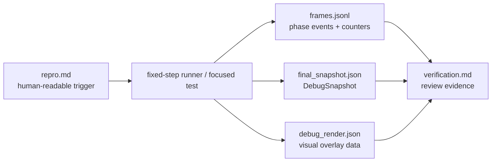
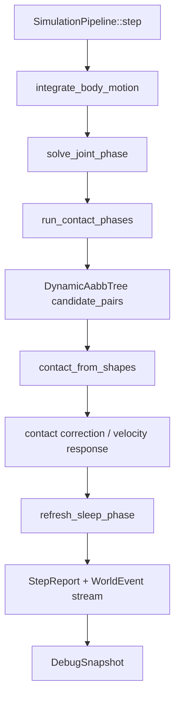

# Debug Observability Design

Picea debugging should be evidence-driven. A bug report should identify the input, fixed step, pipeline phase, contact/sleep facts, and verification result. This document defines the intended observability model for the current `World` + `SimulationPipeline` core; it does not claim all artifacts are implemented today.

## Problem

Physics bugs are often visual, intermittent, or frame-sequence dependent. A screenshot or "looks wrong" report is not enough to locate whether the issue came from body setup, broadphase, narrowphase, contact response, sleep state, query/debug projection, or a future CCD path.

## Target Artifact Flow

## Trace Event Model

Trace events should be append-only JSONL records. A minimal event should include:

| Field | Purpose |
| --- | --- |
| `run_id` | Group events for one reproduction. |
| `step_index` / `phase` | Locate the event in fixed-step time. |
| `body_handles` / `collider_handles` | Identify affected world objects. |
| `broadphase_candidate` | Explain why a pair entered or skipped narrowphase. |
| `narrowphase_contact` | Record point, normal, depth, and shape-pair kind. |
| `contact_lifecycle` | Track started, persisted, ended, or rejected contacts. |
| `material_response` | Record restitution/friction decisions and skipped impulses. |
| `sleep_state` / `wake_reason` | Show whether sleep affected the visible result. |
| `numeric_warning` | Preserve contained non-finite situations. |

Use enum-like reason fields, not free text, so artifacts can be diffed and filtered.

## Phase Coverage

Instrumentation should be phase-scoped. Do not dump the whole `World` at every stage by default.

## Debug Render Model

`debug_render.json` should describe facts, not interpretation:

- world bounds;
- body transforms and sleeping state;
- collider shapes;
- AABBs;
- broadphase candidate lines;
- contact points;
- contact normals;
- manifold labels when manifolds become richer;
- overlay text for step and selected object facts.

The render data should be optional and derived from the same run as `frames.jsonl`.

## Implementation Strategy

1. Start with test-only or opt-in trace collection.
2. Add small typed event structs near the owning module.
3. Keep hot paths allocation-light when tracing is disabled.
4. Prefer stable handles and enum-like reason fields over string logs.
5. Add focused tests for event ordering before using traces as review evidence.
6. Keep the viewer artifact-only until capture and replay are deterministic.

## Non-Goals

- No always-on tracing in the core hot path.
- No browser UI requirement for the first trace format.
- No replacement for behavior-lock tests.
- No use of trace output to justify skipping failing tests.
- No viewer code inside `crates/picea`.

## Acceptance Criteria For Future Implementation

- A deterministic repro can produce matching `repro.md`, `frames.jsonl`, `final_snapshot.json`, and `verification.md`.
- A broadphase or narrowphase bug can show candidate/contact decisions without reading private internals.
- A contact-response bug can show material response and skipped impulse reasons.
- A sleep bug can show low-motion time, sleep transition, and wake reason.
- A frame-sequence bug can show the exact step where divergence begins.
