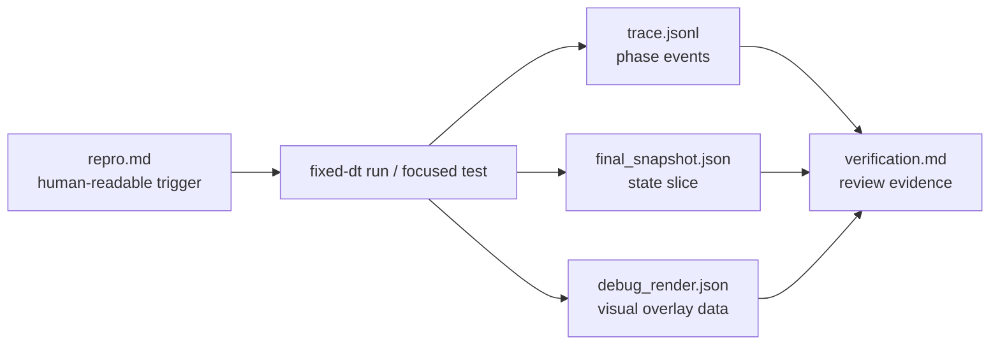
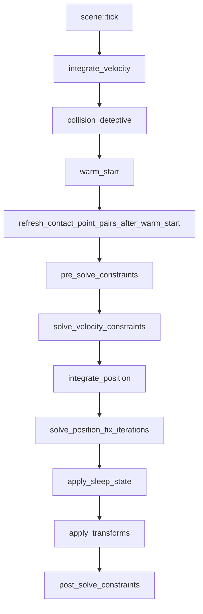

# Debug Observability Design

Picea debugging should be evidence-driven: a bug report should identify the input, tick/substep, runtime phase, contact/manifold state, and verification result. This document defines the intended debug observability design; it does not claim all artifacts are implemented today.

## Problem

Physics bugs are often visual, intermittent, or frame-split dependent. A screenshot or "looks wrong" report is not enough to locate whether the issue came from geometry, broadphase, narrowphase, manifold lifecycle, solver math, or wasm input validation.

## Target Artifact Flow

## Trace Event Model

Trace events should be append-only JSONL records. A minimal event should include:

| Field | Purpose |
| --- | --- |
| `run_id` | Group events for one reproduction. |
| `tick` / `substep` / `phase` | Locate the event in fixed-step time. |
| `element_ids` | Identify affected bodies. |
| `broadphase_candidate` | Explain why a pair entered or skipped narrowphase. |
| `narrowphase_contact` | Record contact count, points, normals, and depth. |
| `manifold_lifecycle` | Track new, active, pending, inactive, or refreshed state. |
| `contact_key_transfer` | Explain whether cached lambda transferred and why. |
| `normal_lambda` / `friction_lambda` | Distinguish cached, applied, clamped, and skipped impulses. |
| `sleep_state` / `wakeup_reason` | Show whether sleep/wakeup affected the visible result. |

## Phase Coverage

Instrumentation should be phase-scoped. Do not dump the whole `Scene` at every stage by default.

## Debug Render Model

`debug_render.json` should describe facts, not interpretation:

- world bounds
- element shapes
- AABBs
- broadphase candidate lines
- contact points
- contact normals
- manifold labels
- sleep labels
- overlay text for tick/substep/phase

The render data should be optional and derived from the same run as `trace.jsonl`.

## Implementation Strategy

1. Start with test-only or opt-in trace collection.
2. Add small event structs near the owning module, not one global untyped string log.
3. Keep hot paths allocation-light when tracing is disabled.
4. Prefer stable IDs and enum-like reason fields over free-form text.
5. Add focused tests for event ordering before using traces as debugging evidence.

## Non-Goals

- No always-on tracing in the core hot path.
- No browser UI requirement for the first trace format.
- No replacement for existing behavior-lock tests.
- No use of trace output to justify skipping failing tests.

## Acceptance Criteria For Future Implementation

- A deterministic repro can produce matching `repro.md`, `trace.jsonl`, and `verification.md`.
- A collision/warm-start bug can show contact key transfer or drop reason without reading solver internals.
- A frame-split determinism bug can show the exact tick/substep where divergence begins.
- wasm invalid-input bugs can identify whether failure happened at JS parsing, wasm facade validation, or core runtime.

