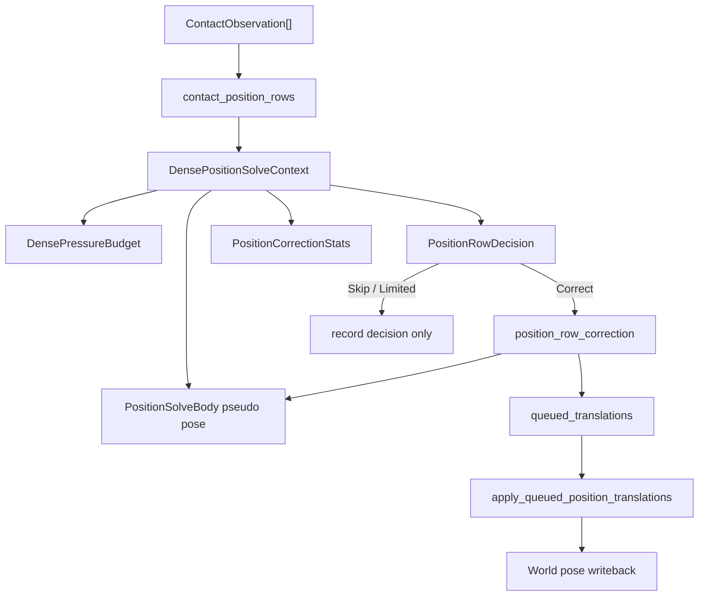
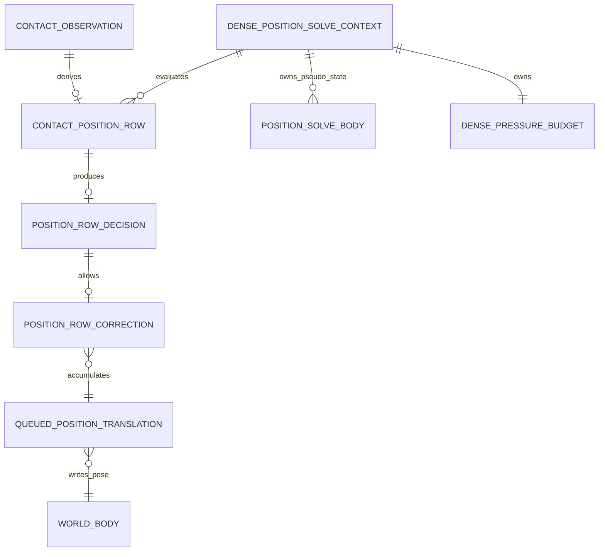
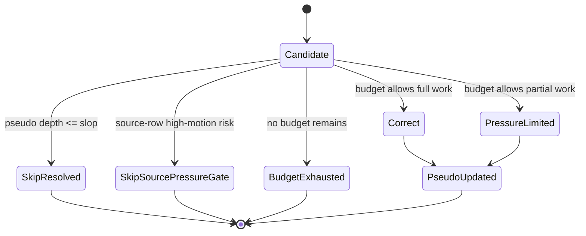
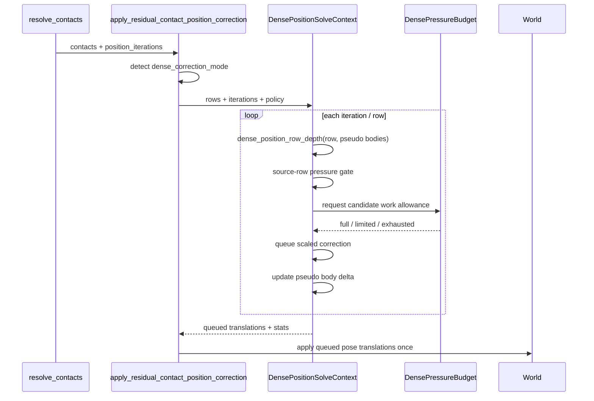

# Dense Pressure / Pseudo-Position / Position-Row 软件架构设计

状态：已同步实现偏差
设计文档：docs/design/dense-pressure-position-row-architecture.md
最后更新：2026-05-14
工作目录：/Users/asyncrustacean/projects/picea

## 背景与目标

`stack_4` 的小型堆叠 block-solve 回归先通过 sparse-stack guard 收住；随后验收发现旧行为锁只保证“安静”，没有保证 4 箱最终仍竖直堆叠；浏览器实时会话进一步指出，稳定堆叠还必须真正进入 sleep。因此本轮最终包含三层修正：dense position correction 的 pressure / pseudo-position 路线、一个受限的稀疏竖直支撑链 stabilized contact graph，以及 `stack_4` 场景级 sleep authoring 修复。最初的 dense 红锁是：

```text
rtk proxy cargo test -p picea --test physics_realism_acceptance \
  contact_position_correction_dense_stack_re_evaluates_row_depth_on_step_surface -- --nocapture
```

失败事实是 `velocity_iterations = 0`、`position_iterations = 4` 时，dense correction
仍然把 `position_correction_total_translation` 推到 `0.6416276`，超过
`position_correction_input_total_depth * 0.78`，即约 `0.624`。这说明问题不在 velocity
impulse、block solve、friction、sleep，而在 residual position correction 对 dense rows
的压力消耗和伪位置重评估契约。追加的 1200 帧 `stack_4` 行为锁则证明：4 箱这种行数不足 16 的稀疏支撑链也需要进入支撑稳定化，否则会长期丢失动态-动态接触；同一浏览器验收也证明 lab 场景必须显式允许动态箱体 sleep，否则 solver 已经稳定也不会进入 sleeping island skip。

目标：

- 将 dense position correction 从“逐行直接排队 correction”升级为有明确输入契约的
  `DensePositionSolveContext`。
- 让 pseudo-position 重评估、dense pressure budget、position-row decision 分层，避免
  stale raw-depth over-correction。
- 保持 public API、`StepConfig` 默认值、narrowphase/contact lifecycle、velocity solver
  不变。
- 为后续 `milestone-driven-development` 提供可以拆成设计/执行 milestone 的接口边界、
  验收门和风险清单。
- 对 4 箱这类稀疏竖直支撑链，只在小世界、小 island、近竖直接触链内启用 stabilized
  contact graph，不把所有普通接触全局 dense 化。
- 对 `stack_4` 场景 authoring 显式设置动态体 `can_sleep=true`，不改变 engine 默认
  `BodyDesc` 或 sleep policy。

## 非目标

- 不重新打开全局 two-point block normal solve。
- 不通过调低全局 `POSITION_CORRECTION_PERCENT` 或减少 `position_iterations` 修绿。
- 不扩大 warm-start fallback，不把 `source_row_continuity_candidate` 升级为 solver truth。
- 不做全局 friction、gravity-derived support budget、shallow support-friction scale 扩展；稀疏支撑链只复用既有支撑稳定化路径。
- 不把 Matter.js / Box2D 逻辑逐字搬进来；只借鉴“position solve 独立于 velocity solve、
  用 pseudo state / position impulse 控制修正压力”的成熟思路。
- 不改变 `World` / `SimulationPipeline` public surface。

## 现状证据

- `crates/picea/src/solver/contact.rs` 已有 `ContactPositionRow`、`PositionSolveBody`、
  `PositionRowCorrection`，dense mode 会用 pseudo translation / rotation 重算
  `dense_position_row_depth`。
- `apply_residual_contact_position_correction` 当前在所有 iterations 中遍历固定 rows，
  对每个 row 计算 depth、生成 correction，并立刻累计到 `queued_translations` 与
  `position_solve_bodies`。
- `dense_contact_position_correction_gate` 已经存在 source-row pressure gate，但它只处理
  `source_row_continuity_candidate` 的一类高运动风险，不负责整体 dense pressure budget。
- 当前红锁使用 `build_dense_position_correction_stack_world(8)`：8 个 dynamic bodies 加
  1 个 static floor，`contact_count=16`，`position_correction_input_total_depth=0.8000002`，
  `position_correction_total_translation=0.6416276`。
- `docs/plans/2026-05-08-matrix-stack-physics-engine-stability-refactor-milestones.md`
  已记录多个撤回实验：dense position angular effective-mass、dense support-friction 扩展、
  non-source separating pressure gate、dense shallow-support velocity bias、contact-count mass
  conditioning、全局 SAT clipping skin 都不能作为当前路线。

## 证据分级

- Fact：红锁在 `velocity_iterations=0` 下失败，因此不是 velocity solver / block solve 的直接问题。
- Fact：当前 dense pseudo-position pass 已存在，但仍不能把 total translation 压到
  stale raw-depth budget 以下。
- Fact：当前 `position_correction_total_translation` 是 per-body queued correction distance
  的累积，不等同于最终净位移。
- Inference：dense graph 中多行共享 body 时，单行 pseudo-depth 变小仍不足以约束全局
  correction work；需要显式 pressure budget / row decision。
- Inference：不能把 contact lifecycle 直接升级成 position solver truth；现有计划已多次
  证明 warm-start/lifecycle 扩展容易提前 ejection。
- Assumption：第一版设计可以只改 private solver internals，不需要新增 public debug schema。
- Recommendation：先做 dense position-row budget 的最小内部实现，等 180/240/600 gates
  证明需要更多观测时，再追加只读 diagnostics 字段。

## 领域名词

| 名词 | 含义 | 为什么重要 |
| --- | --- | --- |
| dense pressure | dense contact graph 中多行修正对同一组 bodies 反复施加的“位置修正压力”。 | 过量会把堆叠推出支撑或制造后续 support gap。 |
| pseudo-position | solver-local shadow pose，只在 position pass 内累积 translation / rotation。 | 让后续 row 基于已消耗修正后的深度重新判断，不直接写 world。 |
| position-row | 从 contact observation 派生出的 residual position correction 行。 | 它是 dense correction 的最小决策单位。 |
| stale raw-depth | 不考虑前面 rows 已经移动 body 的 frame-start penetration depth。 | dense stack 中重复消费 stale depth 会过度修正。 |
| pressure budget | 对一个 dense position pass 可消费的修正工作量上限。 | 防止“每行都局部合理，但全局 translation work 过量”。 |
| source-row pressure gate | 对 source-row continuity candidate 的高运动风险行跳过 residual correction。 | 已存在，但范围窄，不能替代整体 budget。 |

## 待确认问题

### 必须现在确认

无。推荐默认保持 private solver-only 设计，不改变 public API、不改变测试阈值、不把本设计视为
milestone Plan Gate。

### 可在文档中选择

- [ ] A. 只加 frame-level dense pressure budget
  - 适合：先修 `contact_position_correction_dense_stack_re_evaluates_row_depth_on_step_surface`。
  - 好处：改动最小，能直接约束 total translation。
  - 代价：如果 budget 过硬，可能在 180/240 matrix gate 中丢支撑。
- [ ] B. 加 row-level decision + frame-level budget
  - 适合：既要修红锁，又要给 240/600 support-gap 后续留边界。
  - 好处：可解释哪些 row 被修正、限流、跳过，便于后续调试。
  - 代价：内部结构多一点，需要更完整单测。
- [ ] C. 同时新增 public diagnostics schema
  - 适合：浏览器/Artifact 必须展示 row decision 时。
  - 好处：可观测性最好。
  - 代价：扩 public/debug schema，兼容成本更高。

推荐默认：B。先保持 decision reason 在 solver 内部；只有后续验收缺证据时再进入 C。

## 架构视图



## 软件接口说明

### 接口：`DensePositionSolveContext`

职责：
封装 dense position pass 的 solver-local 状态：pseudo bodies、pressure budget、row decisions、
queued translations 与 stats 累计。

调用方：
- `apply_residual_contact_position_correction`

被调用方：
- `dense_position_row_depth`
- `dense_position_row_decision`
- `position_row_correction`
- `record_shadow_position_delta`
- `queue_position_correction`

输入：
- `rows: &[ContactPositionRow]`：当前 frame 的 position rows。
- `iterations: u16`：position iterations。
- `policy: DensePositionPolicy`：dense-only slop、budget ratio、row decision thresholds。
- `world: &World`：只读 body/sleep/wake 判定。

输出：
- `queued_translations: BTreeMap<BodyHandle, QueuedPositionTranslation>`。
- `stats: PositionCorrectionStats`。
- 可选内部 `row_decisions: Vec<PositionRowDecisionRecord>`。

错误：
- 不返回 public error；无效 row / zero denominator 继续用 `None` / skip。

顺序性 / 幂等性：
- row iteration order 继续使用当前 deterministic island/contact order。
- 同一 input world + contacts + config 必须产生 deterministic queued translations。

兼容性：
- private solver-only；不改 public API、不改 `StepReport` 字段语义。

不变量：
- dense mode 才启用 budget。
- pseudo-position 只影响当前 position pass，不直接写 world。
- velocity fields 不得被 position pass 修改。

示例：

```text
context.solve(rows, iterations)
  -> row 0 depth 0.0475 correct 0.0095
  -> row 1 pseudo depth 0.0401 correct 0.0080
  -> row N budget exhausted: limited or skipped
  -> apply queued pose deltas once
```

### 接口：`DensePressureBudget`

职责：
限制 dense position pass 的全局 correction work，避免多行共享 body 时重复消费 stale raw-depth。

调用方：
- `DensePositionSolveContext`

输入：
- `input_total_depth: FloatNum`：iteration 0 统计的 raw input depth sum。
- `current_total_translation: FloatNum`：当前已排队的 correction distance work。
- `row_depth: FloatNum`：pseudo-depth 重评估后的 row residual depth。
- `candidate_translation: FloatNum`：本 row correction 将新增的 translation work。

输出：
- `Allowed { scale: FloatNum }`：`0.0..=1.0`，用于缩放 row correction。
- `Exhausted`：本 row 不再消费 correction work。

错误：
- NaN / infinite 输入视为 `Exhausted` 并保持 numeric warning 由既有路径负责。

顺序性 / 幂等性：
- 预算消费按 deterministic row order 累计。

兼容性：
- 不改变 `position_correction_input_*` stats；只约束 output translation work。

不变量：
- budget 不得增加 correction，只能缩放或跳过。
- non-dense path 不使用该 budget。
- budget ratio 不应低于现有支撑验收需要；先由 red lock 和 matrix gates 共同校准。

示例：

```text
limit = input_total_depth * 0.76
remaining = limit - current_total_translation
candidate = 0.012
if remaining = 0.006 -> scale = 0.5
```

### 接口：`dense_position_row_decision`

职责：
把每个 dense row 在每轮 iteration 中分类为修正、限流、已解决或风险跳过。

调用方：
- `DensePositionSolveContext`

输入：
- `row: &ContactPositionRow`
- `depth: FloatNum`
- `budget: &DensePressureBudget`
- `candidate: PositionRowCorrection`

输出：
- `PositionRowDecision::Correct { scale }`
- `PositionRowDecision::SkipResolved`
- `PositionRowDecision::SkipSourcePressureGate`
- `PositionRowDecision::PressureLimited { scale }`
- `PositionRowDecision::BudgetExhausted`

错误：
- 无 public error；decision 只影响 row 是否消费 correction。

顺序性 / 幂等性：
- 同一 row、同一 pseudo state、同一 budget state 的 decision 必须 deterministic。

兼容性：
- 第一版 decision reason private；后续若 artifact 需要，可只读透传为 diagnostics。

不变量：
- source-row pressure gate 先于 budget：高运动风险 row 不应因为还有预算而被修正。
- resolved row 不消费 budget。
- limited row 的 pseudo delta 与 queued translation 必须使用同一个 scale。

示例：

```text
depth=0.011, source_candidate=false, candidate_work=0.006, remaining=0.003
=> PressureLimited { scale: 0.5 }
```

## 实体关系图 / 数据模型



| 关系 | 基数 | 生命周期所有者 | 删除/归档语义 | 一致性约束 | 证据 |
| --- | --- | --- | --- | --- | --- |
| `ContactObservation -> ContactPositionRow` | 1:0..1 | `contact_position_rows` | 每个 step 临时生成 | sensor / zero-depth / zero-mass row 不生成 | `contact_position_row` |
| `DensePositionSolveContext -> PositionSolveBody` | 1:N | context | position pass 结束后丢弃 | 只记录 pseudo delta，不写 world | `PositionSolveBody` |
| `DensePositionSolveContext -> DensePressureBudget` | 1:1 | context | position pass 结束后丢弃 | budget 只能减少剩余额度 | 当前缺失，设计新增 |
| `PositionRowDecision -> PositionRowCorrection` | 1:0..1 | decision helper | row iteration 后丢弃 | skip 不得产生 correction；limited 必须统一 scale | 当前缺失，设计新增 |
| `QueuedPositionTranslation -> World body` | N:1 | existing queue | pass 结束一次性写回 | sleeping wake/reset idle 沿用既有规则 | `queue_position_correction` |

## 数据结构 / 状态模型



建议内部结构：

```rust
struct DensePositionPolicy {
    total_translation_budget_ratio: FloatNum,
    min_partial_correction_scale: FloatNum,
}

struct DensePressureBudget {
    total_translation_limit: FloatNum,
    consumed_translation: FloatNum,
}

enum PositionRowDecision {
    Correct,
    PressureLimited { scale: FloatNum },
    BudgetExhausted,
    SkipResolved,
    SkipSourcePressureGate,
}
```

## 关键运行时流程



## 调用流 / 数据流

1. `resolve_contacts` 完成 velocity solve 后进入 residual position correction。
2. `apply_residual_contact_position_correction` 统计 eligible contacts，判断 dense mode。
3. position-row correction mode 构造 `DensePositionSolveContext`。第一版对所有 residual rows
   使用 pseudo-position 重评估；dense matrix graph 仍由独立的 16 行阈值控制 velocity-side damping。
4. dense / position-row mode 内：
   - iteration 0 统计 input contact count / max depth / total depth。
   - 每行先用 pseudo state 计算 residual depth。
   - 先执行 source-row pressure gate。
   - 再用 pressure budget 限制 correction work。
   - scaled correction 同时写入 queued translations 和 pseudo state。
5. pass 结束后一次性写回 world pose，继续沿用 sleeping wake/reset idle 规则。

## 错误、兼容性与安全语义

- Public API：不变。
- `StepStats`：字段保留原语义；`position_correction_total_translation` 仍表示实际 queued
  translation work，而不是 budget limit。
- Debug / artifact：第一版不新增 schema，避免 web WIP 被迫跟进。
- Numeric safety：budget 遇到非有限值必须选择 skip/zero scale，不能放大 correction。
- Determinism：budget 消费依赖 row order，因此必须继续使用现有 deterministic island/contact order。
- Sleep：position correction 是否 reset idle 继续由 `QueuedPositionTranslation.reset_idle`
  决定；不得用 sleep 收敛掩盖过量 correction。

## 质量属性与风险场景

- 场景：在 dense overlap fixture 中，当 16 个 position rows 共享 8 个 dynamic bodies，
  系统应在 4 次 position iterations 内重评估 pseudo-depth，并使 total translation work
  低于 stale raw-depth budget，同时不注入 velocity。
  - 风险：budget 过硬导致支撑不足。
  - 证据：既有 dense-only 低比例 correction 实验会造成 ejection。
  - 缓解：只在 dense mode 内按 candidate work 局部缩放，不降低全局 percent。
  - 验证：`contact_position_correction_dense_stack_re_evaluates_row_depth_on_step_surface`。

- 场景：在 180-frame / aligned matrix stack 中，当 dense graph 进入休眠窗口，系统应保持
  no ejection、low penetration、sleep convergence。
  - 风险：pressure budget 切掉真实支撑 row。
  - 证据：已有 180/aligned gates 对 support gap 和 rotation 很敏感。
  - 缓解：保留 source-row gate 优先级；budget 只限制 output work，不改变 warm-start。
  - 验证：`matrix_stack_artifacts_capture_nxm_grid_stack_facts`、
    `aligned_matrix_stack_artifacts_capture_stable_nxm_behavior_lock`。

- 场景：在 `stack_4` 小型堆叠中，4 箱最终必须仍保持竖直支撑链，而不是安静地摊平到地面。
  - 风险：只靠原 sparse-stack block-solve guard 会通过“安静”窗口，但长期丢失动态-动态支撑。
  - 证据：追加 1200 帧行为锁前，最终 `dynamic_support_links=0`，所有接触退化为 floor contact。
  - 缓解：保留 dense matrix 的 16 行阈值；对小世界、小 island、近竖直接触链启用 solver-private stabilized contact graph，使支撑摩擦预算、resting damping 和 block-solve guard 取同一稳定路径。
  - 验证：`stack_4_behavior_lock_stays_deterministic_and_quiet_after_settling`、
    `stack_4_long_window_retains_vertical_support_chain`。

- 场景：在 lab/browser 的 `stack_4` 实时会话中，稳定竖直堆叠必须进入 sleep，而不是永久保持 awake。
  - 风险：legacy 场景 helper 把动态体创建为 `can_sleep=false`，会掩盖 solver 已收敛的事实。
  - 证据：浏览器实时会话在 E3 后保持竖直堆叠但不进入 sleep；检查发现 lab `Stack4` 和测试 helper 都沿用不可 sleep 的动态体 authoring。
  - 缓解：只对 `stack_4` 动态箱体显式开启 `can_sleep=true`，静态地面和全局 sleep policy 不变。
  - 验证：`stack_4_long_window_enters_sleep_after_stable_vertical_stack`，以及浏览器实时会话长窗口中 `active_island_count=0`、`sleeping_island_skip_count=1`。

## 方案选择与取舍

| 方案 | 选择 | 好处 | 代价 | 适用边界 |
| --- | --- | --- | --- | --- |
| frame-level dense pressure budget | 部分采用 | 直接约束 total translation work | 单独使用可能切掉真实支撑 | 作为 `DensePressureBudget` 的一部分 |
| row-level decision + budget | 推荐 | 可解释、可测试、可扩展到 support-gap 后续 | 内部结构更多 | 当前 dense position-row 主路线 |
| 稀疏竖直支撑链 stabilized graph | 采用 | 修复 4 箱长期摊平，且不把所有接触全局 dense 化 | 仍是 private heuristic，需要后续支撑图细化空间 | 小世界、小 island、近竖直支撑链 |
| `stack_4` sleep authoring | 采用 | 让浏览器实时会话体现最终稳定态；不改全局 sleep policy | 仅覆盖该场景，其他场景需显式选择 | `ScenarioId::Stack4` 动态体 |
| 调低 dense correction percent | 放弃 | 实现最简单 | 已有实验显示会造成 ejection / support gap | 不作为路线 |
| contact-count mass conditioning | 放弃 | 类似 Matter.js 的一类分摊思路 | 已有实验退化 180-frame hard gate | 不保留 |
| 扩大 warm-start / lifecycle truth | 放弃 | 可能减少 churn | 既有实验提前 ejection | lifecycle 继续只做 provenance |
| 新增 public diagnostics | 暂缓 | 浏览器可解释性更好 | schema 兼容成本 | 需要证据缺口时再做 |

## 架构决策记录

| 决策 | 状态 | 选择 | 替代方案 | 影响 | 重访触发 |
| --- | --- | --- | --- | --- | --- |
| Dense position correction owner | Proposed | 新增 private `DensePositionSolveContext` | 继续把逻辑散在 `apply_residual_contact_position_correction` | 降低函数复杂度，明确状态所有权 | 实现发现抽象只包了一层壳 |
| Pressure budget 粒度 | Proposed | frame-level budget + row-level scale | 单纯降低 percent 或 per-body row-count mass | 修红锁同时降低支撑退化风险 | 180/aligned matrix gate 退化 |
| Diagnostics | Proposed | 第一版 private decision | 直接扩 `ContactEvent` / `DebugContact` | 避免 public schema churn | artifact 无法定位 budget 决策 |
| Lifecycle 边界 | Accepted from evidence | lifecycle/provenance 不成为 position-row truth | warm-start fallback / retained row | 避免重引入已撤回实验 | 新证据证明 identity 是唯一 blocker |
| `stack_4` sleep authoring | Accepted from browser evidence | 仅场景动态体 `can_sleep=true` | 改 sleep policy 或全局默认值 | 浏览器长窗口能进入 sleeping island skip | 需要不可 sleep 的调试版 stack 场景 |

## 验收标准

- `rtk proxy cargo test -p picea --test physics_realism_acceptance contact_position_correction_dense_stack_re_evaluates_row_depth_on_step_surface -- --nocapture`
  通过。
- `rtk proxy cargo test -p picea --lib solver::contact::tests -- --nocapture` 通过。
- `rtk proxy cargo test -p picea --test physics_realism_acceptance stack_4_behavior_lock_stays_deterministic_and_quiet_after_settling -- --nocapture`
  通过。
- `rtk proxy cargo test -p picea --test physics_realism_acceptance stack_4_long_window_retains_vertical_support_chain -- --nocapture`
  通过。
- `rtk proxy cargo test -p picea --test physics_realism_acceptance stack_4_long_window_enters_sleep_after_stable_vertical_stack -- --nocapture`
  通过。
- 浏览器实时会话验证 `stack_4` 长窗口后仍有支撑接触，且 `active_island_count=0`、
  `sleeping_island_skip_count=1`、动态体 `sleeping=true`。
- `rtk proxy cargo test -p picea-lab --test artifact_run matrix_stack_artifacts_capture_nxm_grid_stack_facts -- --nocapture`
  通过。
- `rtk proxy cargo test -p picea-lab --test artifact_run aligned_matrix_stack_artifacts_capture_stable_nxm_behavior_lock -- --nocapture`
  通过。
- 若进入 support-gap 后续：240/600 ignored observation gates 不得早于当前失败点退化。

## 对后续里程碑的输入

- 建议设计里程碑 D1：确认 `DensePositionSolveContext` / `DensePressureBudget` / `PositionRowDecision`
  private interface，补纯函数 unit tests。
- 建议执行里程碑 E1：只重构 dense position pass 状态所有权，不改变行为；确保现有 gates 不变。
- 建议执行里程碑 E2：引入 dense pressure budget 与 row-level scaling，先修
  `contact_position_correction_dense_stack_re_evaluates_row_depth_on_step_surface`。
- 建议执行里程碑 E3：跑 matrix/aligned/stack_4 gates，若 240/600 support-gap 仍红，仅记录
  blocker，不扩大本 slice。
- 建议设计里程碑 D2：如果 240/600 仍需要进入 dynamic-support retention，则另写
  previous-manifold / support-retention 输入契约，不混入本 position budget slice。

执行前必须保持的接口/边界：

- `World` / `SimulationPipeline` public API 不变。
- `StepConfig` 默认值不变。
- dense matrix graph 的 velocity-side 阈值保持独立；稀疏竖直支撑链只能通过受限 stabilized graph 进入支撑稳定化。
- `ContactObservation` lifecycle / warm-start 语义不扩大。
- velocity solve 不读写 `DensePressureBudget`。

早期验证建议：

- 先写 unit tests 锁定 budget scale / exhausted / limited / source gate priority。
- 再跑红锁单测。
- 最后跑 `stack_4`、180 matrix、aligned matrix 三条 guard。

## 风险 / 后续

- 风险：budget ratio 变成新 magic number。缓解：常量命名必须表达 dense pressure budget，
  并用 red lock + matrix gates 共同证明。
- 风险：row decision private 导致 artifact 证据不足。缓解：先不扩 schema；若调试受阻，
  新开 diagnostics-only slice。
- 风险：240/600 support-gap 不是 correction work budget 能解决。缓解：本设计只负责
  dense position-row 过量修正；support retention / lifecycle 前移另开设计。
- 风险：过早引入 angular pseudo correction。缓解：现有证据已拒绝 dense position angular
  effective-mass 实验，第一版继续保持当前 angular scale 策略。
