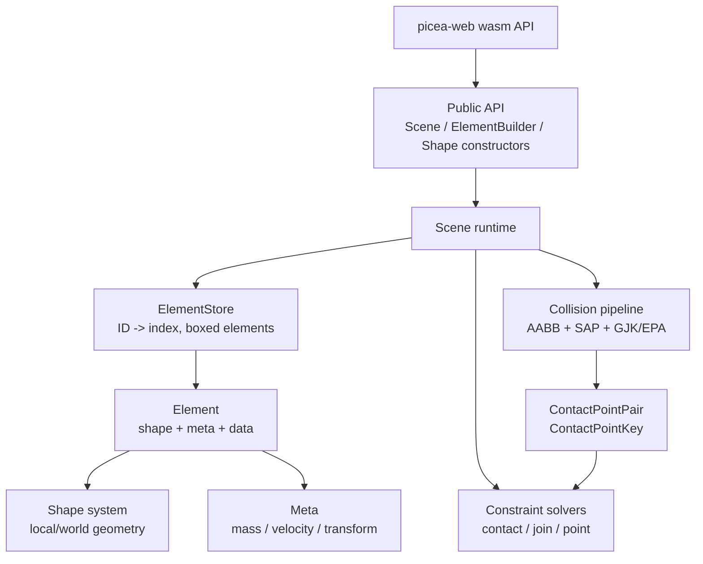

# Engine Design

> Historical note: this document still describes the removed `Scene`/`ElementBuilder`/`picea-web` architecture. The current implementation is centered on `World`, `SimulationPipeline`, and stable read-side APIs.

Picea is moving from a prototype physics engine toward a verifiable and maintainable 2D rigid-body engine. The current design favors deterministic behavior, explicit module ownership, and testable incremental milestones.

## Goals

- Provide a Rust-native 2D physics runtime with wasm bindings.
- Keep simulation behavior reproducible enough for regression tests and AI-assisted debugging.
- Split geometry, collision, constraint solving, storage, and wasm API responsibilities.
- Preserve a narrow milestone workflow: prove the current behavior, then refactor one subsystem at a time.

## Non-Goals

- No 3D physics.
- No UI or renderer ownership in the core engine.
- No wasm-side duplicate physics implementation.
- No large algorithm replacement without behavior locks and milestone scope.
- No hidden fallback that silently treats failed validation as success.

## Design Map

## Data Ownership

| Data | Owner | Notes |
| --- | --- | --- |
| Element list and IDs | `ElementStore` | Current model is `Vec<Box<Element<T>>>` plus `BTreeMap<ID, usize>`. |
| Scene lifecycle | `Scene` | Owns tick order, accumulator, constraints, contact manifolds, callbacks. |
| Geometry | `shape` types | Shapes sync transforms and expose projection/collider traits. |
| Collision candidates | `collision` | AABB/SAP creates candidates; GJK/EPA produces contact pairs. |
| Solver cache | `constraints/contact` | Stores cached normal/friction lambda and stable contact keys. |
| JS-visible handles | `picea-web` | Legacy methods return fallback values; `try*` methods return `Result`. |

## Public API Shape

Rust users interact mostly through:

- `Scene`
- `ElementBuilder`
- `MetaBuilder`
- shape constructors
- constraint creation methods

wasm users interact through `WebScene` and generated wasm-bindgen exports. The wasm API should validate JS input at the boundary and delegate core behavior to `picea`.

## Extension Points

| Future Work | Likely Owner | Current Constraint |
| --- | --- | --- |
| Persistent AABB/support caches | `shape` + `collision` | Must preserve local/world transform semantics. |
| Replace or extend broadphase strategy | `collision` | Must keep candidate filtering behavior locked. |
| Stable feature IDs for contacts | `collision` + `constraints/contact` | Must avoid wrong impulse transfer. |
| Generation arena handles | `element/store` + `scene` | Must preserve public lookup behavior or provide migration path. |
| Debug trace export | `scene` + `collision` + `constraints` | Must not add heavy allocation to hot paths by default. |
| wasm browser smoke coverage | `picea-web` | Must keep wasm-bindgen CLI/test versions aligned. |

## Design Invariants

- `Scene::tick` advances via fixed substeps, not one variable frame step.
- Collision detection happens before warm start in each fixed step.
- Manifold refresh happens after warm start so continuing contacts can consume cached impulses first.
- Storage mutation invalidates contact manifolds to avoid stale element pointers.
- wasm public APIs should not panic on invalid JS input; `try*` methods should return errors.
- Documentation and tests must identify residual risk when behavior is intentionally conservative.
