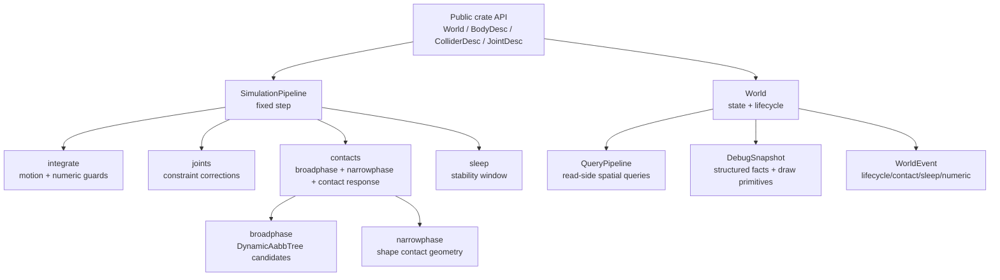

# Engine Design

Picea's current core is a small Rust workspace centered on `World` and `SimulationPipeline`. Historical `Scene`, `ElementBuilder`, `Context`, `picea-web`, and wasm paths are archive material only; they are not the default design surface for new work.

## Goals

- Provide a Rust-native 2D rigid-body core with deterministic fixed-step execution.
- Keep public state access explicit through stable handles, views, query APIs, and debug snapshots.
- Make physics behavior testable with focused acceptance tests before adding larger algorithms.
- Keep renderer, UI, browser, and artifact tooling outside the core crate.
- Prefer data-oriented internal seams that can later support persistent broadphase proxies, solver batches, and benchmarkable scenarios.

## Non-Goals

- No 3D physics.
- No renderer, UI, or visualization ownership inside `crates/picea`.
- No wasm facade in the current workspace.
- No hidden physics fallback that treats failed validation as success.
- No claim of performance or realism without tests, benchmarks, or debug artifacts.

## Current Design Map

## Data Ownership

| Data | Owner | Notes |
| --- | --- | --- |
| Authoritative bodies, colliders, joints | `world` | Stored behind generation handles and exposed through read-only views. |
| Body creation and patch data | `body` | Owns `BodyDesc`, `BodyPatch`, `BodyView`, `Pose`, and body status. |
| Collider geometry, filters, materials | `collider` | Owns `SharedShape`, `CollisionFilter`, `Material`, and collider views. |
| Step cadence and orchestration | `pipeline` | Owns `SimulationPipeline`, `StepConfig`, `StepReport`, and phase ordering. |
| Contact candidate generation | `pipeline/broadphase.rs` | Produces deterministic AABB candidate pairs for the current step. |
| Contact geometry | `pipeline/narrowphase.rs` | Produces contact point, normal, and depth from shape pairs. |
| Position correction helpers | `solver` | Internal helper module, not public API. |
| Query/debug read models | `query`, `debug` | Read-only derived facts for consumers and future tools. |

## Public API Shape

Rust users interact through:

- `World`
- `BodyDesc` / `BodyPatch` / `BodyView`
- `ColliderDesc` / `ColliderPatch` / `ColliderView`
- `JointDesc` / `JointPatch` / `JointView`
- `SimulationPipeline`, `StepConfig`, and `StepReport`
- `QueryPipeline`
- `DebugSnapshot`

Future ergonomic APIs should be additive wrappers over this surface, not a replacement for it. Candidate additions include `WorldRecipe`, `BodyBundle`, `ColliderBundle`, material presets, collision-layer presets, and batch `WorldCommands`.

## Extension Points

| Future Work | Likely Owner | Current Constraint |
| --- | --- | --- |
| Persistent dynamic AABB tree proxies | `pipeline/broadphase.rs` + collider records | Preserve deterministic pair ordering and stable handle semantics. |
| SAT + clipping manifolds | `pipeline/narrowphase.rs` | Keep contact normal orientation and event ordering locked. |
| Sequential impulse solver | `solver` + `pipeline/contacts.rs` | Replace interim velocity response with effective mass, warm-start, and friction cone behavior. |
| Island sleep/wake reasons | `pipeline/sleep.rs` + events/debug | Preserve the body-level stability window already locked by tests. |
| CCD time-of-impact | `pipeline` contact path | Start with fast circle vs static thin wall before broader convex CCD. |
| Artifact capture and viewer | outside `crates/picea` | Core emits facts; tools render and compare them. |
| Bench scenarios | `crates/picea/benches` | Use current public API and Criterion-style baseline comparisons. |

## Design Invariants

- `SimulationPipeline::step` is the public fixed-step execution entrypoint.
- Current workspace facts outrank archived milestone narratives.
- Contact events must keep deterministic handle ordering and stable normal orientation.
- Sleeping requires a low-motion stability window.
- Debug snapshots are read-only facts; they must not mutate world state.
- Visual output and screenshots are not correctness evidence unless backed by tests or artifacts.
