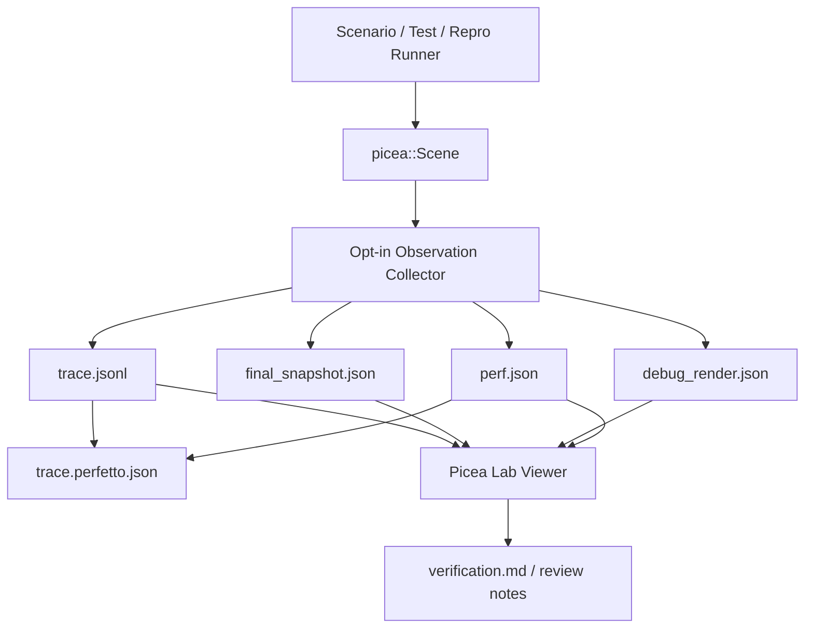

# Picea Lab Observability Architecture

> Date: 2026-04-20
>
> Status: active architecture design. This document records the target direction for a Picea Lab that combines visualization, debugging, replay, and performance inspection. It is not an implementation record.

## 1. Goal

Picea should have a first-class observability toolchain, not just visual examples. The target is a local engineering lab that can answer physics questions with structured evidence:

- What happened at a specific tick, substep, and phase.
- Which broadphase candidates, contacts, manifolds, impulses, and sleep transitions were involved.
- Whether two deterministic runs diverged, and where.
- Whether a change improved or regressed a measured scenario.
- What should be drawn to inspect a bug without reading solver internals first.

The lab must remain outside the core physics contract. The core engine exposes facts; the lab renders, filters, compares, and explains those facts.

## 2. Industry Pattern

Physics engines usually separate simulation from debug presentation:

- Box2D keeps its testbed outside the library. The testbed provides camera controls, mouse picking, test selection, tuning, pause, single-step, and debug draw options, while the library itself stays renderer-agnostic.
- Rapier exposes debug shape data from the physics world and lets callers render it themselves.
- Unity and PhysX provide visual debugger style tooling with object inspection, contacts, queries, timing, and recording.
- Perfetto and Chrome trace style timelines are common interchange formats for phase timing, counters, and event inspection.

The Picea direction should follow that pattern: a typed artifact and replay layer first, a viewer second, and live interactivity after deterministic capture is trustworthy.

References:

- [Box2D Testbed](https://box2d.org/doc_version_2_4/md__e_1_2github_2box2d__24_2docs_2testbed.html)
- [Rapier debugRender](https://rapier.rs/docs/user_guides/javascript/getting_started_js/#rendering-debug-shapes)
- [Unity Physics Debugger](https://docs.unity.cn/Manual/PhysicsDebugVisualization.html)
- [NVIDIA PhysX Visual Debugger](https://archive.docs.nvidia.com/gameworks/content/gameworkslibrary/physx/guide/Manual/VisualDebugger.html)
- [Perfetto Chrome JSON trace support](https://perfetto.dev/docs/getting-started/other-formats)

## 3. Recommended Technical Choice

This section intentionally chooses the first implementable stack, not the most ambitious possible stack.

### 3.1 Artifact and trace model

Use Picea-owned typed artifacts as the source of truth:

- `trace.jsonl`: append-only phase and domain events.
- `debug_render.json`: renderable debug primitives for shapes, AABBs, contacts, normals, labels, and query lines.
- `final_snapshot.json`: final state slice for run comparison.
- `perf.json`: counters and timing summary.
- `trace.perfetto.json`: optional Chrome JSON / Perfetto timeline export.

Do not make Chrome JSON the canonical domain format. It is a good timeline export format, but it is not rich enough to be the only representation of contact identity, manifold lifecycle, drop reasons, and solver cache transfer.

Use `serde`-compatible structs for artifacts. Keep the core collector typed and testable; add adapters later for `tracing`, Chrome JSON, and any viewer-specific format.

Do not start with `postcard` or Perfetto protobuf as the canonical replay format. Both are reasonable later optimizations, but the current Picea debug docs already route around readable JSONL/debug-render artifacts. Early replay files should be easy to diff, review, and attach to bug reports. Add compact binary replay only after the schema stops moving.

References: [tracing crate](https://docs.rs/tracing/), [postcard crate](https://docs.rs/postcard/).

### 3.2 Native viewer

Choose `eframe` / `egui` for the first real Picea Lab viewer.

Reasons:

- It is Rust-native and works well for inspector-heavy tooling.
- `eframe` can target desktop/native and web/wasm from the same UI model.
- Immediate-mode UI is a good fit for rapidly changing debug panels, toggles, timeline cursors, and selected-object inspectors.
- It avoids a Tauri/WebView boundary for the first local tool, so Picea can inspect native artifacts and future live Rust state with fewer moving parts.

Use `egui` painter primitives for the first 2D overlay. If large-scene rendering becomes a bottleneck, move the viewport to a custom `wgpu` / `glow` callback while keeping the panels in `egui`.

References: [egui official integrations](https://github.com/emilk/egui#official-integrations), [wgpu](https://wgpu.rs/).

### 3.3 Web viewer

Do not start with a Tauri app. Tauri is useful when a polished web frontend must be packaged as a desktop app, but Picea does not yet have a web UI to wrap. Adding Tauri now would add IPC, WebView, and frontend packaging before the debug artifact model is proven.

For a shareable browser viewer, use one of these later:

- `eframe` wasm build if keeping one Rust UI codebase matters more than web-native polish.
- PixiJS if the browser viewer becomes a high-volume 2D artifact renderer with web-first distribution.

Reference: [Tauri start guide](https://tauri.app/start/) and [PixiJS](https://pixijs.com/).

### 3.4 Rejected or deferred choices

| Choice | Decision | Reason |
| --- | --- | --- |
| Speedy2D as the main lab UI | Defer / keep for examples | It is already useful for lightweight examples, but the lab needs dense inspectors, timelines, filters, and file workflows. |
| Bevy + bevy_egui | Defer | It is attractive for game-style simulation, but too heavy as the default observability shell for a renderer-agnostic physics crate. |
| Tauri | Defer | It is useful once there is a web frontend to package. Starting there adds IPC and WebView concerns before artifacts are stable. |
| PixiJS first | Defer | Strong for a browser renderer, but it would split the first implementation across Rust core and TypeScript UI before native artifacts are proven. |
| Rerun as the primary viewer | Defer / optional export | Useful for generic visual logs, but Picea needs domain-specific contact/manifold/replay semantics and milestone acceptance gates. |
| Postcard binary replay first | Defer | Compact and serde-friendly, but less reviewable while schemas are changing. Use readable JSONL first, then add binary payloads when stable. |

Reference: [Speedy2D](https://docs.rs/speedy2d/).

### 3.5 Performance tooling

Keep Criterion as the benchmark baseline. It is already present in `crates/picea/Cargo.toml`, and current M9 work already added `crates/picea/benches/physics_scenarios.rs`.

Criterion should measure scenario-level performance and report confidence intervals and change estimates. Lab artifacts should add domain counters around those measurements:

- fixed steps per second
- elements per step
- broadphase candidates
- narrowphase contacts
- active and inactive manifolds
- solver constraints
- max penetration
- deterministic state hash

Export Chrome JSON for timeline visualization in Perfetto. Use duration events for phases and counter events for candidate/contact/manifold counts.

References:

- [Criterion command-line output](https://criterion-rs.github.io/book/user_guide/command_line_output.html)
- [Perfetto external trace formats](https://perfetto.dev/docs/getting-started/other-formats)

### 3.6 Optional external viewers

Rerun is worth keeping as an experiment, not as the primary architecture. It already solves streamed visual data and `.rrd` playback, but Picea needs engine-specific contact/manifold semantics, deterministic artifacts, and milestone acceptance gates. Exporting to Rerun can be a useful sidecar once the Picea artifact model is stable.

Reference: [Rerun Rust API](https://docs.rs/rerun/latest/rerun/index.html).

## 4. Target Architecture



The collector is opt-in. The default hot path should remain equivalent to no observer installed.

## 5. Core Boundary

Core physics may expose:

- event structs
- counters
- debug render primitives
- final state snapshots
- optional observer hooks

Core physics must not own:

- windows
- UI framework state
- camera controls
- panel layout
- screenshot expectations
- benchmark interpretation
- pass/fail claims based only on visuals

This preserves the current engine design non-goal: no UI or renderer ownership in the core engine.

## 6. Artifact Schema Shape

### 6.1 Trace events

Trace events should extend the existing `docs/ai/debug-artifacts.md` guidance. A minimal event should include:

- `run_id`
- `tick`
- `substep`
- `phase`
- `event_kind`
- `element_ids`
- `pair_id`
- `manifold_id`
- `contact_key`
- `reason`
- `values`

`event_kind` should be enum-like, not free text. Examples:

- `phase_begin`
- `phase_end`
- `broadphase_candidate`
- `narrowphase_contact`
- `manifold_lifecycle`
- `contact_cache_transfer`
- `solver_lambda`
- `sleep_state`
- `counter`

### 6.2 Debug render frame

`debug_render.json` should describe draw facts:

- camera and world bounds
- shape outlines
- convex sub-colliders
- AABBs
- broadphase candidate lines
- contact points
- contact normals and impulse arrows
- manifold labels
- sleep labels
- selected-element overlays

The render artifact should avoid interpretation. For example, it can label a contact as `cache_dropped_duplicate_key`, but it should not claim "solver is wrong".

### 6.3 Performance summary

`perf.json` should include:

- run metadata: branch, head, command, target, machine note
- step timing summary
- phase timing summary
- scenario counters
- deterministic state hash
- benchmark baseline link when available

Generated run artifacts should default to `target/picea-lab/runs/<run_id>/`. Only curated benchmark summaries or design records should be archived under `docs/perf/` or `docs/design/`.

## 7. Viewer Experience

Picea Lab should open a run artifact directory and provide these panes:

- viewport: shapes, AABBs, contacts, normals, candidate pairs, labels
- timeline: tick, substep, phase, counters, selected event
- inspector: selected element, contact, manifold, constraint, or trace event
- filters: element id, pair id, phase, event kind, active/inactive, sleep state
- diff: compare two runs by state hash, event sequence, counters, and first divergent tick
- performance: phase timings, counts, benchmark metadata, regression notes

Pause, single-step, and mouse picking belong in the lab viewer or runner, not in core.

## 8. Implementation Milestones

### L0 Design Archive

This document exists and is discoverable from `docs/design/README.md`, `docs/ai/index.md`, and `docs/ai/doc-catalog.yaml`.

### L1 Artifact Schema and Headless Capture

Add typed artifact structs and a no-op-by-default collector. Produce `trace.jsonl`, `debug_render.json`, `final_snapshot.json`, and `perf.json` from a deterministic scenario without a window.

Acceptance:

- capture disabled has no observable behavior change
- trace event ordering is tested
- generated artifacts match documented schema
- at least one contact lifecycle scenario produces artifacts

### L2 Deterministic Replay and Diff

Add a headless runner that can replay a scenario and compare outputs.

Acceptance:

- same input produces same state hash
- changed input produces a localized diff
- first divergent tick/substep can be reported

### L3 Native Picea Lab

Add an `eframe` / `egui` viewer that opens existing artifacts. Do not require live engine attachment in this milestone.

Acceptance:

- can inspect shapes, contacts, manifolds, and phase timeline from artifacts
- can filter by element and pair
- can export a human-readable `verification.md` summary

### L4 Benchmark and Perfetto Export

Expand `crates/picea/benches/physics_scenarios.rs` with scenario families from the architecture refactor requirements and export optional Chrome JSON traces.

Acceptance:

- Criterion benchmarks remain the source of wall-clock claims
- Perfetto export opens as a timeline
- counters and phase durations align with `perf.json`

### Current Implementation Note

As of 2026-04-20, the first headless slice exists:

- `crates/picea/src/tools/observability.rs` defines typed artifacts, JSONL export, Perfetto/Chrome JSON export, artifact directory write/read, state hash, and artifact diff.
- `Scene::tick_observed` exposes opt-in phase observation without changing default `Scene::tick`.
- `crates/picea-lab` provides a headless CLI:
  - `capture-contact <output-dir>`
  - `replay-contact <output-dir> <run-id> <second-circle-x> <steps>`
  - `capture-benchmark <output-dir> <run-id> <scenario> <steps>`
  - `diff <left-dir> <right-dir>`
  - `view <artifact-dir>`
  - `export-verification <artifact-dir> <output-md>`
- Artifact diff reports `first_divergent_tick` and `first_divergent_substep` when event streams diverge.
- `crates/picea-lab/src/viewer.rs` provides an `egui` / `eframe` native artifact viewer with a tested view model, element/pair/phase filtering, contact/timeline inspection, viewport drawing from `debug_render.json`, and verification markdown export.
- The native viewer now supports recipe parameter adjustment with regenerate, contact/normal/label/overlay toggles, zoom/pan view controls, and click selection that feeds existing filters.
- `crates/picea/benches/physics_scenarios.rs` now covers Criterion groups for `manifold/contact_refresh_transfer`, `step/circles_16`, `step/circles_64`, `collision/broadphase_sparse_64`, and `collision/broadphase_dense_64`.
- `capture-benchmark` can export matching artifacts and `trace.perfetto.json` for named benchmark scenarios, while Criterion remains the source for wall-clock timing claims.
- `crates/picea-lab/web` provides a no-build browser artifact viewer with a saved `contact-smoke` fixture. It reads the same artifact shapes as the native viewer and does not run or duplicate physics.

This does not yet expose broadphase candidate or contact-cache drop reason events directly from the owning subsystems.

### L5 Web Viewer

Only after artifact and native viewer semantics stabilize, add a shareable browser viewer.

Acceptance:

- reads the same artifacts as native lab
- no duplicate physics implementation
- browser rendering is tested with at least one saved artifact fixture

## 9. Non-Goals

- No 3D physics viewer.
- No replacement for behavior-lock tests.
- No claim that screenshots prove correctness.
- No always-on tracing in the hot path.
- No `examples/` rewrite as the primary acceptance path.
- No Tauri app until there is a real web frontend worth packaging.
- No public wasm API change just to support the first native lab.

## 10. Risks and Mitigations

| Risk | Mitigation |
| --- | --- |
| Trace overhead leaks into hot path | No-op default collector, feature-gated sinks, allocation-light event structs. |
| Visuals become the truth source | Tests and artifacts remain authoritative; viewer renders facts only. |
| UI work distracts from physics milestones | L1/L2 are headless and acceptance-focused; UI starts only after artifacts stabilize. |
| Artifact schema becomes stale | Route schema changes through `docs/ai/debug-artifacts.md` and this design doc. |
| Performance claims become noisy | Use Criterion confidence intervals and record machine/run metadata. |
| Viewer cannot handle large scenes | Start with egui painter; move viewport rendering to wgpu/glow callback only when measured. |

## 11. Validation Policy

Documentation-only changes for this design should run:

```bash
rtk rg -n "TODO|\\[TODO" AGENTS.md docs/ai .agents/skills -g "!**/picea-doc-routing/SKILL.md"
rtk proxy ruby -e 'require "yaml"; YAML.load_file("docs/ai/doc-catalog.yaml"); puts "yaml ok"'
rtk proxy git diff --check
```

Future implementation milestones should also run the relevant Picea gates from `docs/plans/2026-04-18-picea-physics-engine-milestones.md` and any new lab-specific tests.
