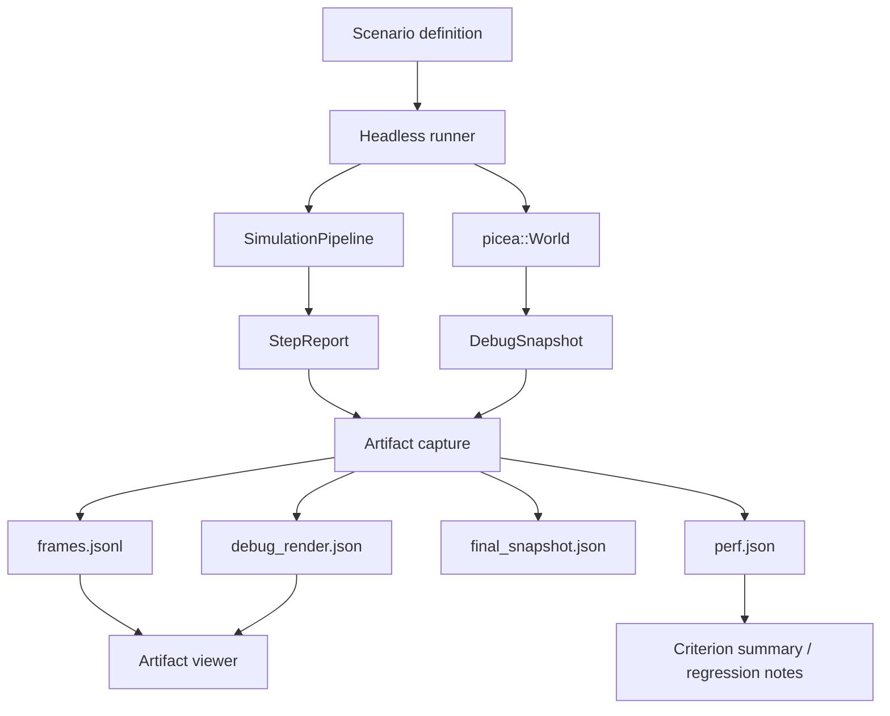

# Picea Lab Observability Architecture

> Date: 2026-04-24
>
> Status: active target design. The first `crates/picea-lab` C/S simulator slice exists with artifacts, HTTP/SSE, and a React Canvas workbench; benchmark harness work is still future scope.

Picea Lab is the proposed toolchain for visualization, reproducible artifacts, and performance measurement around the current `World` + `SimulationPipeline` core.

## Goal

The lab should answer questions that plain tests and screenshots cannot:

- Which broadphase candidates were generated?
- Which candidates survived narrowphase?
- Which contacts, normals, depths, and sleep transitions were produced?
- Did two deterministic runs diverge, and at which step?
- Did a physics change improve or regress a named benchmark scenario?

The core engine should expose facts. The lab should capture, render, compare, and summarize those facts.

## Boundary

`crates/picea` may expose:

- `StepReport`
- `StepStats`
- `WorldEvent`
- `DebugSnapshot`
- `DebugPrimitive`
- optional future artifact/counter structs

`crates/picea` must not own:

- windows or UI framework state
- camera controls
- screenshot approval
- benchmark interpretation
- viewer-specific layout
- browser or native app packaging

## First Slice

The first landed slice is artifact-first with a local C/S viewer layered on top.

1. Headless scenario runner lives outside the core hot path.
2. Deterministic scenarios run through `World` and `SimulationPipeline`.
3. Readable artifacts are exported under `target/picea-lab/runs/<run_id>/`.
4. The web workbench reads live/session artifact facts and does not run physics.
5. Criterion benchmarks should still wait until scenario names and counters are stable.

This lets visualization and benchmarks share the same scenario definitions.

## Artifact Set

| File | Purpose |
| --- | --- |
| `manifest.json` | Run metadata, scenario id, frame count, final state hash, and artifact list. |
| `frames.jsonl` | One record per captured step, with step index, events, counters, and selected snapshot facts. |
| `debug_render.json` | Shape outlines, AABBs, contact points, normals, sleep labels, and optional broadphase candidate lines. |
| `final_snapshot.json` | Final `DebugSnapshot` for deterministic comparison. |
| `perf.json` | Scenario metadata, counters, timing summary, and state hash. |

JSON/JSONL should be canonical for the first slice because it is easy to diff, attach to bug reports, and inspect in code review. Binary replay can come later if schemas stabilize.

## Viewer Choice

The first viewer should stay small and artifact/session-fact driven:

- draw shapes and AABBs;
- draw contact points and normals;
- show sleeping bodies differently;
- expose a step/timeline selector;
- show counters from `StepStats` and future broadphase/narrowphase counters.

A static HTML Canvas viewer is the fastest first step. It avoids adding a heavy UI dependency before the artifact model is proven.

An `egui` / `eframe` native viewer is still a good second step once artifact schemas and scenario names are stable. It is better for inspectors, filters, and richer interaction, but it should not be the first dependency added just to see shapes.

## Benchmark Plan

Use Criterion for wall-clock benchmark claims and keep lab counters as domain context.

Initial benchmark groups:

- `broadphase/sparse_64`
- `broadphase/dense_64`
- `step/circles_64`
- `contacts/resting_overlap`
- `sleep/quiet_bodies`
- `create/batch_1000`

Future groups:

- `narrowphase/polygon_sat`
- `solver/stack_16`
- `ccd/fast_circle_wall`

Do not invent absolute thresholds before the first local baseline. Once baselines exist, any unexplained regression over 5% in a relevant scenario needs investigation or explicit acceptance.

## Metrics

Minimum counters:

- step time
- body count
- collider count
- broadphase candidate count
- narrowphase contact count
- manifold count
- sleep transition count
- max penetration
- deterministic state hash

Later counters:

- candidate reject reason counts
- contact feature-key transfers and drops
- solver iterations used
- normal/tangent impulse ranges
- CCD time-of-impact count

## Target Architecture

## Acceptance

L1 artifact capture:

- capture disabled has no behavior change;
- one deterministic contact scenario writes all required files;
- artifact schema has tests;
- state hash is stable for identical input.

L2 static viewer:

- opens saved artifacts without running physics;
- renders colliders, AABBs, contacts, normals, and sleep state;
- has at least one saved fixture test or screenshot check.

L3 benchmark baseline:

- `cargo bench` discovers named scenarios;
- benchmark output records Criterion results and Picea counters;
- broadphase candidate count is wired into stats or artifact counters.

## Non-Goals

- No live editor in the first slice.
- No screenshot-only correctness gate.
- No always-on tracing in the core hot path.
- No UI dependency inside `crates/picea`.
- No browser or native packaging before artifact capture is stable.
