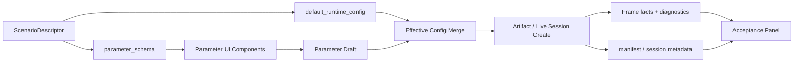
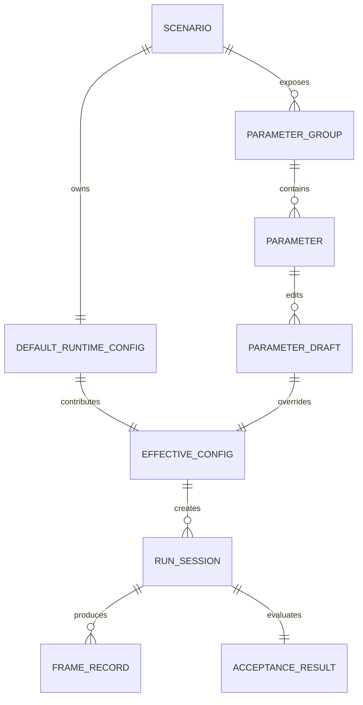

# 场景运行配置与参数 UI 软件架构设计

状态：已落地第一版；独立 Apply / inline invalid 输入为后续 hardening
设计文档：docs/design/scene-runtime-config-and-parameter-ui-design.md
最后更新：2026-05-15
工作目录：/Users/asyncrustacean/projects/picea

## 本轮落地状态

- 已落地：场景拥有 `default_runtime_config` / `parameter_schema`，artifact/live 记录 `effective_runtime_config`。
- 已落地：牛顿摆参数 schema、统一参数面板、slider + number、toggle、segmented control、source badge、Reset/Revert。
- 已落地：牛顿摆默认使用 16 substeps、保守接触位置修正、关节速度投影，并通过 6000 帧浏览器验收。
- 已修复：`joint_velocity_projection` 现在只控制独立关节速度投影阶段，不再在主关节求解中重复施加。
- 后续 hardening：独立 Apply 按钮、非法输入保留与 inline error、牛顿摆验收指标图表化。

## 背景与目标

`picea-lab-web` 需要从“只选择场景并查看事实”升级为“围绕场景调参、运行、验收”的实验工作台。用户入口应是场景：牛顿摆、矩阵堆叠、CCD 场景各自拥有默认运行配置、可暴露参数、验收指标和 UI 分组。

本设计采用“场景拥有配置”的方向：不把 `SolverProfile` 作为产品中心，也不把所有参数做成全局面板。场景声明自己的默认运行配置和参数 schema，UI 根据 schema 渲染统一控件，运行结果记录 effective config，验收面板用场景目标解释运行质量。

## 非目标

- 不把浏览器变成物理引擎；`picea-lab-web` 继续消费 Rust artifact / live session facts。
- 不开放 running-world arbitrary body/collider/joint patch；运行中修改必须先有明确 API 语义。
- 不把所有 solver 内部细节一次性暴露给用户。
- 不把“牛顿摆近无损”配置作为全局默认，避免破坏堆叠稳定场景。

## 现状证据

- `crates/picea-lab/src/scenario.rs` 已拥有 `ScenarioDescriptor` / `ScenarioId` / `ScenarioOverrides` / 内置场景构造。
- `crates/picea-lab/src/artifact.rs` 与 `crates/picea-lab/src/server.rs` 分别负责 artifact run 和 live session。
- `crates/picea-lab/web/src/components/ui/input.tsx`、`button.tsx`、`badge.tsx`、`panel.tsx`、`radix.tsx` 已有基础 UI 组件。
- `crates/picea-lab/web/src/components/workbench/GravityDial.tsx` 已经证明“参数控件封装 + 数值输入 + 状态提示”适合当前 UI 风格。
- `crates/picea-lab/web/src/components/workbench/Inspector.tsx` 已有右侧事实卡片结构，可继续承载选中实体参数和验收摘要。
- 既有诊断路径要求保留 `rust_authoritative` / `lab_derived` / `web_derived` / `missing` source 语义，不能把缺失证据伪装成 0。

## 证据分级

- Fact：场景和运行由 Rust 端拥有，web 是 artifact/live viewer。
- Fact：当前 UI 已有统一基础组件，但缺少 slider/range、number stepper、parameter row 等参数控件抽象。
- Inference：参数如果挂在全局 profile 上，会和用户“我正在调这个场景”的心智冲突。
- Assumption：第一版只支持“运行前 / 重新运行生效”的场景配置，运行中 apply 只保留已有重力 narrow path。
- Recommendation：新增 scene-owned runtime config schema，并用组件化参数 UI 渲染。

## 领域名词

| 名词 | 含义 | 为什么重要 |
| --- | --- | --- |
| Scene Runtime Config | 场景拥有的运行配置，包括 solver、body/collider/joint 默认值和场景参数 | 让参数与场景目标绑定，保证可复现 |
| Parameter Schema | 描述某个参数如何展示、编辑、校验和写入 overrides 的 schema | UI 可以自动渲染统一控件，减少散写表单 |
| Effective Config | 默认值、用户草稿、运行 overrides 合并后的最终配置 | artifact/live session 必须记录它，验收才可复现 |
| Parameter Draft | UI 中尚未应用到运行的编辑状态 | 避免拖动 slider 时误改 running world |
| Acceptance Panel | 面向场景目标的验收视图 | 把“看起来好不好”变成可量化事实 |

## 架构视图



## 软件接口说明

### ScenarioDescriptor 扩展

建议扩展 Rust 端场景描述，让场景显式声明默认运行配置和可编辑参数。

```rust
pub struct ScenarioDescriptor {
    pub id: ScenarioId,
    pub label: String,
    pub description: String,
    pub default_runtime_config: SceneRuntimeConfig,
    pub parameter_schema: Vec<SceneParameterGroup>,
    pub acceptance_schema: Option<SceneAcceptanceSchema>,
}
```

语义：

- `default_runtime_config` 是场景级默认，不是全局 profile。
- `parameter_schema` 是 UI 可编辑面，不等于 core public API 全量暴露。
- `acceptance_schema` 描述该场景要看哪些验收指标。

### SceneRuntimeConfig

```rust
pub struct SceneRuntimeConfig {
    pub solver: SolverRuntimeConfig,
    pub body_defaults: BodyRuntimeDefaults,
    pub collider_defaults: ColliderRuntimeDefaults,
    pub joint_defaults: JointRuntimeDefaults,
    pub scene_params: serde_json::Value,
}
```

语义：

- `solver`：求解器策略，如迭代次数、接触位置修正策略、joint velocity projection。
- `body_defaults`：该场景动态体的默认阻尼、重力缩放、旋转策略。
- `collider_defaults`：材质默认值，如 restitution、friction、density、slop。
- `joint_defaults`：stiffness、damping、rest_length 等约束参数。
- `scene_params`：场景专属参数，如牛顿摆球数、绳长、释放角。

### Parameter Schema

```rust
pub enum ParameterControlKind {
    Number,
    Slider,
    Range,
    Toggle,
    Segmented,
    Vector2,
}

pub struct SceneParameter {
    pub key: String,
    pub label: String,
    pub help: String,
    pub kind: ParameterControlKind,
    pub min: Option<f32>,
    pub max: Option<f32>,
    pub step: Option<f32>,
    pub default_value: serde_json::Value,
    pub unit: Option<String>,
    pub advanced: bool,
    pub applies_to: ParameterApplyMode,
}
```

`applies_to` 用来避免误导：

- `NextRun`：重新运行生效。
- `PausedOnly`：暂停态可 apply。
- `LiveApply`：运行中可明确 apply。
- `ReadOnly`：只展示 effective config。

### UI 组件封装

建议在 `crates/picea-lab/web/src/components/ui/` 或 `components/workbench/parameters/` 新增：

| 组件 | 责任 | 约束 |
| --- | --- | --- |
| `ParameterPanel` | 参数组布局、标题、dirty 状态、Apply/Reset | 不直接知道具体场景 |
| `ParameterSection` | 分组，如“求解器”“球体”“约束”“验收” | 避免卡片套卡片 |
| `ParameterRow` | label/help/source/value 的统一行 | 保证对齐和信息密度 |
| `NumberField` | 数字输入，带 min/max/step/unit | 复用 `Input` 风格 |
| `SliderField` | 单值 slider + 数字输入联动 | slider 用于粗调，number 用于精调 |
| `RangeField` | min/max 范围选择 + 双数字输入 | 适合验收窗口、阈值区间 |
| `SegmentedField` | 少量枚举选项 | 替代散乱 button group |
| `ToggleField` | 布尔配置 | 必须有清晰 label 和 help |
| `ParameterSourceBadge` | 默认/用户覆盖/运行中/只读来源 | 保证可复现性可见 |

## 实体关系图 / 数据模型



| 关系 | 基数 | 生命周期所有者 | 一致性约束 |
| --- | --- | --- | --- |
| SCENARIO -> DEFAULT_RUNTIME_CONFIG | 1:1 | Rust scenario registry | 场景默认必须可序列化、可回放 |
| SCENARIO -> PARAMETER_GROUP | 1:N | Rust descriptor | UI 只渲染 schema 声明的参数 |
| PARAMETER_DRAFT -> EFFECTIVE_CONFIG | N:1 | Web state / server validation | apply 前必须校验 min/max/step/type |
| EFFECTIVE_CONFIG -> RUN_SESSION | 1:N | Artifact runner / live server | manifest/session metadata 必须记录 |
| RUN_SESSION -> ACCEPTANCE_RESULT | 1:1 | Lab diagnostics | 缺失证据必须显式 missing |

## UI / UX 规范

### 总体风格

- 简约、统一、工作台感强：沿用 `lab-panel`、`lab-line`、`lab-muted`、`lab-accent`。
- 不做营销式大卡片；参数面板是高密度但清晰的工具面。
- 所有控件高度、圆角、边框、focus ring 与现有 `Input` / `Button` 保持一致。
- label 左对齐，数值右侧或同一行对齐；长 help 放在 tooltip 或二级说明。
- 默认只展示核心参数，高风险参数放进“高级”折叠区。

### 操作细节

- 数值参数必须同时提供 slider 和数字输入：slider 粗调，number 精确输入。
- slider 必须有 min/max/step/unit，不能只做无刻度拖动。
- range 参数必须有双端输入，支持键盘操作。
- 输入非法值时不直接提交：显示 inline error，保留用户输入，Apply disabled。
- 每个参数显示来源：默认值、用户覆盖、运行中 effective、只读。
- Apply / Reset / Revert 区分：
  - Apply：把 draft 用于下一次运行或允许的 live apply。
  - Reset：回到场景默认。
  - Revert：回到当前 effective config。
- live 播放中对 `NextRun` 参数只标记“下次重新运行生效”，不暗示正在影响世界。

### 牛顿摆参数示例

| 分组 | 参数 | 控件 | 默认建议 | 验收关联 |
| --- | --- | --- | --- | --- |
| 摆球 | 球数 | number / stepper | 5 | 动态体数量 |
| 摆球 | 半径 | slider + number | 0.18 | 接触稳定、间距 |
| 摆球 | restitution | slider + number | 1.0 | 动能包络 |
| 摆球 | friction | slider + number | 0.0 | 能量耗散 |
| 约束 | 绳长 | slider + number | 1.28 | 最大绳长误差 |
| 约束 | joint velocity projection | toggle | on | 径向速度 |
| 释放 | 左球释放偏移 / 角度 | slider + number | 场景默认 | 首次冲量 |
| 求解器 | velocity iterations | slider + number | 场景默认 | 接触传递 |
| 求解器 | contact position correction | segmented | elastic-safe | 能量耗散 |

## 验收标准

### 产品验收

- 选择场景后，UI 显示该场景自己的参数分组，而不是全局 profile。
- 修改参数时有 draft 状态、dirty 标记、Apply / Reset / Revert。
- 每个可调参数都有 label、单位、范围、默认值、help 和来源 badge。
- slider 和 number 输入联动，键盘可操作，非法值不能提交。
- 参数区视觉上与现有 workbench 统一，控件不溢出、不遮挡、不造成布局跳动。
- 参数面板不使用散写表单；必须由封装组件渲染。

### 可复现验收

- `/api/scenarios` 返回 `default_runtime_config` 和 `parameter_schema`。
- artifact manifest 记录 `effective_runtime_config`。
- live session record / frame metadata 可查看当前 effective config 摘要。
- 同一场景 + 同一 effective config 可以复现相同 deterministic run。
- copy debug context 包含场景参数摘要和 effective config hash。

### 牛顿摆物理验收

- 6000 帧内绳长误差保持在验收阈值内。
- 绳向径向速度保持接近 0。
- 首次冲量传递中，右端球峰值显著高于中间球峰值。
- 长时间动能包络显示在验收面板中；若未达标，显示为未通过而不是隐藏。
- position correction 总量、warm-start hit/miss/drop 对用户可见。

### 回归验收

- Stack / Matrix stack 场景仍以稳定性配置运行，不受牛顿摆配置影响。
- artifact replay 和 live session 都遵守同一 scene runtime config 合并语义。
- 前端 contract 覆盖参数 schema、i18n、控件存在性和禁用语义。
- 浏览器验收覆盖至少一个牛顿摆调参运行和一个堆叠场景未回归运行。

## 方案选择与取舍

| 方案 | 选择 | 好处 | 代价 | 适用边界 |
| --- | --- | --- | --- | --- |
| 独立 SolverProfile | 放弃作为中心 | 简单、可复用 | 用户心智偏引擎模式，场景语义弱 | 可作为场景内部快捷预设 |
| 场景拥有配置 | 推荐 | 参数与实验目标绑定，可复现 | schema 初期更重 | picea-lab 场景工作台 |
| 所有参数平铺 UI | 放弃 | 实现快 | 难用、难验收、不可维护 | 临时 debug 不进产品 |
| 参数组件化渲染 | 推荐 | 统一、美观、可测试 | 需要先抽组件 | 长期 UI/UX 基础 |

## 后续里程碑输入

- D1：冻结 scene runtime config schema、effective config 合并和 API 语义。
- E1：Rust descriptor / artifact / live metadata 支持 scene-owned runtime config。
- E2：参数 UI 组件库与 schema renderer。
- E3：牛顿摆参数面板与验收面板。
- V1：端到端验收与文档更新。
