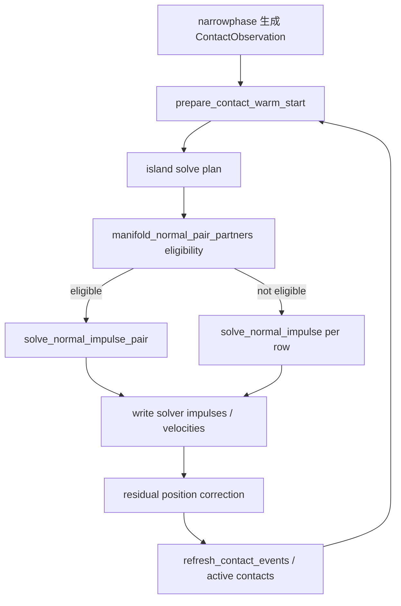
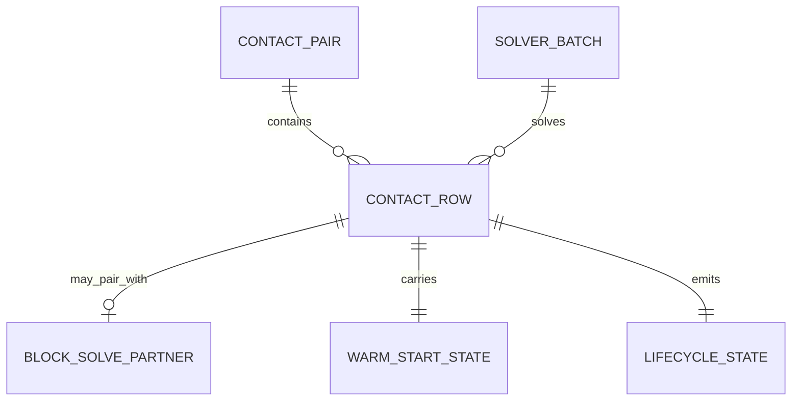
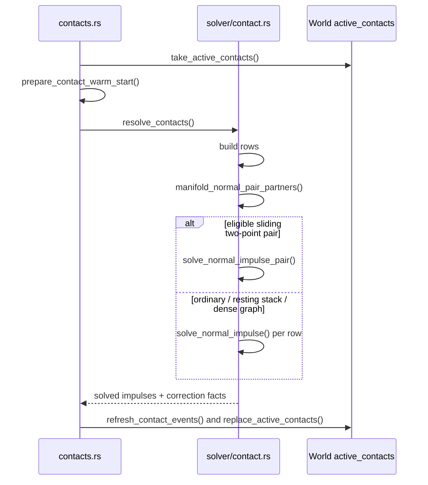

# Stack 4 接触 Block Solve 稳定性技术方案

状态：草稿
设计文档：docs/design/stack-4-contact-block-solve-stability-design.md
最后更新：2026-05-14
工作目录：/Users/asyncrustacean/projects/picea

## 背景与目标

`stack_4` 在浏览器第 177 帧附近表现为四箱体垂直堆叠不稳定。复现的
artifact 显示这不是 UI 绘制问题，也不是单纯 sleep 参数问题，而是 core solver
行为锁已经失败：

- `stack_4 --frames 180` 在 frame `177..179` 仍有 severe
  `penetration_spike` 与 `contact_churn_spike`。
- frame `100..130` 进入稳定的隔帧接触切换：每帧 `4 ContactStarted`
  加 `4 ContactEnded`。
- late frame 的 `warm_start_hit_count = 0`、`warm_start_miss_count = 4`。
- `stack_4_behavior_lock_stays_deterministic_and_quiet_after_settling`
  在 settled penetration gate 失败，实测最大穿透约 `0.29201072`，
  目标上限为 `0.04`。

目标是在不调整 public API、不修改全局 `dt` / iteration / sleep threshold 的前提下，
把 `stack_4` 小型垂直堆叠恢复到稳定、低穿透、低 churn 的行为锁，并防止已证伪的
two-point block normal solve 过宽启用路线再次回归。

## 非目标

- 不通过增大 `velocity_iterations` / `position_iterations` 宣称修复。
- 不通过调高 friction、shallow support budget 或 sleep threshold 掩盖问题。
- 不把浏览器端可视化作为 correctness oracle；浏览器只用于产品验收和证据展示。
- 不改变 `World` / `SimulationPipeline` public surface。
- 不引入 Box2D / Matter.js 运行时依赖。

## 现状证据

- `crates/picea/src/solver/contact.rs` 的 `manifold_normal_pair_partners`
  修复前忽略 graph 规模与支撑状态，只要同一 two-point manifold 就启用
  `solve_normal_impulse_pair`。
- `docs/plans/2026-05-08-matrix-stack-physics-engine-stability-refactor-milestones.md`
  已记录过负向结论：全局/非门控 two-point block normal solve 会让
  `stack_4` settled penetration 退化到约 `0.2897398`。
- 当前复现实测与该负向结论吻合：`stack_4` settled penetration 约 `0.29201072`。
- artifact frame `100..130` 显示接触对在 `0-1 / 2-3` 与 `1-2 / 3-4`
  之间隔帧交替，导致所有 late contacts 都是冷启动。

## 证据分级

- Fact：当前 `stack_4` 行为锁失败，settled penetration 超过阈值。
- Fact：frame `177` late contact warm-start 全 miss，且存在 severe penetration/churn marker。
- Fact：当前 `manifold_normal_pair_partners` 对所有同一 two-point clipped manifold 启用 block solve。
- Inference：过宽启用 block solve 改变了小堆叠中相邻接触的压力传播，使支撑关系隔帧切换。
- Assumption：恢复更窄的 block-solve eligibility 可以先修复 `stack_4`，但 matrix-stack 仍需继续用现有 long-window gate 验证。
- Recommendation：先做最小门控修复和 negative guard，再考虑更完整的 dense pressure / position-row 设计。

## 领域名词

| 名词 | 含义 | 为什么重要 |
| --- | --- | --- |
| two-point block normal solve | 对同一 clipped manifold 的两个接触点一起求法向 impulse，而不是逐点求解。 | 可改善某些滑动接触，但启用过宽会破坏堆叠压力传播。 |
| warm-start | 复用上一帧接触 impulse 作为本帧初值。 | 堆叠稳定高度依赖 warm-start；全 miss 会让 solver 每帧重新爬坡。 |
| contact churn | 接触身份频繁 started/ended。 | churn 会切断 warm-start、扰动 island 和 sleep。 |
| clipped manifold | SAT/clipping 生成的多点接触流形。 | 当前 block solve 只应在该类 manifold 上讨论，但不是所有 clipped manifold 都适合。 |
| behavior lock | 用测试固定当前应保持的物理行为。 | 防止修大矩阵时弄坏小堆叠。 |

## 架构视图



关键边界：`manifold_normal_pair_partners` 只负责选择求解策略，不拥有 contact
identity，也不应该把 dense-stack 负向实验重新塞进所有 clipped manifold。

## 软件接口说明

### 接口：`manifold_normal_pair_partners`

职责：
决定哪些 two-point contact rows 可以进入 `solve_normal_impulse_pair`。

调用方：
- `contact_solver_row_batches`

被调用方：
- `solve_normal_impulse_pair`
- `solve_normal_impulse`

输入：
- `rows: &[ContactSolverRow]`：当前 island 中的 contact rows。
- `sparse_stack_block_solve_guard: bool`：当前 contact graph 是否是类似 `stack_4`
  的小型支撑堆叠，需要更谨慎地放行低速 block solve。

输出：
- `Vec<Option<usize>>`：每个 row 的 block-solve partner；`None` 表示逐行求解。

不变量：
- `dense_contact_graph` 不能作为一刀切禁用条件；aligned matrix 长窗仍需要低速
  two-point manifold 走 block solve 来释放压力。
- 小型 resting stack 中低切向速度、带 position bias 的稳定支撑接触不启用 block solve。
- 只有同一 solver pair、同向 normal、clipped / duplicate-reduced two-point manifold 可进入后续判断。
- 小型 sparse stack 的 2x2 block solve 门槛应高于一般 contact graph；大 graph
  不能跟 `stack_4` 共用这个保护阈值。
- eligibility 必须有测试覆盖，不能靠文档约定。

推荐第一版规则：

```text
eligible =
  same_solver_pair
  && same_normal
  && both rows are Clipped or DuplicateReduced
  && if sparse_stack_guard then both rows have position_bias <= EPSILON
  && max(abs(row_a.initial_tangent_speed), abs(row_b.initial_tangent_speed)) >= graph_specific_threshold
```

其中小型 sparse stack guard 使用 `0.02`，一般 graph 使用 `0.0`。guard 同时要求
whole-world body count、island body slots、row count 都处于小型堆叠规模。理由是
`stack_4` 坏帧来自 4 动态箱体 + floor 这类小世界支撑图，低速 block solve 会在
settling 过程中放大穿透；aligned matrix 后期也可能碎成小 island，但它属于大世界里的
局部片段，仍需要保留低速 block solve，否则最终睡眠或角度收敛会退化。实际执行中
`dense_contact_graph` 全禁用会让 aligned matrix 长窗退化；真正需要禁止的是小型
sparse support 被误判为 block-solve pair。

### 接口：`stack_4` negative guard

职责：
把当前回归固定成自动化保护，防止以后“修大矩阵”时再次弄坏小堆叠。

调用方：
- `cargo test -p picea --test physics_realism_acceptance stack`
- `cargo test -p picea-lab --test artifact_run stack_artifacts_capture_lab_frame_diagnostics_with_marker_sources`

输出：
- `stack_4` settled penetration 不超过 `0.04`。
- frame `120..300` late warm-start 不再长期全 miss。
- late 24-frame contact churn 总量保持在既有行为锁约束内。

不变量：
- 该 guard 不允许通过放宽阈值修绿。
- 若 matrix-stack 因恢复门控退化，必须进入下一阶段 dense solver 设计，而不是重新打开全局 block solve。

## 数据关系



| 关系 | 基数 | 生命周期所有者 | 一致性约束 | 证据 |
| --- | --- | --- | --- | --- |
| `ContactPairKey -> ContactObservation` | 1:N | `pipeline/contacts.rs` | 同 pair 可有多个 clipped rows，但 identity 不能因 solver 策略任意 churn。 | `ContactKey`, `ContactRecord` |
| `ContactRow -> BlockSolvePartner` | 1:0..1 | `solver/contact.rs` | partner 只能是同 pair、同 normal、满足 eligibility 的另一 row。 | `manifold_normal_pair_partners` |
| `ContactRow -> WarmStartState` | 1:1 | `prepare_contact_warm_start` | solver 策略不能让 late stack 长期全 miss。 | `WarmStartStats` |

## 关键运行时流程



## 方案选择与取舍

| 方案 | 选择 | 好处 | 代价 | 适用边界 |
| --- | --- | --- | --- | --- |
| 恢复 block-solve eligibility 门控 | 推荐第一步 | 最小、贴近已知负向证据，优先修复 `stack_4` | 仍需保留 aligned/matrix 长窗回归门 | 当前回归止血 |
| 调整 iteration / friction / sleep 参数 | 放弃 | 实现快 | 掩盖根因，可能破坏其他场景 | 不作为修复路线 |
| 全面重写 position-row / pseudo-pose solver | 后续设计 | 更接近成熟引擎长期路线 | 范围大，风险高，需要单独 D/E milestone | matrix-stack 仍不稳时 |
| contact lifecycle 前移到 narrowphase | 暂缓 | 可能提升 identity 稳定性 | 会扩大 contact schema 和 manifold 持久化边界 | 只有门控修复后 churn 仍不可解释时 |

## 架构决策记录

| 决策 | 状态 | 选择 | 替代方案 | 影响 | 重访触发 |
| --- | --- | --- | --- | --- | --- |
| block solve 默认门控 | Proposed | 高切向滑动、无 position bias 才启用；dense 不一刀切禁用 | 所有 two-point clipped manifold 都启用，或 dense 全禁用 | 恢复小堆叠稳定性并保留 aligned/matrix 行为锁 | matrix-stack long gate 明显退化 |
| 修复入口 | Proposed | 先改 `manifold_normal_pair_partners` eligibility | 先调参数或 sleep | 缩小 blast radius | `stack_4` 修复后仍全 miss |
| 验收顺序 | Proposed | 先 `stack_4` hard gate，再 matrix/aligned/long gates | 只看浏览器现场 | correctness 有自动化依据 | browser 与 artifact 明显不一致 |

## 验收标准

第一层硬门：

- `rtk proxy cargo test -p picea --test physics_realism_acceptance stack_4_behavior_lock_stays_deterministic_and_quiet_after_settling -- --nocapture`
  通过。
- 新增或更新 negative guard，证明非门控 block solve 会被 `stack_4` gate 捕获。

第二层回归门：

- `rtk proxy cargo test -p picea --lib solver::contact::tests -- --nocapture`
  通过。
- `rtk proxy cargo test -p picea --test physics_realism_acceptance stack -- --nocapture`
  通过。
- `rtk proxy cargo test -p picea-lab --test artifact_run stack_artifacts_capture_lab_frame_diagnostics_with_marker_sources -- --nocapture`
  通过。

第三层 matrix 风险门：

- `rtk proxy cargo test -p picea-lab --test artifact_run matrix_stack_artifacts_capture_nxm_grid_stack_facts -- --nocapture`
  通过。
- 若启用长窗验收：`rtk proxy env PICEA_MATRIX_STACK_E4_ACCEPTANCE=1 cargo test -p picea-lab --test artifact_run matrix_stack_long_settle_acceptance_requires_no_ejection_or_runaway_speed -- --ignored --nocapture`。

产品验收：

- 在 `picea-lab-web` 里打开 `Four box stack`，180 帧附近不应再出现 severe
  penetration/churn 作为稳定状态；若仍出现，复制 debug context 回到 artifact 证据层分析。

## 对后续里程碑的输入

建议执行顺序：

1. E1：恢复 `manifold_normal_pair_partners` eligibility，并加单元测试覆盖
   resting stack skip、guarded sliding pair allow、large-graph slow pair allow。
2. E2：跑 `stack_4` hard gate，确认 late warm-start 不再长期全 miss。
3. E3：跑 matrix/aligned 回归门，若 matrix 退化，只记录为 dense solver 后续问题，不回滚到全局 block solve。
4. E4：浏览器验收 `Four box stack`，确认产品可视化和 artifact 证据一致。
5. C1：把负向路线写入计划/设计文档，防止之后被误当作优化重新合入。

执行前必须保持的边界：

- 不触碰当前 dirty 的 web/UI WIP，除非进入浏览器验收后发现证据展示问题。
- 不调整 public API。
- 不改 `StepConfig` 默认 iteration / dt。
- 不放宽 `stack_4` 行为锁阈值。

## 风险 / 后续

- 风险：恢复门控可能让 matrix-stack 的某个局部指标回退。处理方式是进入 dense
  pressure propagation / position-row 设计，而不是重新启用全局 block solve。
- 风险：`stack_4` 修复后仍有 contact churn。处理方式是转向 contact identity /
  persistent manifold lifecycle 证据，而不是调 sleep。
- 后续：如果 matrix-stack 仍不稳定，应基于 existing `ContactPositionRow` 输入契约设计
  pseudo-position / position-row pass，而不是继续堆局部 friction 或 damping 参数。
